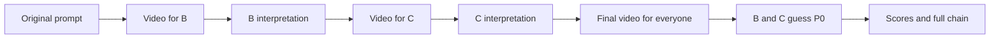

# VibeParty: app and game specification

Status: proposed MVP specification, 12 September 2026.

**Word by Word hackathon override:** its [dedicated demo spec](word-by-word-spec.md) and [simplified stack](word-by-word-tech-stack.md) take precedence over the shared requirements below. That demo uses one room, three/four player phones, one host screen, four words, and disposable in-memory state. The broader room infrastructure and other games remain separate plans; they are not prerequisites for this demo.

**Prompt Royale demo scope:** its dedicated [game specification](games/prompt-royale/game-spec.md) and [technology stack](games/prompt-royale/tech-stack.md) take precedence over shared defaults and acceptance criteria here. Build one room for 3–4 players with a fixed host, curated topics, fixed timers, one initial generation attempt plus one bounded retry per entry, and browser polling. Ready checks, host failover, paired display, durable recovery, and the other games are not prerequisites for this demo. See the [before-and-after simplification](games/prompt-royale/simplification.md); the broader designs for the other games remain unchanged.

For the Reverse Prompt hackathon demo, the [dedicated game specification](games/reverse-prompt/game-spec.md) and [tech stack](games/reverse-prompt/tech-stack.md) override the broader shared defaults below. Build one room for three players without turn timers or production recovery infrastructure. See the [before-and-after comparison](games/reverse-prompt/simplification.md).

## 1. Product concept

VibeParty turns a group of friends into the creators and audience of AI-generated entertainment. Players join a room on their phones, contribute words or prompts, watch the results, and compete through voting or guessing.

The app is being designed for the [Worlds hackathon](hackathon.md). The broader product design covers three games; each dedicated specification defines its reduced demo scope:

| Game | Player activity | Result | Competition |
| --- | --- | --- | --- |
| Word by Word | Players contribute words to a shared story inspired by Consequences. | Each contribution adds to an evolving video scene. | Cooperative; no winner. |
| Prompt Royale | Everyone writes a prompt for the same topic. | One short clip per accepted entry, followed by a group screening. | Most votes wins. |
| Reverse Prompt | Players alternate between watching a video and describing it to generate the next video. | A chain of prompts and videos, followed by guesses of the original prompt. | Closest final guess wins. |

Names are working titles. Except for explicitly confirmed design directions, the game rules below are proposed implementation defaults.

### Interpretation and assumptions

- “One world” in the first game is interpreted as **one word** per contribution. The finalized proposed template assigns one or two contributions per player according to room size.
- Word by Word uses **Consequences** as its selected reference and an **evolving video with additive contributions** as its intended output. Its [demo specification](word-by-word-spec.md) selects four private words followed by four connected segments; its [technical plan](word-by-word-tech-stack.md) selects Reactor FastH3 for evaluation. It uses an existing generative model; training a model is outside the MVP.
- “Model Python” is interpreted as **modern Python for the backend**. See the [backend specification](backend-spec.md).
- The initial experience is a browser app for a group playing together. Personal devices carry private inputs; an optional shared display shows only public information.
- English is the initial language for instructions, word validation, and similarity scoring.
- One real generation provider will be integrated after access, capabilities, latency, and cost are verified. A partner listing alone does not establish API access or supported outputs.

## 2. MVP scope

### Included

- Private rooms, a join code and QR link, guest names, and reconnectable guest sessions.
- Game-specific player limits: **Prompt Royale supports three to four for the hackathon, including the playing host**; Word by Word supports three to four plus its separate host screen. Reverse Prompt supports exactly three, including the playing host. See each dedicated demo specification.
- A lobby, game selection, configurable rounds, visible timers, and synchronized phase changes.
- All three games, playable videos, anonymous contest entries, private relay turns, voting, similarity scoring, and end-of-round reveals.
- Generation progress, bounded retries, timeout handling, and limits on generation spending.
- An optional display mode paired by the host, plus a clearly labelled fixture mode for development and rehearsals.

### Later

Public matchmaking, accounts, persistent profiles, payments, public galleries, native mobile apps, audience voting, voice input, uploads, custom model training, and interactive world controls are outside the first release.

## 3. Shared party experience

### Room flow

1. A host creates a room, enters a display name, and receives a short join code and QR link.
2. Guests join with a name. Duplicate names receive a visible suffix; names never determine identity.
3. The host selects a game and settings. Players see a short rule card; ready checks apply only where the selected game requires them.
4. The host starts when the roster meets the selected game's player limits and any readiness requirements. All three games follow their dedicated demo start rules. Starting freezes the player roster, settings, provider preset, and any role order.
5. The server advances the game through its phases. Every screen shows what to do next and how much time remains.
6. Players watch the reveal and results. The host can play another round, choose another game, or end the room.

New arrivals during a round wait in the lobby until the next round. Disconnecting does not erase an accepted submission or vote. Rejoining on the same browser restores the existing player; a new session cannot claim a disconnected identity by entering its name.

Removing a player revokes their future actions and viewing access. Keep already accepted words, contest entries, ballots, and guesses unless the round is aborted; pending relay turns for a removed player are skipped. Removal is not a way to erase an opponent's score.

After the host has been disconnected for 30 seconds, control passes to the longest-present connected player. A returning former host remains a player. If nobody remains connected, the room becomes inactive; persisted deadlines and recovery rules resolve unfinished work without creating new generations indefinitely.

The host can start valid rounds, extend an input timer once, remove a player, transfer hosting, or abort a round. Hosting does not grant access to other players' private prompts, ballots, guesses, or relay videos before their scheduled reveal. Administrative changes appear in the room activity feed.

### Default settings

| Setting | MVP default |
| --- | --- |
| Active players | Prompt Royale demo: 3–4 including the playing host. Word by Word demo: 3–4 plus a separate host screen. Reverse Prompt demo: exactly 3 including the playing host. |
| Rounds | One round per game launch; replay from results |
| Word by Word | Four fixed slots, one word per slot, 45-second private collection, then host-controlled connected video segments; see the [demo specification](word-by-word-spec.md) |
| Prompt Royale | 60 seconds to submit a prompt; 30 seconds to vote |
| Reverse Prompt | Demo: exactly three players, one generation turn each, no input countdowns; see dedicated spec |
| Individually written prompt / guess length | Reverse Prompt: 1–300 Unicode code points and within the local model's token limit. Other games follow their dedicated demo limits. |
| Video preset | Target 5 seconds for Prompt Royale / Reverse Prompt; Word by Word requests approximately 6 seconds per segment. Landscape and muted by default. |
| Generation deadline | Prompt Royale: 180 seconds per generation phase. Reverse Prompt: 90 seconds per clip, one attempt. Word by Word: 120-second total build limit, with provider cleanup separate from saved playback. These are product limits, not latency claims. |
| Input extension | No input extensions in the dedicated demos; Reverse Prompt has no input countdowns. |

For the contest, the generation phase covers all entries in parallel. For the relay, each step has its own generation phase. The UI explains that larger relay groups require more sequential generations. Use a three-player room for a short demo; time estimates must come from measured provider performance.

Settings are selected from server-validated presets. For Word by Word, validate that the category template, contribution limits, and cumulative rendering instructions fit the selected provider's input limit before accepting a preset. Never truncate accepted contributions. The 500-character limit applies to individually written prompts and guesses, not the multi-player assembled prompt.

### Screens and interaction

| Screen | Required content |
| --- | --- |
| Home | Create room, join room, name entry. |
| Lobby | Join code / QR, roster, connection status, game rules, settings, ready controls. |
| Player view | Current phase, timer, one clear primary action, input or video when authorized. |
| Generation waiting view | Queued / generating / preparing video, ready count where public, elapsed time, recovery message. |
| Screening | Large player, explicit play / replay controls, labelled clip number, playback-error feedback. |
| Results | Winning entry or guess, applicable scores, reveal content, replay and game-selection controls. |
| Shared display | Public roster and phase information, public screening, and results; no private input or relay content. |

Phone browsers may require a tap to start video or sound. Provide keyboard access, labelled inputs, visible focus, readable contrast, non-color status cues, and reduced-motion support. Generated speech is not required to understand or win the MVP games. During private relay turns, the shared display shows progress only. A host-controlled screening cue coordinates playback; frame-accurate synchronization is unnecessary.

## 4. Game 1: Word by Word

### Objective

Create a shared story inspired by **Consequences**, with each player's word adding something to an evolving video. The [hackathon game specification](word-by-word-spec.md) is authoritative for this game's rules, and the [simplified technical stack](word-by-word-tech-stack.md) defines its implementation. The [reference note](word-by-word.md) records the traditional-game background.

### Proposed gameplay

Assign four fixed slots—place, character, action, consequence—across three or four players in join order. Collect privately for 45 seconds. With three players the first supplies two words; with four everyone supplies one. The laptop host is a separate role and does not see private answers.

After all words are accepted, privately build four connected video segments, each adding the next word while retaining earlier scene facts. The host reveals each word, contributor, and approximately six-second clip with Play/Next. Everyone watches the host screen; phones show words and status. Replay uses saved local files. Provider cleanup does not block saved playback. Continuous steering and broader room features are deferred; see [before and after](research/word-by-word/hackathon-simplification.md).

### Constraints

- Store original contributions and contributor identities separately from assembled text and provider instructions. Templates may add connecting text; they must not silently replace accepted contributions.
- Hidden contributions stay private until their scheduled reveal, including from the host and shared display. A generated scene must not reveal later words early.
- Refreshing a browser restores accepted contributions while the server process lives. Missing input ends the round; no automatic replacements or host migration. A server restart loses the room.
- A failed step stops further generation. A saved valid prefix can be revealed while provider cleanup completes; another live session waits for confirmed closure. Unshown words remain private, including in partial results. No paid rerolls.
- This game is cooperative. There are no points, winners, or ranking requirements.

## 5. Game 2: Prompt Royale

The dedicated [game specification](games/prompt-royale/game-spec.md) owns the simplified demo behavior and overrides shared room/recovery rules for this game. See its companion [technology choices and stack](games/prompt-royale/tech-stack.md) and [before-and-after comparison](games/prompt-royale/simplification.md).

### Hackathon limitation

Cap Prompt Royale at **four active players, including the playing host**, with a minimum of three and one room. Reject a fifth join and joins during an active round. Use a fixed host without ready checks, timer extensions, transfer, or removal; host absence aborts the round after 30 seconds. A server restart clears the room. Larger groups and durable recovery are future work; see [limitations and future work](games/prompt-royale/game-spec.md#hackathon-limitations-and-future-exploration).

### Objective

Everyone receives the same topic and tries to create the group's favorite clip.

### Rationale and inspiration

Prompt Royale takes inspiration from **Quiplash by Jackbox Games**, whose creative prompt-and-vote format lets players answer prompts, including fill-in-the-blank sentences, and then pits two answers against each other for the other players to vote on. Credit for that inspiration goes to Jackbox Games. [Quiplash on Steam](https://store.steampowered.com/app/351510/Quiplash/).

Prompt Royale adapts this format to AI-generated video: everyone writes a prompt for the same topic, each accepted prompt becomes a short clip, and the group watches all eligible clips before voting for a favorite. The rationale is to give players a simple creative starting point and a shared reveal, with the group deciding which result is most entertaining.

### Rules and sequence

1. The host selects a topic from a small curated list before the round starts. Example: “The worst possible first day at a new job.”
2. All players see the topic and write privately for 60 seconds. One final submission is allowed per player; local drafts are editable until submission.
3. Submissions remain hidden. Start generation when every player has submitted or the deadline expires. A missed submission creates no entry and no generation request.
4. Generate one clip per accepted prompt with the same frozen model, duration, resolution, aspect ratio, and rendering template. Use bounded concurrency. Do not offer paid rerolls during a contest.
5. After every entry finishes or the phase deadline expires, freeze the set of playable clips. Label entries with neutral identifiers and use one server-shuffled screening order for the room.
6. Screen every eligible clip before voting, within one 180-second screening deadline. The host can skip an unplayable or unsuitable entry before the ballot opens; the exclusion is public. This supervised demo does not require an automated output-review service. Hide author names, submitted prompts, and vote totals until results.
7. Each player on the frozen roster may vote once for another player's eligible clip or abstain. Players whose own generation failed may still vote. Ballots lock on submission.
8. Close voting when everyone has voted or abstained, or after 30 seconds. Count votes on the server, reveal the winning clip, and then reveal authors, prompts, and vote totals.

The topic remains visible during voting so players can judge both entertainment and relevance. There is no automatic topic-relevance score in the MVP.

### Scoring and exceptions

```text
round_score(entry) = number of valid ballots targeting that entry
winners = all entries with the highest positive round_score
```

- No self-votes, duplicate votes, votes for excluded clips, or votes after the deadline.
- Equal top scores produce joint winners. Do not break ties by submission time or an AI judge.
- If no votes are cast, display “No winner — no votes cast.”
- If fewer than two clips are eligible, allow a showcase and mark the round unscored.
- Freeze the ballot set at voting start. If a later playback failure makes the ballot materially unusable, abort scoring for the round rather than changing the candidates after votes arrive.
- A failed or excluded entry does not block the rest. Retry a confirmed transient failure once with unchanged inputs, only within the original deadline and allowance. Reuse existing recordings for download/preparation failures; create at most two sessions per submission. Never retry rejected content or unknown session creation/termination. After failure or retry exhaustion, continue with usable clips or show an unscored result.
- MVP rankings are per round. Do not combine raw votes with Reverse Prompt similarity scores into an overall leaderboard.

## 6. Game 3: Reverse Prompt

The [dedicated game specification](games/reverse-prompt/game-spec.md) is the complete source of truth for the simplified hackathon demo. The [technical specification](games/reverse-prompt/tech-stack.md) defines its single-process stack. Shared room settings, timers, retry policies, and infrastructure elsewhere in this document do not expand that scope.

### Rules and sequence

1. Exactly three people join one room. The host is author A; guests B and C interpret in join order.
2. A privately submits original prompt `P0`. Reactor generates `V0`.
3. Only B receives `V0`. B describes it as `P1`; a fresh Reactor session generates `V1` from `P1` alone and the fixed rendering instruction.
4. Only C receives `V1`. C submits `P2`; another fresh session generates `V2`. No earlier prompt, media, or model state conditions the next clip.
5. Everyone watches `V2`. B and C submit separate private final guesses of `P0`; A is unscored. There are no input countdowns.
6. After both guesses are accepted, score them and reveal all three prompt/video pairs, guesses, scores, and winner/tie. Host Reset returns the same roster to the lobby.



The host has no special access to hidden clues. Players remember different clues, so the contest is casual entertainment. Server authorization protects private prompts, guesses, and media.

### Scoring and failures

Use local Sentence Transformers with `sentence-transformers/all-MiniLM-L6-v2` and CPU PyTorch for the original and both guesses, then calculate cosine similarity and `floor(100 * clamp(similarity, 0, 1) + 0.5)`. Highest integer score wins; equal scores tie. Display similarity out of 100, not percentage accuracy. The [scoring decision](games/reverse-prompt/tech-stack.md#5-scoring-and-text-moderation) defines model preloading, token limits, and local inference. No OpenAI service or API key is required.

A failed or timed-out local inference produces an unscored reveal after the 15-second deadline. Any failed video ends the round on an error screen: there are no skipped steps or automatic paid retries. Each generation has a 90-second application deadline and a provider session cap. Refresh works while the process lives; server restart loses the round. The session quota and unresolved-session guard survive restart.

The demo validates text format and token limits locally and relies on Reactor's checks for generation input. It has no separate app moderation API for names, guesses, or videos; provider rejection can happen after billing starts. These demo choices override the broader moderation requirements below.

## 7. Generation, limits, and failure experience

Generation is shared infrastructure across all games. The app must remain responsive while a provider is working. Show truthful phase labels and elapsed time; show percentages or ETA only when backed by provider data or measurements.

The broader app setup must configure a room budget, provider concurrency, request deadlines, and a maximum number of attempts. Reserve enough budget for its planned rounds before starting them. At `n` players, base demand is `n` outputs for Prompt Royale and `n` sequential outputs for Reverse Prompt. The Word by Word demo instead builds four connected clips with one active session, a verified 180-second provider cap, no paid retries, and at most three live session attempts per server run. It has no persistent budget ledger; its dedicated plan explains the restart limitation. Other games' permitted retries can add cost; account for them explicitly.

If admission fails, tell the host before the round begins. If an unexpected limit is reached during play, stop admitting new generation requests and apply that game's failure rules. Do not automatically switch a live room to fixture clips or another model. Rehearsal mode uses clearly labelled prerecorded outputs and mock scores throughout the room.

Moderate player names, topics, and prompts before public display or generation, and check outputs before playback where moderation support is available. Rejected input can be corrected within its original deadline; it must not consume a paid generation. For the collaborative assembled prompt, rejection ends generation for that round without silently replacing contributed words. Players can report or hide a clip, and the host can abort a round containing an unsuitable result.

Rooms and media are private by default. Players are told that submitted generation prompts go to the configured provider. Local room data and media expire 24 hours after the room ends or expires; any distinct provider retention policy must be disclosed in setup. An inactive room expires after two hours without a connected participant. Public sharing is outside the MVP.

## 8. MVP acceptance criteria

| Area | Observable completion condition |
| --- | --- |
| Join and reconnect | Three separate browsers join one room; refreshing retains identity and restores the current phase without duplicate entries. |
| Word by Word | Three/four players follow the four-slot rules; private answers stay hidden; three live runs including a variation demonstrate additions, continuity, and saved replay. Meet the [demo acceptance checks](word-by-word-spec.md#8-demo-acceptance). |
| Prompt Royale | Three to four players receive one topic; a fifth active player or larger start roster is rejected; clips and authors are anonymous until results; self-votes and duplicate votes are rejected; ties produce joint winners. |
| Reverse Prompt | A three-player chain produces three videos; only the next player can retrieve its input video; eligible guesses are compared with `P0`; the author is unscored. |
| Privacy | Direct API calls, WebSocket events, snapshots, and media URLs cannot expose other players' hidden content before the proper phase. |
| Scoring | Frozen-model paraphrase examples generally outrank unrelated examples; identical valid prompts score 100; empty guesses cannot be submitted; the numeric formula has deterministic boundary tests. |
| Failure recovery | A timeout, disconnected player, duplicate generation notification, and worker restart each resolve without duplicate scores or a permanently stuck round. |
| Spending | Concurrent requests cannot exceed the room's configured reservation limit; an uncertain provider submission is reconciled before any potentially duplicate paid request. |
| Accessibility | Joining, submitting, playing/replaying clips, voting, and reading results work with keyboard controls and on a phone viewport. |
| Demo | Complete one real-provider round of every game with three players; record provider latency and cost. Fixture-only success does not satisfy live generation acceptance. |

## 9. Delivery order and remaining decisions

1. Build room/session management and the fixture provider infrastructure.
2. For the standalone Word by Word hackathon demo, follow its dedicated build order: verify one four-word live chain, add the one-room phone/host flow, then rehearse. The broader shared-room infrastructure is not a dependency.
3. Add parallel contest generation, anonymous screening, and voting.
4. Add private relay turns, final guesses, and the fixed scoring implementation.
5. Exercise reconnects, privacy boundaries, budget limits, and failure recovery; rehearse all three games with the live provider.

Before live integration, obtain provider access, verify supported video presets and private capture, benchmark generation latency and continuity, set verified spending bounds, and pin the scoring model for Reverse Prompt. Word by Word's gameplay and state transitions are now specified; its provider capabilities remain live verification gates. Shared room work and game flows can proceed against labelled fixtures.
