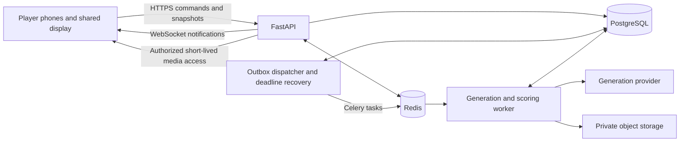

# VibeParty: Python backend specification

Status: broader architecture proposal, 12 September 2026. The [app specification](app-spec.md) defines product purpose and document ownership. Each game's dedicated specifications below define its demo behavior and implementation.

**Word by Word hackathon override:** its [demo game specification](games/word-by-word/game-spec.md) and [simplified technical plan](games/word-by-word/tech-stack.md) take precedence over this broader backend plan. Build that demo as one FastAPI process on the host laptop with an in-memory room, HTTP polling, one async Reactor task, and local clip files. Phones join over local HTTP on the same network; the dedicated technical plan defines the demo's cookies and origin checks. Cloud deployment, HTTPS setup, PostgreSQL, Redis, Celery, migrations, distributed leases, S3, and a budget ledger below are not demo dependencies. They remain a broader architecture proposal; each dedicated game plan decides its demo dependencies. See [before and after](games/word-by-word/simplification.md).

**Prompt Royale demo override:** use the dedicated [technology choices and stack](games/prompt-royale/tech-stack.md) and [game specification](games/prompt-royale/game-spec.md). Its hackathon implementation is one FastAPI process, in-memory state, asyncio tasks, HTTP polling, and private local video files. PostgreSQL, Redis, Celery, WebSockets, S3, durable job recovery, and the broader engineering checks below are not prerequisites for that demo. The remaining sections describe the broader three-game baseline and possible future expansion. See the [before-and-after decision](games/prompt-royale/simplification.md).

For the Reverse Prompt hackathon demo, implement the [dedicated technical specification](games/reverse-prompt/tech-stack.md): one FastAPI process, in-memory room state, local media, polling, local Sentence Transformers scoring, and the user-selected Reactor FastH3 video generation. No OpenAI service or key is required. It supersedes this document's database, queue, worker, WebSocket, recovery, moderation, and deployment requirements for that game. The architecture below remains broader product direction, not required demo infrastructure. The [before-and-after comparison](games/reverse-prompt/simplification.md) explains the cuts.

**Local demo target for all games:** the portal, Word by Word, Prompt Royale, and Reverse Prompt run on the host laptop, serving the built frontend and API over LAN HTTP with one Uvicorn worker. Remote deployment, Linux cloud hosts, Caddy, and TLS setup below remain future proposals. Follow the dedicated game plans and [local environment setup](environment-setup.md) for the current target.

## 1. Architecture

Use a modular Python application with a separate worker process built from the same codebase. Keep game rules independent of HTTP, queue infrastructure, and model-provider SDKs. The first release does not need microservices or an extensible game-plugin framework.



PostgreSQL is authoritative for rooms, phases, submissions, votes, jobs, budgets, and scores. Redis carries tasks, ephemeral presence, and change notifications. Losing a Redis notification must not lose an accepted player action or invalidate a result.

### Proposed stack

| Concern | Choice | Purpose |
| --- | --- | --- |
| Runtime | Python 3.13, pinned patch release | A supported modern baseline; verify every dependency on this version before locking the environment. |
| Environment | `uv`, `pyproject.toml`, committed `uv.lock` | Reproducible dependencies and development commands. |
| API | FastAPI, Pydantic v2, Uvicorn | Typed request validation, OpenAPI, HTTP, and WebSockets. |
| Database | PostgreSQL, SQLAlchemy 2, psycopg 3, Alembic | Transactions, explicit constraints, and migrations. |
| Jobs | Celery with Redis | Separate generation, polling, media preparation, and scoring from web requests. |
| Provider HTTP | HTTPX | Explicit timeouts and bounded connection pools. |
| Media | Private S3-compatible object storage | Store video bytes outside the database. |
| Similarity | Sentence Transformers in the worker | Fixed-model semantic comparison without an open-ended LLM judge. |
| Quality | Ruff, mypy, pytest | Formatting/linting, static typing, and behavior tests. |
| Local services | Docker Compose | API, worker, one scheduler/dispatcher, PostgreSQL, Redis, and local object storage. |

Python's official lifecycle table should guide runtime upgrades; 3.13 is a baseline choice here, not a claim that it is the newest release. [Python version status](https://devguide.python.org/versions/).

Commit the lockfile and use frozen dependency installation in CI and deployment, following uv's project model. Pin exact application dependency versions through the lockfile rather than putting floating “latest” versions in images. [uv project documentation](https://docs.astral.sh/uv/guides/projects/).

A lightweight browser frontend is sufficient; React with TypeScript is a proposed implementation choice. Serve frontend and API through one origin to simplify secure sessions. Business rules and score calculations remain in Python.

## 2. Code organization and Python practices

```text
backend/
  pyproject.toml
  uv.lock
  .python-version
  src/vibeparty/
    main.py
    config.py
    api/                 # Routers, schemas, session dependencies, error mapping
    domain/              # Pure game rules, score formula, phase validation
      games/
        word_by_word.py
        prompt_royale.py
        reverse_prompt.py
    services/            # Transactions and use cases
    persistence/         # SQLAlchemy mappings and focused database queries
    realtime/            # Authorized snapshots and notifications
    generation/          # Provider protocol, real adapter, fixture adapter
    scoring/             # Embedding adapter and versioned preprocessing
    jobs/                # Celery tasks, outbox dispatch, reconciliation
    media/               # Storage and playback authorization
  migrations/
  tests/
    unit/
    integration/
    contract/
    e2e/
```

Use type annotations on application interfaces, explicit enums for states, Pydantic schemas at boundaries, and small domain functions for game decisions. Keep ORM objects out of public responses. Use separate input, private-player, and public-display schemas so private fields cannot leak through broad serialization.

Inject configuration, database sessions, provider adapters, clocks, and random generators. Use timezone-aware UTC timestamps and server-generated identifiers. Keep deadlines in the database, not in long-lived coroutine sleeps. Random orders are generated once and persisted so reconnects do not reshuffle the game.

The API uses async database/HTTP operations. Give each concurrent task its own `AsyncSession`; SQLAlchemy documents that a session is mutable transaction state and must not be shared by concurrent tasks. [SQLAlchemy asyncio guidance](https://docs.sqlalchemy.org/en/20/orm/extensions/asyncio.html#using-asyncsession-with-concurrent-tasks).

Celery tasks are ordinary synchronous functions using worker-owned database sessions and HTTP clients. Initialize connection pools per worker process, never share inherited live connections after a fork, and keep embedding inference in workers. Do not place blocking SDK calls or CPU-heavy scoring in FastAPI's event loop.

Use lifespan hooks for resource initialization/cleanup, typed settings for configuration, narrow exception handling, and explicit transaction boundaries. Avoid generic repository abstractions that merely duplicate SQLAlchemy. Secrets come from environment injection or a deployment secret store; `.env.example` contains placeholders only.

## 3. Domain model and constraints

For the broader persistent backend, use UUID identifiers and foreign keys, timestamp every durable record, and index foreign keys plus frequent room/state queries. Use integer counts and integer budget units with an explicit currency and scale. The Word by Word demo holds its room in memory and uses session/attempt limits instead of a monetary ledger.

| Entity | Important fields and invariants |
| --- | --- |
| Room | Four-digit join code stored as a string under the shared [room code standard](shared/room-code-spec.md), status, host participant, settings, version, last activity, expires/ends at. Join code unique across games while active. |
| Participant | Room, display name, role, joined at, removed at. Identity independent of display name. |
| Session | Hashed opaque credential, participant or display role, expiry, revocation. Display credentials are read-only and room-scoped. |
| Round | Room, game kind, phase, phase version, phase deadline, settings snapshot, generation/scoring versions, outcome. At most one active round per room. |
| RoundParticipant | Frozen roster, order, author/relay role, eligibility, withdrawal status. Unique `(round_id, participant_id)`. |
| Word by Word demo state | Not a database entity in the demo: four assigned slots, accepted contribution text (a word, phrase, or short sentence of up to 120 Unicode code points after trimming), clip metadata, and reveal index live in one in-memory RoomState. See its dedicated technical plan. |
| Submission | Round, participant, kind, step index, original text, effective provider prompt, moderation status, accepted at. Unique permitted participant/kind/step slot. |
| RelayStep | Round, step index, assigned participant, input asset, submission, output asset, status. Unique `(round_id, step_index)`; first step is the author. |
| GenerationJob | Round, source submission or assembled prompt, logical key, state, deadline, attempt limit, lease owner/expiry, provider job ID, preset, error category. Logical key unique. |
| GenerationAttempt | Job, attempt number, stable provider idempotency key, request status, provider receipt, cost reservation, actual/estimated cost. Unique `(job_id, attempt_number)`. |
| MediaAsset | Job, private object key, MIME type, duration, dimensions, availability/moderation status, expiry. No public bucket URLs. |
| RoundEntry | Contest entry, participant, asset, anonymous label, display order, eligible flag. Ballot set becomes immutable at voting start. |
| Vote | Round, voter, target entry or explicit abstention, accepted at. Unique `(round_id, voter_id)`. |
| Guess | Round, participant, text, accepted at. Unique `(round_id, participant_id)`; author ineligible. |
| Score | Round, participant/entry, score kind, value, model/formula revision, input hash. Unique scoring target and kind per round. |
| BudgetReservation | Room, round, optional job/attempt allocation, currency, amount, status. Reserve and settle atomically without counting allocations twice. |
| IdempotencyRecord | Actor, route, key, body hash, stored response, expiry. Same key with different body is a conflict. |
| OutboxEvent | Room, room sequence, type, durable payload, created/published at. Written with the domain transaction. |

Use normal columns for fields that enforce identity, joins, eligibility, and uniqueness. JSONB is appropriate for frozen provider presets and validated metadata, not the entire mutable game state.

Cross-record invariants such as self-vote prevention and active relay ownership must be checked in the same transaction that writes the action. Database uniqueness backs up application validation. A worker cannot award a score twice because a queue delivered the task twice.

## 4. State transitions and concurrency

| Game | Normal phase progression |
| --- | --- |
| Word by Word demo | `LOBBY` → `INPUT` → `GENERATING` → `REVEAL` → `RESULTS`; failed/partial rounds also end at results. No separate recovery phase. |
| Prompt Royale | `prompting` → `generating` → `screening` → `voting` → `results` → `finished` |
| Reverse Prompt | `author_prompt` → `generating_step` → `relay_prompt` → `generating_step` (repeat) → `guessing` → `scoring` → `reveal` → `finished` |

Word by Word ends an incomplete input round without generation and stops building at the first failed step. A saved valid prefix may play while provider cleanup completes, with unshown contributions remaining private. Result labels describe complete, partial, or no video; they are not scores. Other games use their explicit aborted/unscored behavior. A finished round cannot be reopened by a late generation result.

For every mutation:

1. Authenticate the session and validate the payload and idempotency key.
2. Lock the room and current round in a consistent order. Check role, frozen roster, removal status, expected phase version, and server time against the persisted deadline.
3. Revalidate game invariants, write the accepted action, reserve any generation budget, and advance the phase if its conditions are met.
4. Increment the room sequence for observable changes and the phase version only when phase/turn authority changes. Persist jobs and outbox events in the same transaction.
5. Commit, then let the dispatcher enqueue work and notify clients. Never keep a database lock open during a provider call.

Use phase versions for actions so one player's accepted contest submission does not make another player's otherwise valid simultaneous submission stale. Use separate room sequence numbers to order notifications.

Deadline processing runs periodically and on snapshot recovery, using persisted times and the same transaction guards as player actions. Accept a submission only when the server validates it before the phase deadline; reaching the API before the deadline does not guarantee acceptance if its transaction is processed afterward. If a timeout and submission race, one transaction wins and the other revalidates. Record the result once.

## 5. HTTP and real-time contracts

All routes are under `/api/v1` except health endpoints. Room identifiers and join codes are locators, never authorization credentials. Mutations require session authentication, CSRF protection, and an `Idempotency-Key`; phase-scoped commands also carry `expected_phase_version`. Session-bootstrap routes (create room, join room, redeem display pairing) necessarily work before authentication: enforce allowed origins, admission/rate limits, and short-lived idempotency scoped to a random browser bootstrap nonce. Subsequent actions use the issued session, not the join code or nonce.

| Method and route | Action |
| --- | --- |
| `POST /rooms` | Create a room and host session; enforce creation limits and demo admission controls. |
| `POST /rooms/join` | Join by code and name; issue a scoped guest session. |
| `GET /rooms/{room_id}` | Return the authenticated viewer's current snapshot and authoritative server time. |
| `POST /rooms/{room_id}/ready` | Change the caller's lobby readiness. |
| `POST /rooms/{room_id}/rounds` | Host starts a round with validated settings and budget reservation. |
| `POST /rooms/{room_id}/participants/{id}/remove` | Host removes a participant under game-specific rules. |
| `POST /rooms/{room_id}/host-transfer` | Current host transfers control to an eligible connected participant. |
| `POST /rooms/{room_id}/display-pairings` | Host creates a short-lived, single-use code to pair a read-only display session. |
| `POST /display-sessions` | Redeem a pairing code and set the display cookie; rate-limited. |
| Word by Word demo routes | The dedicated plan uses smaller `/api/contribution`, `/api/state`, and `/api/reveal/next` routes. Do not implement this broader `/api/v1` route set as a prerequisite for the demo. |
| `POST /rounds/{round_id}/prompts` | Submit a contest, author, or relay prompt with an explicit kind/step. |
| Prompt Royale arena routes | The dedicated demo uses `/api/round/exclude` and `/api/round/open-voting`: reveal all clips together in the arena, then let the host freeze the ballot and open a 10-second vote. See the [demo HTTP contract](games/prompt-royale/tech-stack.md#3-minimal-state-and-http-contract). |
| `POST /rounds/{round_id}/entries/{entry_id}/exclude` | Host excludes an unplayable contest entry before voting, with a visible reason. |
| `POST /rounds/{round_id}/votes` | Submit one target entry or explicit abstention. |
| `POST /rounds/{round_id}/guesses` | Submit one eligible final guess. |
| `POST /rounds/{round_id}/extend` | Host uses the one permitted input extension. |
| `POST /rounds/{round_id}/abort` | Host ends the active round and stops new generation admission. |
| `POST /rooms/{room_id}/end` | Host closes the room and starts retention/cancellation handling. |
| `POST /assets/{asset_id}/reports` | Submit a clip report; hide it for that viewer and notify the host. |
| `GET /assets/{asset_id}/playback` | Check current viewer/phase access and return short-lived playback authorization. |
| `GET /assets/{asset_id}/stream` | Serve private relay media, including range requests, after current session/phase authorization. |
| `WS /rooms/{room_id}/events` | Authenticated phase, roster, and progress notifications. |

Validated actions return their accepted result and versions. Work that is queued returns `202` with an application job ID where relevant. Use `401` for missing/expired sessions, `403` for forbidden actions, `404` for unavailable or inaccessible resources where existence is private, `409` for conflicting state/idempotency, `422` for invalid input, and `429` for admission/rate limits.

Error bodies contain a stable `code`, friendly `message`, `request_id`, and a recoverable next action. Never expose provider responses, stack traces, hidden prompts, or credentials in errors.

Example notification:

```json
{
  "type": "round.phase_changed",
  "room_id": "room-uuid",
  "sequence": 42,
  "round_id": "round-uuid",
  "phase_version": 7,
  "data": {"phase": "voting", "deadline_at": "2026-09-12T14:05:30Z"}
}
```

Use HTTP for durable commands and WebSockets for notifications. On connection, reconnect, an event gap, or a detected version mismatch, fetch a fresh authorized snapshot. Deduplicate old sequences. A periodic lightweight snapshot refresh while a round is active recovers a lost final notification even if no later event exposes a sequence gap.

A WebSocket connection manager is local transport state only. FastAPI's example explicitly notes the limits of keeping connections solely in memory for a single process. Redis broadcasts changes between API processes; snapshots come from PostgreSQL. [FastAPI WebSocket documentation](https://fastapi.tiangolo.com/advanced/websockets/).

Publish content-free invalidations or already-public facts to room channels. Build recipient-specific private responses only after authorization; never broadcast a private payload and ask the browser to hide it. Display sessions receive public projections only. WebSocket reconnects recheck session revocation and participant removal.

## 6. Generation provider boundary

Implement a narrow typed protocol, backed initially by one real adapter and one fixture adapter:

```python
class GenerationProvider(Protocol):
    def capabilities(self) -> ProviderCapabilities: ...
    def submit(self, request: GenerationRequest, *, idempotency_key: str) -> ProviderReceipt: ...
    def get_status(self, provider_job_id: str) -> GenerationStatus: ...
    def cancel(self, provider_job_id: str) -> CancelResult: ...
```

These are proposed application types, not claims about a partner's SDK. Capabilities include supported media types, preset limits, whether idempotent submission and cancellation exist, and available moderation/status mechanisms. Adapters map unavailable features to explicit unsupported results.

`GenerationRequest` contains the application job ID, creative prompt, immutable rendering-template version, frozen model/preset, and seed only if supported. Use text-to-video for Prompt Royale and Reverse Prompt. The Word by Word demo uses a direct FastH3 integration function with cumulative scene instructions, predecessor clip IDs, and private capture; it does not implement this generic job framework. That video path still requires live validation. Preserve player text separately from effective provider instructions. The Reverse Prompt relay submits only the current interpretation, without an earlier video or hidden prompt.

Output is a validated asset descriptor with MIME type, dimensions, duration, and internal storage location. Browser clients never choose arbitrary model identifiers, provider URLs, job IDs, or credentials. There is no generic public “generate anything” route; generation admission follows an authorized game action.

### Durable job lifecycle

```text
queued -> submitting -> running -> preparing_media -> succeeded
                    -> submission_unknown -> reconciliation
nonterminal states -> rejected | failed | timed_out | cancelled
```

The API transaction creates the job, its reservation, and an outbox event. A dispatcher publishes jobs after commit and records publication. Duplicate publication is expected. Workers acquire a persisted lease and inspect the job before any external side effect. Generation execution is a no-op on redelivery for completed or terminal jobs; separate reconciliation can still record late receipts and costs without changing game results.

Generation and scoring belong in workers. FastAPI's background-task guidance identifies external task systems such as Celery for heavier work across processes; this app additionally needs durable job tracking across restarts. [FastAPI background tasks](https://fastapi.tiangolo.com/tutorial/background-tasks/).

- Store a stable idempotency key before submitting. Retrying the same uncertain request must reuse it if the provider supports idempotency.
- Record the provider receipt immediately. Poll with short, bounded tasks rather than tying up a worker in a minutes-long sleep.
- A submission timeout may mean the provider accepted and charged for work. Mark it `submission_unknown` and reconcile by provider request/job lookup. If the provider has neither idempotency nor lookup, do not automatically resubmit; let the phase fail visibly. Exactly-once billing cannot be promised by the application alone.
- Use at most one automatic retry beyond the first attempt for confirmed retryable failures, with exponential backoff, jitter, and `Retry-After` support. Validate budget and deadline first. Rejected content, invalid requests, and authentication errors are terminal.
- A transport retry of an unknown submission is the same attempt. A confirmed failed job followed by a newly billed submission is a new attempt with a new reservation and key.
- Late completion is recorded for cost reconciliation but cannot revive an aborted round, enter a frozen contest ballot, or replace the relay's chosen input. Keep late assets inaccessible and expire them.
- Media copying or formatting failures retry that operation against the existing provider result; do not regenerate a successful paid video.
- Celery delivery is not an exactly-once guarantee. Design tasks to be idempotent before enabling late acknowledgement, and recover expired leases using the database. [Celery task guidance](https://docs.celeryq.dev/en/stable/userguide/tasks.html).

The scheduler scans pending outbox events, expired leases, unknown submissions, due polls, and phase deadlines. Queue loss can be repaired from database job state. Authenticated webhooks can be added if supported; they are optional because the MVP uses polling. Any added webhook must verify provider signatures, freshness, job ownership, and duplicate delivery before applying transitions.

## 7. Budget and media controls

Before starting a round, atomically reserve a conservative upper bound for all planned generations, including the permitted retry allowance. On each attempt, allocate part of that reservation; on completion, settle known costs and release only unused amounts. Keep an uncertain charge reserved until reconciliation or conservative settlement. If pricing cannot be expressed as a safe upper bound, use a provider-side spending cap and a conservative application request quota before admitting live play.

Enforce room, deployment, and provider concurrency limits. An application semaphore alone is insufficient across workers; use persisted lease/accounting state. For the hackathon deployment, gate room creation with an organizer access code and enforce a global cap so repeatedly creating rooms cannot bypass room budgets. This is deployment access control, not a paid product feature.

Store validated, playable clips in private object storage when the provider permits copying. Prefer browser-compatible MP4 with H.264 and a poster frame; if conversion is needed, perform it in a bounded worker process. Verify MIME type, byte limits, duration, and dimensions. Treat provider download URLs as untrusted: restrict hosts and redirects to the configured provider/storage allowlist and reject private-network destinations. Do not fetch player-supplied URLs.

Playback authorization checks room membership, role, round phase, entry availability, and relay step. Use short-lived signed URLs with opaque object names for public-to-the-room clips. For unrevealed relay assets, use an authenticated streaming route so authorization is checked on subsequent requests, including range requests. A previously authorized viewer may remember or retain a video they already saw; the app cannot erase it from their device.

Prevent author or prompt leakage through filenames, response metadata, poster URLs, logs, or embedded media metadata. Delete database content, object copies, and fixture-independent caches according to the retention policy. Cleanup must also cover orphaned, failed, late, and reported outputs. Disclose external provider retention separately.

## 8. Security and observability

- Use HTTPS and opaque random session credentials stored as hashes server-side. Browser cookies are `HttpOnly`, `Secure`, and appropriately `SameSite`; credentials never appear in join URLs or logs.
- Validate CSRF tokens and allowed origins for cookie-authenticated mutations; validate the `Origin` header on WebSocket handshakes. Same-origin deployment is the default.
- Rate-limit room creation, join-code attempts, inputs, connections, and reports. Enforce maximum body sizes, text/token lengths, and generation counts server-side.
- Render all names, prompts, topics, and provider messages as escaped text. An embedding scorer treats prompts as data and has no tool access.
- Moderate before public display and generation, using a bounded validation step outside long-held room locks; revalidate deadline/phase when committing the accepted submission. Validate assembled collaborative prompts again before dispatch.
- If required moderation is unavailable, pause new paid generations and fail with a recoverable explanation; a keyword list is not an equivalent replacement.
- Recheck authorization on every command, snapshot, socket connection, private response, and media request. Removing a player revokes future room access while preserving accepted historical actions as the game rules require.
- Emit structured JSON logs with request, room, round, job, attempt, and event identifiers. Redact session tokens, provider keys, raw private prompts/guesses, and signed URLs.
- Track join failures, command latency, socket reconnects, queue age, generation latency/success, retries, unknown submissions, moderation failures, scoring latency, budget reservations, and actual/estimated spending.
- Expose `/health/live` for process health and `/health/ready` for required service readiness. Report worker/provider degradation separately so a slow generation service does not make room navigation unavailable.

## 9. Validation and deployment

All targets below are requirements to verify during implementation; no runtime performance has been measured in this documentation-only repository.

### Tests that protect game behavior

| Layer | Coverage |
| --- | --- |
| Unit | Contribution preservation and reveal order under the finalized Word by Word rules, permitted state transitions, ties/abstentions, author exclusion, skipped relay steps, score clamping/rounding, deadline boundaries. |
| Database integration | Simultaneous submissions, duplicate votes, unique constraints, phase-timeout races, concurrent budget reservations, transaction/outbox atomicity. Use PostgreSQL, not SQLite substitutes for locking behavior. |
| Provider contract | Success, rejection, timeout after acceptance, duplicate receipt, safe retry, cancellation unsupported, late completion, invalid/oversized media, fixed preset preservation. |
| Authorization | Cross-room access, forged actor IDs, removed players, display restrictions, private relay URLs, anonymous contest metadata, CSRF and socket-origin checks. |
| Recovery | API/worker restart, Redis publication loss, duplicate tasks, expired leases, absent host, missed final notification, scorer unavailable. |
| Scoring evaluation | Frozen paraphrase/unrelated/negation examples, token-limit behavior, repeatable scores, all participants using the same model revision. Review semantic limitations without pretending every negation is reliably distinguished. |
| Browser E2E | Three independent sessions complete each game, refresh during generation, replay media, submit votes/guesses, and reach correct results on phone-sized viewports. |

Use fixtures and a deterministic mock clock for normal CI; external paid generation is an explicit smoke-test suite with a hard budget. Fixture assets and scores are visibly labelled in the app. Do not call live providers from ordinary unit tests.

### Quality and operating targets

- CI checks frozen dependency installation, Ruff formatting/linting, mypy, relevant tests, and migration application on an empty database.
- Target p95 below 300 ms for ordinary room commands and below one second from a committed phase change to connected clients under a rehearsal load of 10 rooms with eight players each. Measure generation separately.
- Keep API, worker, and dispatcher in separate supervised processes from one versioned build. Run containers as non-root and pin base images. The embedding model is downloaded/pinned during build or setup, not first requested during a party.
- Run migrations as an explicit release step before starting the new application version. Use one scheduler initially; its database guards must still tolerate duplicate execution.
- Shut down workers gracefully. Persist in-flight job receipts and recover leases after restart. Configure Celery visibility/acknowledgement settings for bounded task duration rather than the provider's full generation time.
- Before the hackathon, verify provider credentials, common preset, moderation support, storage playback, runtime dependency compatibility, fixed scoring revision, configured spending caps, and one full live round of every game.

Deployment provider, exact package/model revisions, and the generation vendor remain integration choices. Record them with benchmarked latency and cost when selected; do not infer these from the hackathon's partner list.
