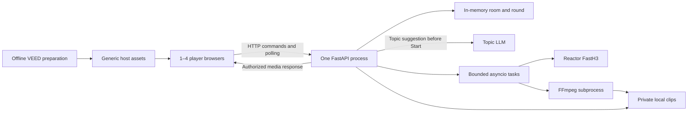

# Prompt Royale: hackathon technical stack

[All docs](../../README.md) · [Game spec](game-spec.md) · [Simplification](simplification.md) · [Research](../../research/prompt-royale/README.md)

Version: 1.8, 16 September 2026. Capture now accepts shorter clips and encodes each received image once at 24 fps, up to five seconds. Capture regressions and a three-browser fixture round with mixed clip lengths passed; see the [verification](../../research/prompt-royale/shorter-clips-2026-09-16.md). This replaces the earlier [image-hold fallback](../../research/prompt-royale/tolerant-capture-2026-09-15.md). Four-player and physical-phone live acceptance remain unverified.

**One room, at most four players, one Python application process.** This replaces the earlier PostgreSQL/Celery/Redis/S3 design for the Prompt Royale demo. The broader [backend specification](../../backend-spec.md) is future context for this game, not a prerequisite. See the [game rules](game-spec.md), [before-and-after comparison](simplification.md), and [provider research](../../research/prompt-royale/README.md).

## 1. Selected demo stack

| Area | Choice | Purpose |
| --- | --- | --- |
| Frontend | React, TypeScript, Vite | A small set of phase screens. |
| Styling/state | CSS Modules, CSS variables, React state/context | Responsive UI and local drafts; no additional state framework. |
| Transport | Browser fetch; HTTP commands and one-second snapshot polling | Room updates without WebSocket connection/replay infrastructure. |
| Frontend tools | Node.js 24 LTS, npm, package-lock.json | Build static assets and lock dependencies. |
| Backend | Python 3.13, uv, FastAPI, Pydantic v2, Uvicorn | Rules, validation, sessions, polling API, and file responses. |
| Room state | Python dictionaries/dataclasses plus asyncio.Lock | In-memory authoritative state; no database or ORM. |
| Topic suggestions | Backend HTTPX request to OpenAI [GPT-5.6 Luna](https://developers.openai.com/api/docs/models/gpt-5.6-luna), with reasoning effort `none`; live validation remains open | Suggest one topic in the lobby for the host to confirm or regenerate. |
| Generation orchestration | Tracked asyncio tasks and a semaphore | Two active entry slots and one bounded retry per entry inside the app; no job broker. |
| Scene provider | Reactor FastH3 via reactor-sdk; HTTPX for scoped token requests | One fixed provider/model integration. |
| Input validation | FastH3 full-prompt character validation | Check the complete effective prompt; no rewriting model. |
| Media | FFmpeg, ffprobe, private local temporary directory | Prepare MP4s up to five seconds and serve through authorized API routes. |
| Playback | CSS Grid and native HTML video with shared playback controls | A 2×2 arena with up to four silent clips playing together on phones and the projected host screen. |
| Optional host | VEED Fabric 1.0 through an offline fal-client preparation script | Pre-render generic host clips; runtime has no FAL key requirement. |
| Checks | pytest, Ruff, TypeScript checking, ESLint, one Playwright round test | Focus on rules, privacy, and the actual group flow. |
| Local runtime | Host laptop, one Uvicorn worker, HTTP over the same Wi-Fi or hotspot | FastAPI serves the built frontend and same-origin API; remote deployment is deferred. |

Remove PostgreSQL, SQLAlchemy, psycopg, Alembic, Redis, Celery, boto3/S3, WebSockets, durable outboxes, and separate dispatcher/worker services from the required demo. Defer mypy and a separate Vitest suite; backend typing and frontend type checking remain.

Keep the established runtime families, then pin compatible patch/package versions with uv.lock and package-lock.json in the first build. Install FFmpeg before the event; FastH3 requires no local tokenizer. Dependency versions are pinned in the lockfiles.

### How the stack is used

This is the implementation map for the demo, not a claim that these dependencies are already installed.

| Part of the experience | Technology and responsibility |
| --- | --- |
| Join, lobby, prompt form | React/TypeScript render the phase screens; CSS Modules style them; React state holds the draft. Vite builds the browser assets. |
| Choose a topic | React offers Host chooses and Auto-generated topic. FastAPI loads bundled choices or requests an LLM suggestion; the host sees “Generated by an LLM” with Confirm topic and Generate another. Start checks the current selection and confirmation. |
| Submit and follow the round | Browser fetch sends commands and polls once per second. FastAPI routes the requests, Pydantic validates them, and Uvicorn serves the single application process. |
| Keep the game consistent | Python in-memory objects hold the room and ballots. An asyncio.Lock protects short state changes; the housekeeping task enforces deadlines. |
| Generate and retry a clip | A tracked asyncio task uses the Reactor SDK for the live session and HTTPX for scoped tokens. A semaphore limits active work; the same task handles the single retry. The validator checks the complete prompt against FastH3's 800-character API limit before submission. |
| Prepare and watch clips | ffprobe inspects the recording; FFmpeg produces the MP4. The backend authorizes all eligible clips together when screening opens. React places native HTML videos in a 2×2 CSS Grid and coordinates Play arena, Pause all, and Replay all. |
| Vote and reveal | FastAPI validates the ballot, Python counts votes, and React renders the result from the next snapshot. No AI scoring service is involved. |
| Present the host | An offline fal-client script uses VEED Fabric to prepare generic clips once. The browser plays those static assets; gameplay makes no VEED API requests. |
| Build, check, and run | npm and uv lock/install dependencies; pytest, Ruff, TypeScript/ESLint, and Playwright check the demo. FastAPI serves the built frontend and API from the laptop over one local HTTP origin. |

The retry adds a counter, a short delay, and a second pass through the existing task. It adds no service or retry library. Exact package versions, and compatibility with the demo laptop's OS/architecture remain to be verified in the first integration build.

## 2. Architecture and its boundary



Run exactly one Uvicorn worker, one application instance, and no live-reload process during the demo. More workers create separate processes and would split this in-memory room state. No serverless request runtime or autoscaling deployment is selected. [FastAPI workers](https://fastapi.tiangolo.com/deployment/server-workers/).

Store strong references to active tasks, collect their errors, and cancel/await them at round end and graceful shutdown. Use the Reactor SDK asynchronously; run FFmpeg as an asynchronously awaited subprocess so it does not block polling and votes. Isolate entry failures so one exception does not cancel every other entry. Python documents task ownership and cancellation behavior. [asyncio tasks](https://docs.python.org/3.13/library/asyncio-task.html).

This deliberately gives up durable execution: process failure loses the room and jobs. A new process starts empty and never resubmits interrupted generation automatically.

## 3. Minimal state and HTTP contract

Keep one room containing participants, host ID, current round, last-seen times, and lobby topic state: choice mode, selected topic or pending suggestion, suggestion ID, request status, and confirmed suggestion ID. The round contains a frozen roster/topic/topic mode/preset/Live-or-Fixture mode, phase and version, deadlines, submissions by player ID, entry statuses, a fixed shuffled mapping of arena positions/labels to entry IDs, exclusions, ballots by player ID, and final result. Store task/session handles separately from the JSON views.

Keep its room code as a string and follow the shared [four-digit room code standard](../../shared/room-code-spec.md) for generation, validation, join links, lifecycle, and implementation acceptance. **Start another round** keeps the code; **End game** removes its lookup.

```text
lobby -> prompting -> generating -> screening -> voting -> results
results -> lobby (Start another round)
any active phase -> results (unscored abort)
```

Use one lock for room admission and short state changes. Validate role, membership, round ID, phase/version, deadline, and duplicate actions under that lock. Never hold it while contacting a provider, downloading, or encoding. Completion tasks recheck the current round ID/phase before publishing; an old task cannot insert media into a new round.

| Route | Behavior |
| --- | --- |
| POST /api/room | Create the only room with the host access code; return an existing valid host session on a repeated create. |
| POST /api/room/join | Validate the four-digit room code string and name, then join in the lobby; repeat with the same cookie returns existing membership. |
| GET /api/room | Return an authorized snapshot and update that participant's last-seen time. |
| POST /api/room/topic | Host changes topic mode or selects a bundled topic in the lobby; clear any previous selection/confirmation when changing mode. |
| POST /api/room/topic/generate | Host requests one LLM suggestion in the lobby, including Generate another; clear the previous selection/confirmation and track the new request. |
| POST /api/room/topic/confirm | Host confirms the current completed LLM suggestion by ID in the lobby; reject stale IDs. |
| POST /api/room/start | Require a selected bundled topic or the host's confirmation of the current LLM suggestion. Freeze the selected 1–4 present players, topic mode, and topic; create the round once. |
| POST /api/round/submission | Accept one immutable prompt per player. |
| POST /api/round/exclude | Host excludes the supplied entry ID during screening, with a public reason; retain its position as a placeholder. |
| POST /api/round/open-voting | Host confirms the group has watched every remaining arena clip; freeze at least two eligible candidates and open the 10-second vote once. |
| POST /api/round/vote | Accept one eligible entry ID or explicit abstention. |
| POST /api/round/abort or /again | Host ends scoring or returns a finished round to the lobby. |
| DELETE /api/room | Host ends the room and cleans its files. |
| GET /api/media/{opaque_id} | Authorize the current phase and membership, then serve the local MP4. |

Commands return a fresh snapshot; errors return a short code/message. Exact repeated accepted submissions/ballots return their confirmation; altered ones return conflict. Host mutations carry expected phase version and, for exclusions, the target entry ID. Exclusion and Open voting run under the room lock so the ballot freezes against a single eligible set. Repeated Open voting cannot restart the voting deadline, and exclusions after voting opens are rejected. A small in-memory cache of host command IDs/receipts per room handles lost responses; no generic persistent idempotency service is needed.

Generate topic suggestions before Start through a tracked asynchronous LLM request, outside the room lock. Allow one pending request per room and deduplicate repeated command IDs. Recheck room, lobby, topic mode, and request ID before publishing a response so a stale completion cannot replace a later selection. Return pending suggestions and their confirmation controls to the host; reveal the frozen topic to every player when the round starts. Regeneration, mode changes, and Start another round clear selection/confirmation. If the request fails, keep Start blocked until the host retries successfully and confirms, or selects a bundled topic. Keep provider credentials on the server; select and document the LLM model, request timeout, output length limit, and call allowance during integration. The LLM supplies a topic only; the host can recognize topics played before and request another.

Use opaque random session cookies with HttpOnly and SameSite=Lax. Omit Secure for the trusted local HTTP demo so phones can send cookies to the laptop's LAN address. Require same-origin JSON mutations and check Origin against the configured browser origin; reject untrusted origins. Keep host access code and provider keys in environment variables. Limit join attempts and request sizes in the same process. No accounts/OAuth service is required.

Build explicit player snapshots: public phase/topic/progress plus only that caller's accepted prompt/ballot. At screening, reveal the complete eligible arena mapping and authorize its clips together; before then, hide all contest media. Keep labels and positions stable through voting and results, with empty/excluded placeholders as needed. Excluded media loses playback authorization. Supply the private own-entry flag only for voting, and keep it off projected screening views. Never serialize the entire room. Authors and prompts appear only at results; other ballots never appear.

Poll once per second while the page is active; do not overlap requests. Refetch immediately after a command, tab focus, or network recovery. Include server time, phase version, an increasing room revision for snapshot ordering, and a process boot ID; discard older revisions. An expired session/changed boot tells the browser to rejoin. This accepts approximately one-second UI lag under normal operation; it is not a measured SLA.

A single one-second housekeeping task checks phase deadlines, host absence, and room expiry even when no browser polls. Voting opens with a 10-second server deadline and closes earlier if all players vote or abstain. Also check deadlines on every mutation so a delayed tick cannot admit late votes. Use monotonic time internally and timestamps for display. No database scheduler is needed.

### Arena playback

Use two equal CSS Grid columns and four stable tiles, with video aspect ratios preserved and all tiles visible on the phone layout. Load authorized eligible clips when screening begins and show loading/error states per tile. One Play arena gesture starts every ready eligible video from the beginning together; Pause all pauses the group and Replay all resets the group. Coordinate each repeat by waiting for the eligible videos to finish, then restarting them together. Use muted inline playback. If any start is blocked or playback stalls, pause the group and show a retry action or the affected tile's error so the host can exclude it before voting. Loading and retries use the original 180-second screening deadline.

Playback controls act on the current browser; the host's projected arena is one shared viewing surface. Polling keeps phase, positions, and eligibility consistent across browsers. Refresh restores the same arena and offers Play arena again. Keep the video elements and positions when voting opens, adding private tile selection and the 10-second countdown. Hide excluded media immediately and never reshuffle after a vote. At results, add authors, prompts, totals, and winner highlights to the same eligible tiles. Simultaneous decoding of four clips on target phones remains a required rehearsal check.

## 4. Reactor and media path

Use `reactor/fast-h3`, its landscape canvas, and a silent final clip up to five seconds at
1280×768. Freeze one round seed and this rendering template:

```text
Topic: {topic}
Scene description: {player_prompt}
Render one continuous shot of this scene.
```

Normalize the player's scene to NFC and enforce 1–500 code points. Validate the entire
rendered input at no more than 800 characters, matching the [FastH3 enqueue schema](https://docs.reactor.inc/model-api-reference/fast-h3/schema).
The Helios UMT5 tokenizer is retained only for standalone legacy comparisons.

1. Admit at most two tracked entry tasks and pace session starts six seconds apart.
2. Mint a short-lived token scoped to `reactor/fast-h3`, `max_sessions: 1`, and
   `max_session_duration_seconds: 60`; pass it to the SDK. The normal game's connect,
   build and capture lifecycle remains bounded to 60 seconds or the remaining phase time.
3. Connect, retain the session ID, read `get_state` duration bounds, disable autoplay,
   and enqueue the scene with the frozen seed and a requested six-second duration. Read
   back the accepted duration; the provider snaps it to a legal frame count.
4. Wait for the matching `clip_generated`, then `play` that clip. Capture decoded BGRA
   frames from the SDK media thread through a bounded 12-frame buffer. Save each received
   image once at 24 fps, up to 120 images. Keep collecting during matching playback until
   the frame cap, even when delivery takes more than five receiver seconds. Require matching
   `clip_finished` and at least two captured frames. Fewer frames produce a shorter MP4:
   40 frames produce about 1.67 seconds. Do not pad with repeated images or interpolate
   missing content. Diagnostics retain received/captured counts, output duration and
   receiver timing; sender timestamps may all be zero.
5. Independently verify session closure on success, failure, and cancellation. Retain
   stage, clip ID, frame counts and safe error identities in private diagnostics.
6. Prepare and probe a silent H.264 MP4 up to five seconds with yuv420p, faststart and fixed
   dimensions. Preparation has at most 20 seconds inside the original 180-second phase.
   Check byte limits (100 MiB source, 20 MiB final); publish only while the round is still
   generating, and remove temporary media after preparation or the retry decision.

FastH3's public reference manifest disables server recording. A hosted session accepted
recording requests on 16 September, but repeated downloads remained HTTP 202; successful
recording output has not been verified. Capture uses local frame encoding and requires
neither `request_recording` nor a provider recording URL. See the
[hosted test](../../research/prompt-royale/repeat-download-2026-09-16.md) and
[reference implementation](https://github.com/reactor-team/infinite-livestream/tree/main/fast-h3).

FastH3 also exposes `set_flush_on_clip_end`: the default returns the stream to black;
disabling it retains the final image. Live comparisons received more tail frames
with it disabled, including frames after `clip_finished`. The game currently uses
the default and has no late-capture grace period. See the
[flush behavior reference](fast-h3-flush-behavior.md) for command verification,
stop/reset/continuation semantics, measured results and integration limits.

Pass subprocess arguments without a shell and feed FFmpeg local files, not user URLs. Kill and reap the subprocess on timeout/cancellation. Scope each round's paths to a generated directory; only server-created opaque asset IDs resolve to files. Serve videos through an authorized FileResponse, not a public static mount. Verify byte-range playback on phones. [FastAPI file responses](https://fastapi.tiangolo.com/advanced/custom-response/#fileresponse).

Reactor's built-in input moderation remains active. Replace the earlier unselected automatic OutputReviewAdapter requirement with the host's Exclude clip/Abort controls for an invite-only supervised demo. This does not claim automated output safety or pre-screened clips. Automated output review is future work before expanding to unattended/public play. [Reactor moderation](https://docs.reactor.inc/resources/content-moderation).

### One simple retry

Each entry has an in-memory `retry_used` flag and `creation_attempts` counter. Allow one recovery pass across its generation/download/preparation pipeline, not a separate retry allowance at every stage. Keep the same prompt, topic, model, seed, and settings; never retry a successful clip to obtain a preferred result.

- Retry a transient infrastructure failure only after confirming that no session was created or that the previous session ended. A recoverable download error can reuse the existing recording; a temporary preparation error can reuse the saved source. Neither starts a new paid generation. If no reusable recording exists, the recovery pass may create one replacement session.
- Do not retry invalid input, moderation rejection, authentication/configuration errors, host exclusions, cancellation, or an ambiguous creation/termination. Unknown session status still blocks new live starts for operator verification.
- Release the active entry slot, wait two seconds (or a longer provider `Retry-After`), then reacquire through the same semaphore/start limiter. Recheck round, deadline, and call allowance after waiting. First attempts already waiting for a slot proceed while the retry waits.
- A replacement generation must have at least 80 seconds left at admission for its existing 60-second session lifecycle and 20-second preparation budget. A preparation-only retry needs its 20-second budget. A recording-download retry needs the configured download timeout plus preparation time. Waiting and cleanup still count toward the original 180-second phase; never extend it for a retry.
- On the second failure, insufficient time/allowance, or terminal rejection, mark the entry unavailable. Show aggregate “Retrying” progress while recovery is pending; publish at most one clip per entry.

Keep this branch inside the tracked entry task. Do not layer automatic new-session retries in HTTPX/the SDK on top of it; verify actual adapter behavior in the capture spike. Crash recovery remains out of scope.

## 5. Capacity and spending

### Hackathon limitation and future capacity

Set `PROMPT_ROYALE_MAX_PLAYERS=4`; reject a configuration above four. Use `LIVE_PLAYER_LIMIT=3` for the first rehearsal, then explicitly raise it to four for the four-player rehearsal. For showtime, retain only a successfully rehearsed limit; never exceed four in either mode. This is an operator setting, not a player option. Enforce join/start counts under the room lock. There is no second room or five-player waitlist.

Start with two entry tasks and at least six seconds between session-creation attempts, increased if actual account limits require it. Use one start-time lock and a semaphore rather than a distributed token bucket. Treat the Reactor account as exclusively used by this demo during rehearsal/showtime: limits are account-wide, not isolated by API key. Default documented quotas are five concurrent sessions and ten starts per minute; verify the account values. [Reactor rate limits](https://docs.reactor.inc/resources/rate-limits).

Two entry slots mean four first attempts require two waves; retries may add work. Queueing, retry waits, capture, and preparation all count toward 180 seconds. Do not admit a new task without its configured preparation runway. A retry is optional when the remaining deadline cannot fit it. These limits require measurement, not a promise that every clip will finish. Future multiple rooms or other simultaneous games require shared admission control and likely a durable queue.

### Simple call allowance

Replace the financial reservation ledger with `MAX_GENERATION_ATTEMPTS_PER_ENTRY=2` (initial attempt plus one retry), at most eight creation attempts for a four-player round, and an initial `MAX_LIVE_SESSION_STARTS=16` per process run. Before Start, require remaining allowance of `2 * roster_size`, covering the initial attempts and possible replacements. Increment before every creation request, including retries; never refund unknown/failed attempts. Retrying an existing download/preparation does not consume a session start. Start another round does not reset the counter. Changing the allowance belongs to local operator setup, not a player control.

At the researched $0.0017 per billable second and a 60-second provider cap, first-attempt model exposure is $0.306 for three entries or $0.408 for four. Allowing one replacement for every entry raises those bounds to $0.612 and $0.816 respectively. The unchanged 16-start run limit represents $1.632, enough allowance for two four-player rounds if every entry uses a replacement. These are estimates for that observed rate, excluding other infrastructure, not current billing guarantees. Recheck price and balance in the provider dashboard before the demo. [Pricing endpoint](https://api.reactor.inc/pricing), [billing](https://docs.reactor.inc/resources/billing).

These video session limits and estimates exclude topic LLM calls. Configure a separate bounded allowance for topic suggestions and host-requested regeneration when choosing the LLM integration.

The counter is not durable and does not cap spending across process restarts or other account users. Launches default to fixture mode. Before each live-enabled launch, the operator checks outstanding sessions, balance, and the remaining allowance, then explicitly supplies the live flag and that allowance. Do not automatically restart a crashed process with live generation enabled. Record the check in the demo runbook; no billing integration is required.

## 6. Failure and cleanup

| Failure | Demo response |
| --- | --- |
| Confirmed transient infrastructure failure | One retry if session status is known, allowance remains, and it fits the original deadline; otherwise unavailable. |
| Confirmed pre-creation 429 | Use the same one-retry allowance and honor Retry-After plus local start pacing; no third attempt. |
| Transient download/preparation failure | Use the one recovery pass on the existing recording/source when possible; no new session merely to repeat preparation. |
| Invalid input, moderation rejection, authentication/configuration error | Terminal; do not retry or rewrite the prompt. |
| Session creation/termination uncertain | Keep the session counted as occupied; block new live starts until operator verification. Cancel queued entries within the round deadline. |
| Round deadline, host absence, abort | Stop admission, cancel owned tasks, attempt termination, freeze completed entries or finalize unscored as the game rules require. |
| Lost browser response | Re-fetch state or return the existing accepted action; never create another generation. |
| Process crash/restart | Discard the room, purge orphaned app files, require rejoin; provider lifetime caps bound already-created sessions. No job replay. |

Delete round files on Start another round/end/expiry, after cancelling their tasks; late writers remove their own files. Purge the demo-owned temporary directory on startup. Best-effort shutdown cleanup is helpful but not a crash guarantee. The operator purges remaining files after the event within 24 hours. No backup/history or automated retention SLA is promised. Provider retention remains separate.

Log concise phase/job timings, session IDs, status, retry reason/number, termination failures, and attempted-call count. Do not log prompts, raw tokens, or private ballots. Use ordinary logs and `/health`; a metrics stack and ten-room performance target are deferred.

## 7. Local operation and optional VEED

Prepare one optional reusable intro and one celebration with standard `veed/fabric-1.0` at 480p using an owned mascot image and recorded audio. The endpoint takes image/audio inputs. Download and check the files once, include matching text, and ship them as static generic assets. No runtime speech provider, live avatar, queue webhook, or room-specific rendering is needed. Missing assets fall back to text. [Fabric API](https://fal.ai/models/veed/fabric-1.0/api).

Build the React app locally and serve its static output and `/api` through FastAPI on the host laptop. Run one Uvicorn worker without reload, binding to `0.0.0.0:8000` for phone access. Set `PUBLIC_ORIGIN=http://<laptop-LAN-IP>:8000` and use that address on the host and all phones over the same Wi-Fi or hotspot. `http://localhost:8000` is for laptop-only checks. During development, Vite proxies API requests to FastAPI; configure Origin checks for the actual browser-facing address. Verify firewall/network access and keep the laptop awake. Remote hosting, Caddy, domains, and TLS setup are deferred.

Install FFmpeg and pin the SDK on the actual laptop OS/architecture. Use a private writable temporary directory with enough disk for four bounded sources. Verify outbound Reactor connectivity and capture from this machine and network; live topic suggestions also require internet access to the selected LLM. Follow the [local environment guidance](../../environment-setup.md) if native dependency compatibility requires a local runtime adjustment.

Keep code in four small areas: frontend phase screens; backend room/rules/API; generation/capture; media preparation. Add a fixtures adapter behind the same generation function and an offline VEED preparation script. Avoid a general game-plugin, repository, or provider marketplace framework.

## 8. Build order and validation

1. **Capture spike:** pin a compatible SDK/runtime on the demo laptop, generate one live entry, prepare its MP4, play it on a phone through the laptop's LAN URL, and verify termination and observed charge. This is the main integration risk.
2. **Fixture round:** implement the single room, polling, both topic modes with a mocked LLM response for checks, host confirmation/regeneration, simultaneous arena playback, 10-second voting from arena tiles, prompt rules, anonymous media access, results, and replay. Fixtures are labelled and independent of live credentials; identify mock topic suggestions as fixtures.
3. **Live round:** select and validate the topic LLM, attach bounded video tasks, the single retry, provider caps, call allowances, timeout/failure outcomes, and cleanup. Rehearse both topic modes with three players, then four, on the actual host and phone browsers.
4. **Presentation:** add optional VEED clips and polish only after the round is usable.

Use pytest for scoring, duplicate actions, cap enforcement, deadline races, and mocked provider failures. Cover rejection of unconfirmed or stale topic suggestions at Start, confirmation reset on regeneration/replay, stale LLM completions, and rejection of votes at or after the 10-second deadline. Cover failure → retry → success, no third attempt, unchanged inputs, reuse of a saved recording, refusal when time/allowance is insufficient, and no retry for rejected/unknown sessions. Use one Playwright scenario with separate player contexts for a full round and a refresh. Manually verify both topic modes, Generate another and Confirm topic, topic generation failure, Safari/Chrome playback, host absence, a process restart, and one failed/late entry. Pin and build dependencies; run Ruff, TypeScript checks, ESLint, pytest, and that browser flow. Do not build a separate load-testing or exhaustive distributed-recovery suite for this demo.

For the arena, check media denial before screening, simultaneous reveal of all eligible entries, stable positions across viewers/refresh/voting/results, empty and excluded placeholders, exclusion versus Open voting races, and duplicate Open voting without deadline extension. In the browser flow and phone rehearsal, verify four clips playing and repeating together, Play arena/Pause all/Replay all, blocked playback recovery, tile selection, and winner highlights. Record phone playback results separately from generation capacity.

Record the rehearsed player limit, preset/capture timings, dependency versions, account quota/price check, and demo reset/cleanup steps. A passing fixture flow does not establish live generation readiness. The current three-player FastH3 results and remaining rehearsal scope are recorded in the [live report](../../research/prompt-royale/tolerant-capture-2026-09-15.md).

## Adopted application integration (foundation)

This game plugs into the shared local FastAPI/React application. The [shared contract](../../development/contracts/shared.md) owns exact prefixed API paths, module exports, session discovery, Origin/cookie rules, exclusive party admission, code rotation, and confirmed close-before-switch behavior. Browser routes are `/games/prompt-royale/host` and `/games/prompt-royale/join?code=…`. Prefix every API route above with `/api/games/prompt-royale` in place of `/api`. Use the game-specific private directory from `GameContext.settings.media_dir(game_id)`. Game rules, role distinctions, timers, attempt accounting and media authorization above remain authoritative. Shared dependencies and configuration are owned by Session A; do not change manifests/lockfiles in a game worktree.
