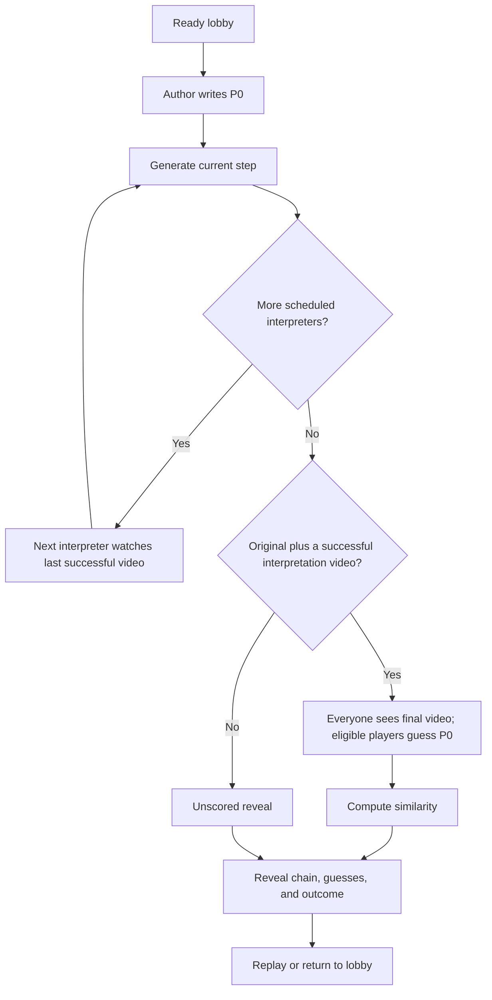

# Reverse Prompt: complete game specification

> Archived before simplification on 12 September 2026. Historical design only; implement the [current hackathon specification](../game-spec.md).

Version: 1.0 proposed MVP. Updated: 12 September 2026.

This document defines the player experience, rules, visibility, outcomes, and acceptance criteria for Reverse Prompt within VibeParty. The [technical specification](tech-stack-v1.md) defines its implementation. Provider evidence and untested assumptions are recorded in the [Reactor and VEED research](../../../research/reverse-prompt/README.md).

This is the detailed source of truth for Reverse Prompt. It preserves the core rules in the [shared app specification](../../../app-spec.md), and makes previously unspecified timing, eligibility, and recovery behavior explicit. These are implementation defaults, not evidence of an already built application.

## 1. Concept and intended experience

Reverse Prompt is a private video relay for three to eight friends. One person writes a scene, AI generates a short video, and the next person describes what they see. Their description generates a new video. After everyone has had a turn, the group watches the final scene and tries to guess the original prompt.

The entertaining moment is the reveal: a reasonable interpretation at each step can turn an astronaut's picnic into a robot wedding. Players compete through their final guesses, while the whole group enjoys how the idea changed.

The MVP supports people playing together with individual phone browsers and an optional shared display. Remote play also works through the same screens, without built-in voice or chat. English is the supported language. It is a casual contest: earlier participants remember different clues, so the score is not a ranked measure of prompting ability.

### Non-negotiable rules

- Each participant receives one scheduled generation turn: the author creates the original; everyone else interprets a video.
- A generation uses only the current player's text plus one fixed rendering instruction. Earlier prompts, videos, images, and model memory must not condition it.
- Before the reveal, only the next interpreter can retrieve the video assigned to their relay turn. The host has no extra access to hidden content.
- Final guesses are separate submissions, compared with the original player-written prompt.
- No AI writes an absent player's interpretation, improves a submitted prompt, guesses for a player, or decides the winner.
- A slow or unavailable optional avatar cannot stop the game.

## 2. Scope and default settings

| Included in the MVP | Deferred |
| --- | --- |
| Private rooms, join code/QR, guest identities, lobby readiness | Accounts, matchmaking, public rooms, public galleries |
| Three to eight players, one round at a time, replay | Tournament scoring, persistent leaderboards, teams |
| Private prompts, short videos, final guesses, full chain reveal | Uploads, voice input, interactive world navigation |
| Semantic scoring, ties, skipped steps, unscored outcomes | AI judges, prompt coaching, hints, rerolls |
| Reconnect, host transfer, timers, spending admission, reports | Mid-round joining, editing accepted submissions |
| Clearly labelled fixture mode for development/rehearsal | Automatic live-to-fixture substitution |
| Optional reusable animated host clips | Live conversational avatar, dynamic recap export |

| Setting | MVP value and meaning |
| --- | --- |
| Players at start | 3–8 ready, connected participants; host may play |
| Rounds per launch | One; start another from results |
| Author selection | Uniform random selection for the first round; rotate on replay |
| Relay order | Random permutation of every other participant, frozen at start |
| Author input | 45 seconds |
| Interpreter input | 45 seconds, including viewing/replaying the assigned clip |
| Final guesses | 45 seconds, including viewing/replaying the final clip |
| Input extension | Host may add 30 seconds once per author, interpreter, or guessing phase |
| Generation phase | 180 seconds total, including queue, generation, media preparation, and permitted retries |
| Scoring phase | 60 seconds total, including retries |
| Clip | Five seconds, landscape, muted by default; preserve the selected model's aspect ratio |
| Prompt and guess | 1–500 Unicode code points after normalization; also fit the pinned tokenizer/provider limits |
| Display name | 1–24 code points after trimming; duplicate names receive a visible suffix |
| Host absence | Transfer after 30 seconds disconnected |
| Room expiry | Two hours with no connected player or host; the shared display does not keep a room active |
| App data retention | Delete room content and media within 24 hours after room end/expiry |

Input clocks begin when the server publishes the phase with its authorized, playable media. They do not wait for an individual phone to acknowledge playback. This bounds stalled browsers and gives the room one authoritative deadline. The UI shows “Watch and describe — 45 seconds” or “Watch and guess — 45 seconds.” Browser loading and replay consume that window; the host can use the one extension for connection problems.

Only the extension and optional host presentation are host-adjustable in the first release. Generation preset, base timers, limits, and spending caps are server configuration. Freeze the selected configuration before starting; a replay can use a newly validated configuration. Estimates such as a four-minute round must be based on rehearsal measurements, not advertised provider streaming latency.

For planning, three full prompt windows plus one full guessing window total 180 seconds. If each of three generation phases takes an assumed 30 seconds, the round reaches scoring in about 4 minutes 30 seconds, excluding extensions and handoffs. Viewing is already inside the input windows in this specification; do not add it again as in the research's earlier illustrative pacing scenario.

## 3. Roles, room setup, and permissions

| Role | What they do |
| --- | --- |
| Host | Creates the room, starts a valid round, grants extensions, removes players, transfers hosting, aborts a round, or ends the room. Hosting can overlap any playing role. |
| Original author | Writes `P0`; watches the final video and reveal. Never submits a final guess or receives points. |
| Interpreter | Watches the assigned input video, writes one interpretation, and later submits a final guess. |
| Waiting guest | Joined after the round started; stays in the lobby until the next round. Receives no active-round prompts or media. |
| Shared display | A paired, read-only view showing public progress, the final video during guessing, and the reveal. |

### Room flow

1. The host enters a name, creates a room, and receives a join code and QR link. Creation can require the event's organizer access code.
2. Guests join with names. Names identify players visually, not for authentication. Refreshing the same browser restores its issued identity; entering the same name on a different browser does not claim it.
3. The lobby shows connected/waiting players, readiness, rules, the optional display pairing control, and whether the room is live or using fixtures.
4. Start is available with three to eight ready, connected players and successful service/budget admission. If admission fails, keep the lobby intact and show the actionable reason. Do not accept a partial start.
5. Freeze the roster, author, order, preset, timers, scoring version, and budget. Clear readiness for the next launch.

The first author is random. On replay, choose randomly among current participants with the fewest previous author turns in this room; exclude the immediately previous author when another equally eligible player exists. A new participant starts with zero author turns. Generate a new relay permutation for each round.

Host changes and removals appear in the public activity feed. If the host stays disconnected for 30 seconds, transfer control to the longest-present connected player, breaking identical join times by participant ID. A returning former host does not automatically regain control. A waiting guest can inherit administrative control but still cannot see active-round private content.

## 4. Round sequence

Use `Pi` for the accepted prompt at scheduled step `i`, and `Vi` for its successful video. Skips retain their original step indices; later steps are not renumbered.



The diagram shows the normal path. Failure transitions are defined in section 8.

### 4.1 Original prompt

The author sees a private editor, rules reminder, character/token feedback, and countdown. Guidance: describe visible subjects, actions, and surroundings. A non-submitted example may be shown: “An astronaut serves tea to penguins on the Moon.” The app must not supply a prompt when the author times out.

The server validates the text and locks the first accepted submission as `P0`. Submission is final. Generate `V0`; all players see progress only. The author cannot preview `V0` during the relay, because it is the next interpreter's private clue.

If the author does not submit or `V0` fails, finish through an unscored outcome. There is no replacement author within this round.

### 4.2 Interpret and regenerate

For the next scheduled, non-removed participant:

1. Assign the last successful video as this step's immutable input. It may come from more than one step earlier if intervening steps were skipped.
2. Publish the private input video and start the 45-second input phase. Show play, pause, replay, a plain-text editor, and “Describe what you see.” Never show the source prompt.
3. Accept at most one prompt. A rejected draft remains editable within the same deadline. Lock an accepted `Pi` and start its generation phase immediately.
4. Generate `Vi` from `Pi` alone. Once playable and approved, it becomes the last successful video. Advance to the next scheduled interpreter.
5. A timeout or failed result marks this step skipped and preserves the previous successful video. Continue automatically.

The interpreter loses future access to the assigned video when their input phase ends. They may still see their own accepted text; they cannot browse prior videos. The application cannot erase something already watched or recorded on a player's device.

### 4.3 Final video and guesses

After resolving every scheduled step, require `V0` and at least one successful interpretation-generated video. If that condition is not met, skip guessing/scoring and reveal the available chain unscored.

Otherwise, publish the last successful video to the frozen roster's remaining members and the shared display. Start the shared 45-second guess clock. All non-author roster members who have not been removed may submit one private guess, including players whose relay input or generation failed. Disconnected players retain eligibility until the deadline and can reconnect to submit.

The last scheduled interpreter can use “Use my description” if they have an accepted relay prompt. This copies their own text into the editable guess field; it does not submit it or imply that it is the correct answer. Other players can type any valid guess, including wording they remember writing.

Keep guesses and scores hidden. Close early when every participant who can still submit has an accepted guess; otherwise close at the deadline. Removal preserves an already accepted guess and ends any outstanding obligation to wait for that player's input. No submission may arrive after closure.

### 4.4 Reveal and replay

After scoring completes or its deadline expires, publish one immutable outcome. The reveal contains:

- Original prompt and author, subject to content restrictions.
- An ordered chain of every scheduled step: participant, accepted prompt if revealable, successful video, or a neutral skip/failure label.
- Explicit links between each step and its actual input, so skipped steps do not suggest a nonexistent video.
- All accepted final guesses, their scores when available, and missing-guess labels.
- Winner or joint winners, or the reason the round is unscored/has no winner.

Show an immediately usable overview with all reveal-authorized data. The host can cue a guided replay of the chain on the shared display; participants may inspect it at their own pace. Do not require a slow animation or avatar to unlock results.

Replay returns to the lobby, clears readiness, admits waiting guests to the next roster, and leaves the completed round read-only until room expiry. Scores are per round; do not aggregate them into a VibeParty leaderboard.

## 5. Screens and content visibility

| Screen/state | Active player | Others / shared display |
| --- | --- | --- |
| Home / join | Name, create/join, validation feedback | No room data before admission |
| Lobby | Roster, ready control, rule card, mode label | Same public lobby information |
| Author input | Private editor and own draft | Author name, step 1 of n, countdown |
| Generating | Own accepted submission acknowledgement, status | Step number, participant, elapsed time; no prompt/video |
| Interpreter input | Assigned input video, editor, timer | “Alex is describing the scene,” step number, countdown |
| Guessing | Final video, private guess editor if eligible | Author/display see final video and submission count only |
| Scoring | Waiting message; own accepted guess | Progress only; no partial scores |
| Reveal | Full authorized chain and final outcome | Same reveal for roster and display |
| Waiting / removed | Lobby / access-revoked message | No active-round private data |

Additional visibility rules apply even if an API or asset URL is requested directly:

| Data | Before reveal | At reveal |
| --- | --- | --- |
| Original prompt | Author can retrieve their own accepted text | Remaining roster + display |
| An interpretation | Its writer can retrieve their own accepted text | Remaining roster + display |
| Intermediate video | Only its currently assigned interpreter, only during that input phase | Remaining roster + display if available |
| Final video | Entire remaining roster + display from guessing start | Same |
| Final guess | Its writer only | Remaining roster + display |
| Scores / winner | No player access | Published together |
| Provider keys, session tokens, raw logs, hidden metadata | Backend only | Backend only |

“Remaining roster” excludes removed participants. Prior accepted records from removed participants remain part of the chain/outcome. Public here means public to this round, not accessible on the internet. A role restriction still applies when that player is the host. Provider readiness, posters, errors, filenames, and progress messages must not reveal hidden text.

## 6. Input and scoring rules

Normalize all prompts/guesses with Unicode NFC and outer-whitespace trimming. Count Unicode code points consistently across phone and server. Treat input as plain text; preserve meaningful punctuation, case, negation, and internal wording. The chosen tokenizer may apply its own fixed normalization. Enforce both the 500-character limit and the pinned scoring/provider token limits before acceptance; never silently truncate.

Empty input, input over the effective limit, or rejected content is not accepted and can be corrected before the original deadline. An accepted prompt/guess cannot be edited, withdrawn, or replaced. Validation in progress is not an accepted submission; the interface must distinguish them.

For every accepted final guess:

```text
a = normalized_embedding(normalized_original_player_prompt)
b = normalized_embedding(normalized_final_guess)
s = dot(a, b)
points = floor(100 * clamp(s, 0, 1) + 0.5)
```

Use the same pinned model, tokenizer, preprocessing, and scoring code for every guess. Compare with the original `P0`, never a provider-enhanced prompt or the final interpretation. Store the computed result once. Refreshing or retrying does not rescore it.

| Case | Result |
| --- | --- |
| Similarity 0.824 | 82 points |
| Similarity below 0 | 0 points |
| Identical valid normalized prompt and guess | 100 points |
| Highest integer score shared by accepted guesses | Joint winners; no speed-based tiebreak |
| Accepted guesses all score 0 | They tie for the highest score |
| Missing guess | Display 0 and “No guess”; cannot win |
| Original author | “Author — unscored”; excluded from ranking |
| No accepted guesses | No winner |
| Any required score still unavailable at the 60-second deadline | Entire round unscored; publish no partial ranking |

Winner candidates are only participants with accepted valid guesses, including a guess accepted before its writer was removed. Removal cannot erase a rival's score. Mark a departed winner accordingly. A score of 82 is displayed as “Similarity: 82 / 100,” with a brief explanation that meaning is compared and important details can be missed. It is not “82% accurate.”

## 7. Phase and timer contract

| Phase | Completion trigger | Timeout / exception |
| --- | --- | --- |
| `author_prompt` | Author prompt accepted | Unscored reveal |
| `generating_step` | Approved, playable asset recorded | Initial step: unscored; later step: skip |
| `relay_prompt` | Assigned interpreter prompt accepted | Skip and advance |
| `guessing` | All outstanding eligible guesses accepted | Close and score accepted guesses |
| `scoring` | All required scores stored | Unscored reveal after 60 seconds |
| `reveal` | Host returns to lobby or starts replay setup | No automatic paid work |
| `finished` | Historical completed round | Immutable |

The round stores a separate outcome: `scored`, `no_winner`, `unscored`, or `aborted`. Unscored rounds can still reveal approved content; an aborted round shows an end message without automatically exposing the chain.

Only the server advances phases. Deadlines are absolute server times and continue through refreshes, disconnections, and application restarts. A submission is accepted only if authorization, validation, and the final transaction succeed strictly before the deadline. At exactly the deadline, it is late. Clients reconcile their countdown with server time.

An extension must be accepted before the current input deadline and adds 30 seconds to that deadline once. If all required input is already accepted, the phase advances immediately and cannot be extended. Extensions do not alter generation/scoring deadlines, reset a player's turn, or apply to a future phase.

## 8. Failures, absence, and reporting

| Event | Required behavior |
| --- | --- |
| Player refresh / brief disconnect | Restore the same identity and only currently authorized state; keep deadlines and accepted input. |
| Interpreter never submits | Skip their step at timeout; no generated substitute text. |
| Current interpreter removed before submission | Skip immediately; pass the last successful video forward. |
| Player removed after submission | Keep the accepted prompt/job/guess; revoke future actions and media access. |
| Author removed before `P0` is accepted | End unscored. |
| Initial generation fails or is rejected | End unscored; show only content approved for reveal. |
| Later generation fails, is rejected, or times out | Record skip and continue with the last successful video. |
| No successful interpretation video | Unscored reveal; no guessing contest. |
| Only one valid final guess | That guess wins, provided the chain qualified for scoring. |
| Clip fails to load on one phone | Offer retry and playback-error report; keep the phase deadline. Host can extend an input once. Do not regenerate the clip. |
| An asset is globally unusable or withdrawn before final reveal | Abort scoring if the asset was already assigned as an interpreter's clue or guessing began; do not rewrite history or replace the clue mid-contest. An asset rejected before assignment follows generation-failure rules. |
| Host aborts | Stop new work, cancel/terminate in-flight work where possible, revoke private playback, and show the reason. No winner or automatic chain reveal. |
| All players disconnected | Stop admitting new paid sessions, allow existing work to settle, and keep deadline recovery running. If a generation phase cannot resume before its deadline, use its normal failure rule. |
| Late provider result after a skip/abort | Record for cleanup and cost accounting only; never insert it into the chain. |
| Budget/provider limit reached | Admit no unfunded work; fail the affected step using its normal rule. Keep successful earlier clips. |

Starting requires three players. Falling below three later does not erase accepted actions or automatically abort; resolve pending steps and apply the same minimum successful-chain and valid-guess requirements. A disconnected player is not automatically removed.

Players can immediately hide a clip on their device and report it. Reporting does not reveal the clip or its prompt to an otherwise unauthorized host; the host receives an opaque report and can abort. Hide a reported clip on the paired display when the host requests it. Confirmed unsuitable assets are withheld from all future playback. Once final results are published, a report or deletion does not recalculate scores; it can suppress the media or end the room.

If required moderation cannot complete, do not admit paid generation or publish unchecked media. Tell the affected player about the service failure without echoing hidden content. Content rejected before acceptance can be rewritten during the remaining input time. A later vendor rejection does not reopen a locked prompt or guarantee a refund.

## 9. Optional VEED presentation

The first host integration consists of reusable, pre-generated mascot clips: a rules introduction and generic encouragement while generation runs. It uses no room prompts, guesses, or player likenesses. Provide the same instructions in text, a mute control, and a skip control. Turn it off by default if assets are unavailable.

A later dynamic reveal may speak an original prompt or announce a winner only after those facts are publicly revealed. It must use the server's final outcome, run independently, and have text fallback. It may not leak hints, become the score judge, or add waiting to the relay. A live conversational host remains outside this MVP.

## 10. Accessibility, privacy, and experience quality

- Support current iOS Safari, Android Chrome, and desktop Chrome/Edge/Firefox/Safari at the time of release; record the tested versions. A 360-pixel-wide viewport must work without horizontal scrolling.
- Provide labelled fields, visible keyboard focus, keyboard-operable playback, readable contrast, large tap targets, and non-color status indicators. Announce phase changes accessibly without speaking every timer tick.
- Generated audio is not required. Preserve important visual content with letterboxing, explicit play/replay, and fullscreen. Do not add descriptive captions that disclose the answer before reveal. The visual guessing mechanic itself requires seeing the clip; a nonvisual variant needs separate rules.
- Respect reduced-motion settings for interface effects and disable automatic looping. Playback may require a user tap. Never depend on autoplay to complete a phase.
- Show queued / generating / preparing video with elapsed time. Only show percentages or estimated completion when backed by real data.
- Before joining, disclose that generation prompts go to Reactor and that submitted text and sampled output images use the configured moderation service. Generic pre-generated VEED host clips require no player data. Provide provider-retention information separately from VibeParty's deletion schedule.
- Rooms, media, guesses, and prompts are private. Public sharing/export, camera capture, voice cloning, and user uploads are not provided.
- Fixture rooms show a persistent “Rehearsal — prerecorded videos and mock scores” label on every device and the display. No mid-round mode change is allowed.

## 11. Acceptance criteria

| ID | Observable completion condition |
| --- | --- |
| RP-01 | Three independent browser sessions join, ready up, start, and complete a round with three distinct generated videos. |
| RP-02 | Every accepted generation contains only its assigned prompt plus the frozen template; no earlier media or model state is reused. |
| RP-03 | Direct snapshot, socket, poster, and media requests cannot reveal another player's hidden prompt, clue, or guess; host and display obey the same limits. |
| RP-04 | Refreshing during input, generation, guessing, and reveal restores identity/state without accepting duplicates or changing timers. |
| RP-05 | Only non-authors submit guesses; accepted guesses use `P0` for scoring; identical input scores 100; integer ties, missing guesses, and no-winner cases match section 6. |
| RP-06 | Initial failure ends unscored; intermediate failure skips; insufficient successful chain never produces a ranked contest. |
| RP-07 | Timeout/submission/extension races resolve once, at server-defined boundaries; missed turns cannot keep the round stuck. |
| RP-08 | Host disconnect, player removal, all-player absence, and late provider completion preserve accepted records and visibility rules. |
| RP-09 | Worker failure, duplicate delivery, and media-preparation retry do not blindly create a second paid generation or publish partial results. |
| RP-10 | Round admission reserves a valid budget; session caps stop orphan spending; live generation never silently switches to fixtures. |
| RP-11 | Reveal shows the actual chain, skipped steps, guesses, and one immutable outcome, with reports/unavailable content handled explicitly. |
| RP-12 | Three phone-sized sessions complete the game with keyboard-accessible controls; sound/optional avatar can be disabled without blocking play. |
| RP-13 | Closed/expired rooms revoke access and scheduled cleanup removes app-owned prompts, media, caches, and derived artifacts within the specified retention window. |
| RP-14 | One full three-player live rehearsal records actual generation-stage timing, total round time, provider failures, and spend. Fixture success alone does not satisfy this criterion. |

The [technical specification](tech-stack-v1.md) maps these requirements to data, API, worker, media, scoring, and deployment decisions.
