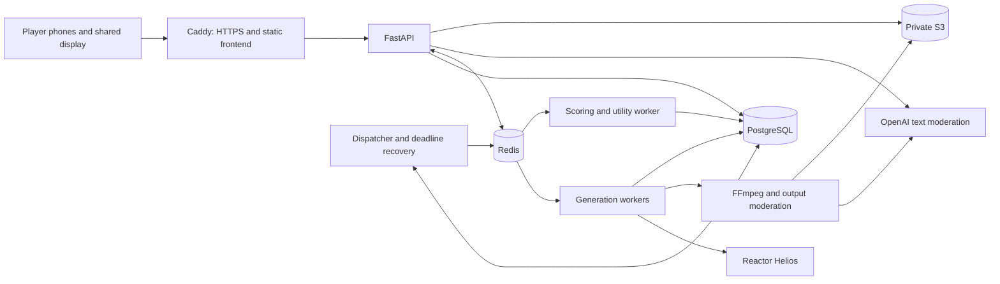

# Reverse Prompt: technology choices and technical specification

> Archived before simplification on 12 September 2026. Historical design only; implement the [current hackathon specification](../tech-stack.md).

Version: 1.0 proposed MVP. Updated: 12 September 2026.

Implement the behavior in the [game specification](game-spec-v1.md). This document selects the stack and defines architecture, contracts, data, generation, scoring, security, deployment, and validation. The [provider research](../../../research/reverse-prompt/README.md) contains the evidence, pricing examples, and documentation conflicts behind the Reactor/VEED choice.

These are implementation decisions, not claims of deployed or benchmarked software. Exact dependency patches, container digests, model hashes, provider credentials, and account quotas must be recorded during setup. A live release must pass the gates in section 14. This document specializes the [shared Python backend specification](../../../backend-spec.md), particularly its render-job abstraction, for Reactor's streaming sessions.

## 1. Selected stack

| Layer | Choice | Reason and boundary |
| --- | --- | --- |
| Player/display frontend | React 19, TypeScript, Vite | Interactive browser UI; static build served from the same origin as the API. No server-rendering requirement for private rooms. |
| Routing and server state | React Router, TanStack Query, native `fetch` and WebSocket | Explicit routes, authorized snapshots, and invalidation-driven refresh. The server owns game state. |
| Styling | CSS Modules with shared CSS variables | Small, responsive interface without an additional component framework. Native form and video controls where practical. |
| Frontend toolchain | Node.js 24 LTS, npm with committed lockfile | Build/test runtime only; no Node server in the deployed game path. |
| Backend runtime | Python 3.13, `uv` | Retains VibeParty's Python baseline and supports model/scoring workers. Pin a tested patch. |
| API | FastAPI, Pydantic v2, Uvicorn | Typed HTTP contracts, authentication, viewer-specific snapshots, and WebSockets. |
| Database | PostgreSQL 17, SQLAlchemy 2, psycopg 3, Alembic | Authoritative transactions, constraints, deadlines, budgets, and migrations. |
| Queue / notifications | Celery 5.6 with Redis | Background work and pub/sub; Redis is recoverable infrastructure, never the game database. Pin a compatible Redis release. |
| Scene generation | Reactor `reactor/helios` through `reactor-sdk` | Text-driven generation captured into short clips. A fresh backend-owned session per attempt. |
| Similarity | Sentence Transformers + CPU PyTorch; `sentence-transformers/all-MiniLM-L6-v2` | Local, versioned sentence embeddings; no external score judge or vector database. |
| Moderation | OpenAI Moderations API, `omni-moderation-2024-09-26` | A documented snapshot for text and image checks. This is an additional integration selected here to satisfy pre-generation moderation. |
| Provider HTTP | HTTPX; official OpenAI Python SDK for moderation | Explicit timeouts and retry control. Reactor media transport stays in its SDK. |
| Optional host | VEED `veed/fabric-1.0` through `fal-client` | Pre-generate generic speaking-mascot assets. Not a runtime dependency for relay or scoring. |
| Media processing | FFmpeg and ffprobe in bounded worker subprocesses | Inspect, remux/transcode, trim, strip metadata, create posters and moderation samples. |
| Asset storage | Private Amazon S3 through boto3 | Application-controlled retention and playback authorization. Local filesystem adapter for fixtures. |
| Hosting baseline | One Linux VM with Docker Compose, Caddy HTTPS proxy, private S3 bucket | A small demo deployment with persistent worker processes. No short-lived serverless generation handler. |
| Testing / quality | pytest, Ruff, mypy; Vitest, Testing Library, Playwright, ESLint, TypeScript checks | Domain, database, provider-contract, browser, and accessibility verification. |
| CI | GitHub Actions | Frozen installs, lint/types, migrations, relevant tests, and container builds. Live provider tests are explicit and budgeted. |

React's documentation identifies Vite, React Router, and TanStack Query as available building blocks; the choice to assemble a small SPA is specific to this app. Node lists version 24 as LTS. Python 3.13 and PostgreSQL 17 are deliberate supported baselines, not claims that they are the newest versions. [React SPA guidance](https://react.dev/learn/build-a-react-app-from-scratch), [Node releases](https://nodejs.org/en/about/previous-releases), [Python lifecycle](https://devguide.python.org/versions/), [PostgreSQL lifecycle](https://www.postgresql.org/support/versioning/).

### Alternatives considered

| Decision | Alternative | Why the selected approach fits this MVP |
| --- | --- | --- |
| Helios scene generation | VEED Fabric | Fabric animates an image using supplied audio; it is suited to the host presentation. |
| Independent generated clips | Shared navigable world / previous-video conditioning | Independent clips preserve the game's interpretation-only relay rule. |
| Backend-owned Reactor session | Give each player a Reactor token | A player needs one clue, not session operations or logs. The application mediates playback. |
| FastAPI + SPA | Add a second full-stack JavaScript backend | Room rules and workers already belong in Python; duplicate server ownership adds coordination. |
| PostgreSQL | In-memory room dictionaries / SQLite in production | Concurrent commands, restarts, and spending reservations require durable transaction behavior. |
| Local embeddings | LLM judging or remote embedding on each guess | The score formula can run locally with frozen weights, predictable inputs, and no network dependency. |
| CPU application workers | Rent an application GPU | Reactor performs video inference; the proposed sentence model is small enough to evaluate on CPU during the spike. |
| Native WebSocket notifications | Socket.IO, peer-to-peer game state | HTTP commands and authoritative snapshots cover the game contract. |
| Reusable VEED assets | Live conversational avatar | A public live-avatar contract was not established in the research. Runtime narration would add dependencies and delay. |

## 2. Architecture and process ownership



Use one modular Python codebase with separate processes. The API handles short commands and authorized streaming. Generation workers own SDK connections. A separate CPU/utility worker performs scoring, cleanup, and media-recovery jobs so a busy generation queue does not delay final scores. A dispatcher/recovery process publishes outbox work and resolves persisted deadlines.

Queue messages carry application IDs only. Disable Celery's result backend for game status; all authoritative results and recovery receipts live in PostgreSQL. Redis pub/sub carries public facts or invalidations, never private prompts or provider tokens.

Start with two generation worker processes, each executing one active session task. Initialize SDK/network resources inside the worker process, after fork. Each Celery task owns one bounded asyncio event loop for its Reactor runner. No SDK connection lives inside an HTTP request or a process-global object inherited across forks.

Use a 30-second database lease renewed every 10 seconds for active job ownership. Every state write checks the current lease generation/fencing token. Losing a lease stops further application writes and triggers session cleanup. A replacement worker reconciles the existing attempt; acquiring an expired lease does not authorize a second paid session.

Configure worker soft/hard time limits with a cleanup allowance beyond the 180-second game deadline, capped at 190/210 seconds. At task start, also enforce limits of remaining phase time plus 10/30 seconds, so time spent queued does not extend the cleanup window. These process limits do not extend gameplay or provider session caps. Set Redis visibility timeout above the longest task limit, initially 300 seconds, and verify acknowledgement/redelivery behavior. Celery documents both idempotent task requirements and Redis visibility-timeout redelivery. [Celery tasks](https://docs.celeryq.dev/en/stable/userguide/tasks.html), [Redis broker behavior](https://docs.celeryq.dev/en/stable/getting-started/backends-and-brokers/redis.html).

## 3. Repository and version policy

```text
frontend/
  package.json, package-lock.json
  src/
    api/                 # Generated types, fetch, authorized snapshot cache
    routes/              # Home, lobby, player, display, reveal
    components/          # Video, countdown, prompt editor, score, chain
    styles/
  tests/
backend/
  pyproject.toml, uv.lock, .python-version
  src/vibeparty/
    main.py, config.py
    api/                 # HTTP, sessions, CSRF, WebSocket, projections
    domain/reverse_prompt.py
    services/            # Transactional commands, deadlines, reservations
    persistence/         # Tables and queries
    generation/          # Reactor runner, fixture adapter, capability registry
    moderation/          # Text/image adapter and versioned policy
    scoring/             # Frozen model and formula
    media/               # Processing, storage, authorized range streaming
    jobs/                # Tasks, leases, outbox, recovery, cleanup
  migrations/
  tests/
fixtures/reverse-prompt/  # Labelled videos, scenario manifests, mock scores
deploy/                  # Container definitions, Compose, Caddy config
docs/games/reverse-prompt/
```

This is the intended layout; these code files do not exist yet. Generate frontend API types from FastAPI's OpenAPI schema. Keep domain transitions independent of ORM objects, HTTP, SDKs, and real clocks.

Pin dependencies in both lockfiles and images by digest. Resolve the scorer to an immutable model-repository commit, download weights/tokenizer at build or setup time, and record checksums. Use local-only model loading during play, with remote code disabled. Freeze a release manifest containing build ID, schema version, SDK versions, scoring revision, moderation snapshot/policy version, provider slug, preset, and rendering-template version.

If Reactor cannot expose an immutable hosted model revision, record that limitation and the available schema/preset identifiers. Do not claim reproducible video output; the application can freeze what it sends, but cannot guarantee an unchanged hosted implementation. Do not upgrade adapters or models during an active round.

## 4. Persistence and invariants

Use UUID identifiers, UTC timestamps, and relational columns for identity/authority. JSONB holds validated frozen presets or provider descriptors, not the entire mutable room. Required records specialize the shared schema:

| Record | Required fields / constraints |
| --- | --- |
| `Room` | Join-code hash/lookup, host participant, mode, lifecycle, sequence, last human presence, expiry, cumulative budget. One active round. |
| `Participant`, `Session` | Identity independent of name; hashed random session credential, role, expiry, revocation. Track every browser session separately. |
| `Round` | Game, author, frozen configuration/versions, phase, phase version, deadline, extension-used flag, final input asset, outcome, reveal cue. |
| `RoundParticipant` | Frozen membership, unique order, author flag, removal state. Membership remains after removal. |
| `Submission` | Round, step, writer, accepted original/normalized text, effective request text, moderation receipt, accepted time. Unique `(round_id, step_index)`. |
| `RelayStep` | Index, assigned participant, immutable input asset, submission, job, output asset, status, skip reason. Unique `(round_id, step_index)`; step 0 is the author. |
| `GenerationJob` | Unique logical key `(round_id, step_index)`, deadline, state, attempt limit, lease owner/generation/expiry, error category. |
| `GenerationAttempt` | Unique `(job_id, attempt_number)`, session/token reference, clip receipt, terminal evidence, timestamps, cap, reserved and settled amount. Tokens encrypted and excluded from logs/responses. |
| `MediaAsset` | Opaque object key, checksum, duration/dimensions/codec/MIME, poster key, moderation status, availability, expiry; never a public storage URL. |
| `Guess`, `Score` | Unique guess per round/participant and score per guess; accepted text, input hash, scorer versions, raw finite cosine, integer points. Author cannot have a guess. |
| `BudgetReservation` | Room/round/attempt allocation, USD cents, provider credits, rate snapshot, state; allocations do not double-count the parent reservation. |
| `IdempotencyRecord` | Actor/route/key, normalized request hash, pending/accepted/rejected result, stored response, expiry. Same key with different body returns conflict. |
| `OutboxEvent` | Durable task/invalidation event and room sequence, publication state. Payload contains IDs or public data only. |
| `AssetReport` | Reporter, asset, reason code, visibility action, timestamp. Do not copy private prompts into a host notification. |

Check actor, step, and original-author exclusions inside the same transaction that writes a submission or guess. Foreign keys must keep assets/jobs tied to the correct round. Use uniqueness as a final defense against concurrent duplicates.

### Command transaction

1. Authenticate and validate the request envelope; obtain or replay its idempotency record. Rate-limit before external work.
2. For text, perform normalization, token-length checks, and bounded moderation outside long-held room locks. A pending idempotency record suppresses parallel copies of this validation.
3. Lock room then round in a consistent order. Recheck session revocation, role, roster, current phase/version, step, server time, and the moderation result's exact text/policy hash.
4. Apply one legal transition, reserve/allocate funds if needed, persist job/outbox records, and update versions atomically.
5. Commit, then publish notifications/work. A crash before publication is repaired from the outbox.

Use `phase_version` for authority and `sequence` for room notification ordering. Accepting one guess increments sequence but does not invalidate another player's simultaneous guess. An input extension changes phase version because its authority/deadline changes; rejected stale clients refresh and retry within the updated deadline.

Deadlines use `now < deadline_at`; equality is late. The recovery process runs once per second and on authorized snapshot recovery using the same locks as player actions. Terminal outcomes are irreversible. There is no provider call while holding a database transaction open.

## 5. HTTP, WebSocket, and frontend contract

Use `/api/v1` and same-origin cookies. All authenticated mutations require CSRF protection and `Idempotency-Key`; phase-scoped actions require `expected_phase_version`. Actor identity comes from the session, never a supplied participant ID.

| Method / route | Contract |
| --- | --- |
| `POST /rooms` | Create guest host/session and room; validate organizer admission, name, and mode. |
| `POST /rooms/join` | Join by code and name; late arrivals become waiting guests. |
| `GET /rooms/{room_id}` | Viewer-specific snapshot, server time, sequence, phase version, permitted actions. |
| `POST /rooms/{room_id}/ready` | Set caller readiness while in lobby. |
| `POST /rooms/{room_id}/rounds` | Host starts Reverse Prompt after roster/service/budget admission. |
| `POST /rounds/{round_id}/prompts` | `{kind: "author" | "relay", step_index, text, expected_phase_version}`; only the assigned writer. |
| `POST /rounds/{round_id}/guesses` | `{text, expected_phase_version}`; author excluded; one accepted guess. |
| `POST /rounds/{round_id}/extend` | Extend current input phase once; no generation/scoring extension. |
| `POST /rooms/{room_id}/participants/{id}/remove` | Host removal with preserved accepted records. |
| `POST /rooms/{room_id}/host-transfer` | Transfer administration to a connected room participant. |
| `POST /rounds/{round_id}/abort` | Abort with a public reason code; stop admission and request cleanup. |
| `POST /rounds/{round_id}/reveal/advance` | Host changes public replay cue after reveal; never changes scores or content authorization. |
| `POST /rounds/{round_id}/finish` | Host returns to lobby, marks old round finished, resets readiness. |
| `POST /rooms/{room_id}/end` | End room, revoke access, start retention/cleanup. |
| `POST /rooms/{room_id}/display-pairings` | Host issues single-use, 60-second display pairing code. |
| `POST /display-sessions` | Redeem pairing into a read-only cookie; never a host session. |
| `GET /assets/{asset_id}/playback` | Authorize current viewer and return application stream/poster routes. |
| `GET /assets/{asset_id}/stream` | Authorized GET/HEAD and byte ranges; revalidate on every request. |
| `GET /assets/{asset_id}/poster` | Same current visibility check as the video. |
| `POST /assets/{asset_id}/reports` | Caller currently authorized for asset may report/hide it locally. |
| `POST /assets/{asset_id}/display-hide` | Host suppresses an already public-to-display clip; grants no private viewing access. |
| `WS /rooms/{room_id}/events` | Authenticated public invalidations, phase/progress, and reveal cues. |

Room/join/display bootstrap routes are the authentication exceptions: use allowed-origin checks, rate limits, and a browser-generated bootstrap nonce for idempotency. A join code locates a room and cannot authorize snapshots. Keep phase/history reads behind the authenticated snapshot rather than adding an unrestricted history endpoint.

Return `202` only after a prompt is accepted and its job is persisted; include an application job ID, not provider credentials or IDs. Return ordinary accepted-command responses for guesses and controls. A still-validating duplicate may receive `202` with an explicit `validation_pending` status; it must not imply acceptance or creation of a generation job. The client resolves uncertainty through the same key and a fresh snapshot.

Use `401` for expired authentication; `404` for inaccessible private content; `403` for visible actions the role cannot perform; `409` for stale phase/duplicate conflicts; `422` for invalid or rejected content; `429` for admission limits; and `503` for unavailable required validation. Error bodies contain `code`, safe `message`, `request_id`, and recovery action. Never pass through provider errors verbatim.

### Authorized snapshot shape

```json
{
  "room_id": "room-uuid",
  "mode": "live",
  "sequence": 42,
  "server_time": "2026-09-12T14:05:00Z",
  "round": {
    "id": "round-uuid",
    "phase": "relay_prompt",
    "phase_version": 7,
    "deadline_at": "2026-09-12T14:05:45Z",
    "step_index": 1,
    "step_count": 3,
    "active_participant_id": "participant-uuid",
    "outcome": null
  },
  "viewer": {"role": "player", "can_submit_prompt": true},
  "private": {"input_asset_id": "asset-uuid", "own_submission": null}
}
```

The example is for the authorized interpreter. Construct separate player/display projections: other viewers receive no `private.input_asset_id`, provider descriptor, or hidden text. Do not serialize a full ORM graph and remove fields in JavaScript. Own accepted text may be returned only to its writer before reveal.

WebSockets send content-free invalidations or facts already public to all recipients. On initial connection, reconnect, sequence gap, or stale response, fetch a fresh snapshot. Poll every five seconds during active play as a fallback, coalescing with notifications. Deduplicate old sequences. Clear obsolete private video/poster references and blobs immediately on a phase change or revocation. Keep drafts in memory/session storage scoped to room, round, and input kind; never auto-submit restored drafts, and clear them at room exit/expiry.

## 6. Reactor adapter and media pipeline

### Frozen preset

Select `reactor/helios`, text-only conditioning, native landscape aspect ratio, default 2× output as the initial spike preset, and a normalized five-second clip at 24 fps. Verify the actual dimensions against the selected preset before enabling it. The initial preset sends no explicit seed; retain any returned seed as backend-only provenance. Player rerolls and seed controls are disabled.

Helios documents text prompts, chunk-based streaming, and video-only output. Its overview lists 640×384 native and 1280×768 at 2×. Session recording and Python downloading are separate APIs. [Helios overview](https://docs.reactor.inc/model-api-reference/helios/overview), [Helios commands](https://www.reactor.inc/models/helios/api), [Reactor recordings](https://docs.reactor.inc/concepts/recordings).

Initial rendering template `reverse_prompt_scene_v1`:

```text
Show one continuous short visual scene depicting the following description.
No added captions, subtitles, or narration.
Description:
{accepted_player_text}
```

This is an application prompt proposal to evaluate, not a guarantee that the model follows every instruction. Insert the accepted text unchanged. Do not run it through a prompt-rewriting model. Store both the original and effective request, but score only the original.

### Job lifecycle

```text
queued -> submitting -> running -> preparing_media -> succeeded
                    -> submission_unknown -> reconciliation
any nonterminal state -> rejected | failed | timed_out | cancelled
```

`preparing_media` covers capture/download, conversion, checks, moderation, and storage. A generation is successful only when its stored asset is approved and playable before the phase deadline. Keep separate attempt/session lifecycle fields; a downloadable result can need media repair after its GPU session has ended.

Implement the adapter as an application-owned asynchronous `render(request, context, observer)` operation inside a worker, with `context` carrying cancellation, deadline, and the current lease. `observer` persists safe progress and receipts. Query persisted jobs for API status. A Reactor session is not a vendor render job that can be assumed to support HTTP polling.

### One attempt

1. Check remaining phase time, human presence, job lease, cancellation, moderation, and budget. Reserve the account-wide session slot and creation-rate token before connecting.
2. Mint a backend-only token scoped to `reactor/helios`, `max_sessions=1`, and `max_session_duration_seconds` no greater than the remaining phase time (maximum 180). Persist encrypted auth material needed for recovery until cleanup. A token's own expiry does not replace the session-duration cap. [Reactor authentication](https://docs.reactor.inc/authentication).
3. Create a fresh SDK session; persist its ID immediately. Set the prompt and start once. Record allocation and first-frame times. The Python SDK can receive the JWT directly. [Python client](https://docs.reactor.inc/sdk-reference/python/reactor).
4. Observe enough generated media for the five-second selection. Use the first five seconds of complete, decodable generated media from the new run, with no quality-based take selection. Capture a bounded full recording of this short fresh session so a trailing-window offset does not choose different content. Verify the pinned SDK's actual event fields and media timestamps; do not infer duration from elapsed wall time alone.
5. Persist the clip descriptor before teardown. Request it while connected; download before the deadline. Reactor's Python helper writes MPEG-TS, requiring remuxing or transcoding for the MP4 asset. Once a successful spike establishes that a receipt survives session termination, disconnect after receipt persistence and download without holding the GPU; until then, keep the session only as long as bounded export requires. [Recording capture/download](https://docs.reactor.inc/concepts/recordings).
6. Terminate the creator session in cleanup on success, cancellation, timeout, or exception. Do not retain a session while someone types. Track termination evidence separately; disconnecting a client that only adopted the session does not end its owner's session. [Session ownership](https://docs.reactor.inc/concepts/sessions).
7. Validate and store media, then atomically publish success if the job/phase/lease still permits it. Late completion remains unavailable and cannot replace a previously chosen input.

Recording must be enabled on the account/model. Exact media boundaries, readiness after termination, and orphan cleanup remain live contract tests. If the SDK cannot capture the defined deterministic segment, revise and version the preset before starting any live round; do not silently choose arbitrary frames during play.

### Media limits and visibility

- Initial limits: 100 MiB downloaded source, 10 MiB final clip, 20-second processing subprocess limit, and no more than 15 seconds of captured source for this preset. All limits are application defaults to validate during the spike.
- Normalize to a five-second MP4 with H.264, `yuv420p`, constant 24 fps, no audio, and fast-start metadata. Accept duration within one frame of five seconds. Preserve the full scene/aspect ratio; no crop. Remux only when it already satisfies the contract, otherwise transcode.
- Drop embedded tags that might contain prompts, authors, or URLs. Preserve any provider-required attribution in a neutral, non-clue-bearing form and verify output-use requirements before release. Use opaque storage and download names.
- Decode a poster and moderation images from the normalized asset. Publish none of them until checks succeed. Poster authorization equals video authorization.
- Allow downloads only from configured provider/storage hosts; validate redirects and resolved destinations, rejecting private-network targets. Never fetch a player-supplied URL. Run FFmpeg with restricted protocols, CPU/memory/time limits, and per-job temporary directories.
- Enable S3 Block Public Access and use scoped backend credentials. Serve all gameplay media through the authorized application stream route for the MVP, including after reveal, so removing a participant stops future requests. Do not cache private responses in a shared CDN. [S3 public-access controls](https://docs.aws.amazon.com/AmazonS3/latest/userguide/access-control-block-public-access.html).
- Support browser ranges, correct content length/type, and `Cache-Control: private, no-store`. Reauthorize each GET/HEAD/range request. Bytes already delivered cannot be revoked from a device.

## 7. Scoring and moderation

### Scorer

Select `sentence-transformers/all-MiniLM-L6-v2` at one immutable repository revision. The model card describes 384-dimensional sentence embeddings, an Apache-2.0 license, and default truncation beyond 256 word pieces. Disable truncation in validation: reject any normalized prompt/guess whose encoded length, including required special tokens, exceeds the pinned model's `max_seq_length`. Resolve and expose that exact limit at setup. [Model card](https://huggingface.co/sentence-transformers/all-MiniLM-L6-v2).

Use NFC and outer trimming for both sides. Do not remove stopwords, negate words, translate, or stem text. Run CPU inference in evaluation mode with one pinned dependency/hardware configuration, normalized embeddings, and the cosine/rounding formula in the game specification. Sentence Transformers documents cosine-based semantic comparison. [Similarity API](https://www.sbert.net/docs/sentence_transformer/usage/semantic_textual_similarity.html).

Embed `P0` once and batch the accepted guesses. Validate finite values and vector shapes; NaN, inference failure, or missing model files is an error, not zero. Persist input hashes, exact versions, raw similarity, and integer scores in one finalization transaction. Return the stored values thereafter. Require identical normalized inputs to produce 100 after rounding. The UI ranks only accepted guesses, excluding the author and missing entries.

Before selecting the immutable revision, evaluate a fixed set of paraphrases, unrelated scenes, changed subjects/actions, and negation examples. Record its known mistakes. A simple release gate is that the intended paraphrase outranks the unrelated guess for every curated test group; do not require or claim reliable negation understanding. Retry scoring only within its 60-second deadline, then reveal the entire round unscored if any required result is still unavailable.

### Moderation policy `party_moderation_v1`

OpenAI documents `omni-moderation-2024-09-26` as a snapshot supporting text and image inputs. It is not a video/audio model. Select that explicit snapshot for the initial evaluation rather than silently moving an alias during a round. [Moderation model](https://developers.openai.com/api/docs/models/omni-moderation-latest).

Use the standalone Moderations endpoint to check exact normalized display names, submitted prompts, effective generation requests, and final guesses. Reject a result with `flagged=true`; treat a missing/failed result as unavailable. Cache identical content only within the room, keyed by policy/model/text hash. An external request occurs before acceptance and outside the locked game transaction. [Moderations guide](https://developers.openai.com/api/docs/guides/moderation).

Set a five-second timeout for a validation attempt, with at most one bounded retry if time remains. The original input clock continues. A player can correct rejected input; no Reactor session starts until the accepted text and its effective request pass. Rate-limit retries to avoid creating a moderation flood. Guess moderation adds an external check before acceptance; the similarity calculation itself stays local.

Before making a video available, inspect extracted images at two frames per second plus the final frame, at most 11 samples for the five-second clip. Send bounded image batches and reject the asset if any result is flagged. This is a proposed sampled-image check, not comprehensive video understanding; it can miss content between frames. Validate sampling and category coverage with rehearsal examples. Keep reporting/host-abort controls, and never describe an unchecked or merely sampled clip as guaranteed safe.

Reactor also screens submitted content and may terminate a session after billing starts. Preserve that rejection separately from preflight rejection. If the provider explicitly flags accepted text, withhold that text from the reveal pending the application's content policy; never echo it in a public error. [Reactor moderation](https://docs.reactor.inc/resources/content-moderation).

Moderation must be configured before live admission. If it is unavailable, return a recoverable service error for input or fail the affected media job at its deadline. Fixture mode uses clearly labelled deterministic moderation fixtures. Do not substitute a keyword list or let a host override a rejected result.

## 8. Spending, quotas, and retries

Store budgets in integer USD cents and raw provider credits with an explicit rate snapshot. Round each conservative reservation upward to cents; never round a positive sub-cent charge to zero. Set initial operator-configurable caps to **$5 per room** and **$25 per demo deployment**, with two concurrent app-owned generation sessions and one account-wide rate limiter. These are proposed limits, not purchases or measured costs.

Reserve a round's worst-case admitted attempt allowance before start:

```text
per_attempt_cents = ceil(max_session_seconds * credits_per_second
                         / credits_per_dollar * 100)
round_reservation_cents = players * max_attempts * per_attempt_cents
```

Use a maximum of two paid attempts per step, both within the same 180-second phase deadline. Reserving the full duration for both is deliberately conservative. With the research's published Helios rate of 17 credits/second and 10,000 credits/USD, the example is 31 cents per capped attempt: $1.86 for three players or $4.96 for eight with two attempts allowed. Recheck rates and rederive reservations before live admission. Storage/compute and optional host preparation need separate operator budgets. [Reactor billing](https://docs.reactor.inc/resources/billing), [dated price evidence](../../../research/reverse-prompt/README.md#cost-and-pacing).

The round reservation is allocated to attempts, not charged again on every nested record. Release unused allocations only after success/terminal evidence; retain the maximum for uncertain sessions until bounded reconciliation or conservative settlement. Account-wide consumption includes other VibeParty games and external uses of the same provider account. Query/dashboard-check actual quotas at setup; never assume our two workers control the entire account.

| Failure type | Retry rule |
| --- | --- |
| Rejected content, invalid preset, authentication error | Terminal; do not resubmit. |
| Confirmed capacity/rate refusal before session creation | Wait `Retry-After` within the original deadline, then retry admission. |
| Connection timeout with uncertain session creation | `submission_unknown`; persist all available receipts. No blind second creation. |
| Active connection temporarily lost | Recover the same session only if the pinned SDK supports and proves ownership; keep its budget reserved. |
| Confirmed terminated failed session, no usable clip | One new paid attempt allowed if lease, remaining time, and reservation permit it. |
| Clip download, conversion, storage, or output-check transport failure | Retry against the saved clip/result within deadline; no new video generation. |
| Job redelivery or process restart | Inspect persisted attempt first; do not treat it as a fresh request. |
| Phase already ended / room aborted | Settle and clean up; no retry that can reenter the game. |

Reactor's hosted submission idempotency/reconciliation contract was not established by the research. Application idempotency prevents duplicate commands and jobs, but does not promise exactly-once provider billing. A crashed worker's session cap is mandatory. Cleanup must reconcile owner termination rather than assuming an adopted client's disconnect released the GPU.

The scheduler continues existing deadlines when everyone disconnects but admits no new paid sessions. A queued accepted prompt can start if a human returns before its deadline; otherwise the normal initial/later-step failure rule resolves it. Close abandoned rooms after two hours without human presence. Displays do not trigger continued spending.

## 9. Optional VEED host preparation

Implement an offline/operator asset-preparation command, not a public generation endpoint. Use one owned mascot image, supplied/recorded generic audio, and `veed/fabric-1.0` at 480p. Store and approve the resulting rules/encouragement clips like bundled presentation assets. Record their provenance and captions/transcript separately from player-created clues.

Fabric requires image, audio, and resolution and returns a video file; fal handles its queue/access. It does not synthesize arbitrary speech from text in the documented schema. [Fabric contract](https://fal.ai/models/veed/fabric-1.0/api).

The live runtime needs neither `FAL_KEY` nor a fal network call to play pre-generated host assets. If the host feature is enabled but an asset fails, show the rule text. A later dynamic reveal would need a separately budgeted audio-generation step, fal job receipt, deadline, and authorized reveal payload; it is outside MVP completion.

Do not integrate VEED's live-avatar waitlist into the runtime or use Fabric as a fallback relay scene generator. See the [research limitations](../../../research/reverse-prompt/README.md#veed-findings).

## 10. Authentication, privacy, and retention

- Use cryptographically random opaque session cookies, hashed at rest, with `HttpOnly`, `Secure`, and `SameSite=Lax`. Use HTTPS, allowed-origin checks, CSRF tokens, and WebSocket origin/session validation. Revalidate revocation on every action/read, including reconnects.
- Issue a short random join code unique among active rooms, initially six unambiguous uppercase letters/digits. Rate-limit lookup attempts; the code grants no existing identity or private read access.
- Retain role/round membership checks on historical reveals. A guest who joined late must not gain access to an earlier round merely because the room now has a different active roster.
- Rate-limit create/join, names, submissions, extensions, reports, token creation, and external calls. Bound JSON bodies, input sizes, file bytes, and subprocess resources. Scope idempotency keys to authenticated actors, or bootstrap nonces before authentication.
- Put provider keys in operator-injected secrets; never put them in frontend environment variables. Redact cookies, CSRF tokens, JWTs, raw text, signed URLs, and raw provider messages from logs. Escape all user text in HTML.
- Tell users that Reactor receives generation requests; OpenAI receives submitted text and sampled generated images for moderation. Generic VEED assets contain no room content. Provider policies are distinct from application deletion; verify current account handling before enabling live mode. [OpenAI data controls](https://developers.openai.com/api/docs/guides/your-data).
- Set `content_delete_at` to room end/expiry plus 24 hours. Revoke access and enqueue content cleanup immediately; retry failures hourly and finish by that deadline. Delete database content, object versions if any, posters, temp files, moderation samples, token/clip receipts, draft caches under application control, and orphan/late outputs. Clean temporary files immediately after each job and use a storage lifecycle rule as a backstop.
- Do not keep long-lived backups of ephemeral room content in the demo. Any backups introduced later need an explicit retention policy consistent with the product. Keep only content-free aggregated operational/spending totals after content deletion; settle unresolved charges conservatively before discarding detailed receipts.

All authoritative privacy checks belong to the API/worker, not frontend hiding or client-supplied roles. A reported video ID must not let an unassigned host obtain its media. An output rejected after use as a clue invalidates scoring before reveal as specified; a report after published results can suppress media without rewriting the outcome.

## 11. Deployment and configuration

Use a persistent Linux x86_64 VM, initially a four-vCPU/eight-GiB rehearsal target, with Docker Compose services for Caddy, API, PostgreSQL, Redis, generation workers, utility worker, and dispatcher. This is a capacity hypothesis to measure, not a guarantee. Store clips in private S3; database volumes survive container restarts. Run API/workers as non-root and expose only HTTPS publicly.

Build Python on a Debian 12-compatible glibc base, initially the Python 3.13 slim Bookworm image pinned by digest, with FFmpeg installed. Reactor's native wheels require a compatible platform; Linux distribution requirements include glibc 2.34+. Avoid assuming an Alpine/musl image works. [Reactor SDK distribution](https://pypi.org/project/reactor-sdk/).

Caddy serves the static Vite build, terminates HTTPS, and proxies API/WebSocket traffic. The same origin avoids cross-site cookie setup. Configure WebSocket and range-stream timeouts explicitly. Verify outbound WebRTC/ICE connectivity from the generation container during the live spike, not just ordinary HTTPS reachability. FastAPI documents building a project-specific container for deployment. [FastAPI containers](https://fastapi.tiangolo.com/deployment/docker/).

| Configuration | Required policy |
| --- | --- |
| `APP_MODE` | `fixture` or `live`, frozen per room; deployment controls permitted modes. |
| `DATABASE_URL`, `REDIS_URL`, `PUBLIC_ORIGIN` | Required, validated at startup; credentials excluded from logs. |
| `REACTOR_API_KEY`, `REACTOR_MODEL` | Backend only; allowlisted model `reactor/helios`. |
| `GENERATION_PRESET_VERSION`, `RENDER_TEMPLATE_VERSION` | Required manifest entries; match tested media contract. |
| `GENERATION_PHASE_SECONDS`, `MAX_GENERATION_ATTEMPTS` | 180 and 2; attempts share the deadline. |
| `PROVIDER_SESSION_CAP_SECONDS` | At most 180 and clamped to remaining phase time at each attempt. |
| `PROVIDER_CONCURRENCY`, `PROVIDER_CREATION_RATE` | App default concurrency 2; creation rate from verified account quota. |
| `ROOM_BUDGET_CENTS`, `DEPLOYMENT_BUDGET_CENTS` | Initial proposed 500 / 2500, operator-set; no client override. |
| `PROVIDER_RATE_SNAPSHOT` | Credits/second, exchange rate, timestamp, and maximum reservation basis. |
| `OPENAI_API_KEY`, `MODERATION_MODEL`, `MODERATION_POLICY_VERSION` | Required in live mode; selected snapshot and evaluated policy. |
| `SCORING_MODEL_ID`, `SCORING_MODEL_REVISION`, `SCORING_MODEL_PATH` | Pinned model ID, immutable commit and local cached weights; no first-guess download. |
| `S3_BUCKET`, `S3_REGION`, storage credentials | Private bucket; scoped access; no public ACLs. |
| `HOST_ASSET_MANIFEST` | Optional approved local/storage asset list; no runtime key needed. |
| `FAL_KEY` | Only the operator's optional asset-preparation environment. |
| `ORGANIZER_ACCESS_CODE` | Required for demo room creation; guest joins still use room code. |

Run migrations as an explicit release step. Validate database connectivity, scorer files, presets, and moderation configuration before live admission. Provider health should disable starting new live rounds without making ordinary room navigation fail readiness. Rehearse one application and one worker restart while a session is in progress.

A single VM is acceptable for the hackathon but is a host-level failure point. Keep backups/recovery and capacity claims limited to what has been exercised. Horizontal scaling can add API/worker replicas using the same database leases, outbox, and global quotas; it is not part of the first release.

## 12. Observability and operating targets

Log structured events with request, room/round/job IDs and phase/attempt metadata, excluding private content. Track:

- Room admission, join errors, authenticated command latency, stale/duplicate actions, and reconnect recovery.
- Queue/allocation time, first-frame time, captured duration, download/conversion/moderation/storage latency, submission-to-playable time, and session billed duration.
- Success/rejection/skip/unknown-submission counts, missed termination confirmation, expired leases, and outbox lag.
- Reserved/settled/uncertain spending, concurrent sessions, quota failures, scoring duration/failures, and cleanup overdue items.
- Optional host playback failures separately from game failures.

Expose `/health/live` for process health and `/health/ready` for required local service/model readiness. Keep secret-free operator diagnostics for provider health and pending cleanup.

Initial targets: p95 below 300 ms for ordinary commands excluding external moderation; committed phase notification within one second; median submission-to-playable below 30 seconds during the live sample; every generation phase resolves within 180 seconds and scoring within 60 seconds. Report moderation time separately from ordinary command time. These are acceptance targets, not measurements.

Exercise the room system with ten rooms of eight players using fixtures. A live provider-load test must respect verified quotas and an explicit spend cap. Record sample size, region, container build, account preset, and all observed failures with each latency report; a few demo runs cannot establish reliable p95 generation performance.

## 13. Verification mapped to game requirements

| Layer | Essential checks | Game criteria |
| --- | --- | --- |
| Pure domain tests | Author rotation, schedule/skip propagation, phase deadlines/extensions, removal eligibility, no-winner/unscored outcomes, score clamp/rounding/ties | RP-02, RP-05–08 |
| PostgreSQL integration | Simultaneous guesses, duplicate prompt transactions, timeout races, unique jobs, atomic reservations/outbox, fencing against stale workers | RP-04, RP-07, RP-09–10 |
| Provider contracts using fixtures | Unknown session creation, termination/lease loss, missing recording, late output, invalid media, bounded retries, paid-generation independence | RP-02, RP-06, RP-09–10 |
| Authorization | Host/display/author/interpreter access matrix; guessed IDs; wrong room; removed/late guests; historical rounds; posters and range requests | RP-03, RP-08, RP-11 |
| Scorer evaluation | Pinned revision/token limits; identical/paraphrase/unrelated/negation cases; persisted results; all-or-nothing final ranking | RP-05 |
| Browser E2E | Three isolated sessions, all phases, refresh, delayed media, host transfer, guesses, skipped chain, reveal/replay, mobile layout and mute | RP-01, RP-04, RP-06, RP-08, RP-11–12 |
| Recovery / retention | API/worker/Redis restart, outbox repair, no blind paid resubmit, token expiry, late/orphan cleanup, room deletion across storage and DB | RP-09–10, RP-13 |
| Opt-in live rehearsal | Real private text-only clips, export/playback, moderation, owner termination, full three-player round, real cost/time report | RP-01–03, RP-10, RP-14 |

CI runs frozen dependency installation, Ruff lint/format, mypy, TypeScript/ESLint, meaningful tests, and migrations against an empty PostgreSQL database. Use deterministic fixture responses and a fake clock for ordinary tests. Provider credentials are absent from default CI; a fixture round with mock scores is never reported as live integration success.

## 14. Delivery order and live release gates

1. **Foundation:** implement schemas/migrations, sessions/rooms, domain transitions, authorized snapshots, and fixture media. Complete a three-session fixture relay including guesses/reveal.
2. **Scoring and moderation:** pin/evaluate the local model and moderation snapshot. Verify text limits, score finalization, output-sample policy, error handling, and provider-data disclosure.
3. **One real clip:** confirm Reactor account access, recording availability, preset, rate/cap behavior, fresh-session prompt isolation, deterministic capture, private S3 copy, phone playback, and creator termination.
4. **Durability:** implement lease/outbox repair, unknown-submission handling, same-result media recovery, deadline/abort cleanup, and conservative spend accounting. Prove safe behavior before turning on multiple live rooms.
5. **Full live game:** complete a three-player chain and final guesses; exercise one intermediate failure, reconnect, and host transfer; record timing/cost and privacy results.
6. **Presentation:** add approved reusable VEED host assets, accessibility polish, and guided reveal cues. Skip unavailable optional assets without changing game completion.

Do not enable live play until credentials, exact release versions, rate snapshot, model-recording support, media contract, moderation checks, session cap/termination, and private playback have passed. Hosted idempotency and immutable model revision remain limitations if the provider does not offer them; the application must handle uncertainty as specified rather than fabricate support.

The implementation is complete when all mandatory [game acceptance criteria](game-spec-v1.md#11-acceptance-criteria) pass and the live-rehearsal report records actual results. Dynamic avatar narration, an alternative world model, or a public sharing feature is not required for that milestone.
