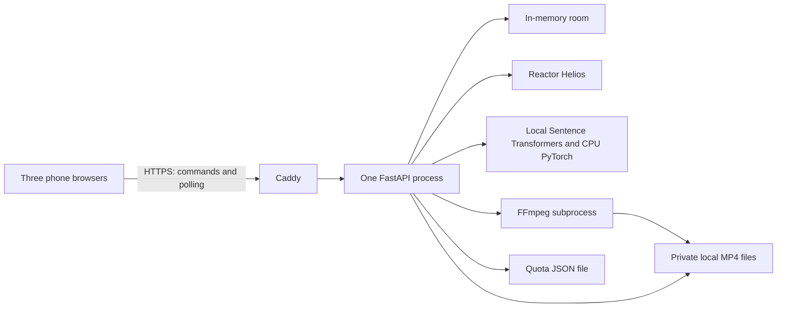

# Reverse Prompt: hackathon technical stack

[All docs](../../README.md) · [Game spec](game-spec.md) · [Simplification](simplification.md) · [Research](../../research/reverse-prompt/README.md)

Version: 2.1 demo scope. Updated: 12 September 2026. Status: selected design, not installed or runtime-verified.

**The stack is sufficient for the three-player demo.** Use one persistent Python application, in-memory game state, and private local video files. The outstanding feasibility test is turning a fresh Reactor stream into a playable five-second clip within the demo's time budget. Follow the [game specification](game-spec.md); this document replaces the broader [backend requirements](../../backend-spec.md) for Reverse Prompt. See [before and after](simplification.md) and the [archived architecture](archive/tech-stack-v1.md).

## 1. Stack we will use

**Reactor Helios generates all three relay videos. Sentence Transformers scores guesses locally. No OpenAI API key or service is required.** Live video generation still requires Reactor credentials; their availability has not been verified in this documentation review.

| Layer | Choice | Purpose |
| --- | --- | --- |
| Browser UI | React 19, TypeScript, Vite, CSS Modules | One responsive page, phase components, native video playback |
| Browser communication | Native `fetch`; one-second polling | Submit commands and retrieve an authorized snapshot |
| Frontend tooling | Node.js 24 LTS, npm lockfile | Build static assets; no JavaScript server in production |
| Backend | Python 3.13, FastAPI, Pydantic 2, Uvicorn | Rules, guest cookies, validation, media authorization, provider calls |
| State and concurrency | Python dataclasses/dictionaries, `asyncio.Lock`, retained asyncio task references | One room and one generation at a time, in one process |
| Video generation | Reactor Helios, `reactor-sdk` | Fresh text-only video session for each relay step |
| Video preparation | FFmpeg and ffprobe | Produce and validate a short browser-compatible MP4 |
| Similarity scoring | Sentence Transformers, `sentence-transformers/all-MiniLM-L6-v2`, CPU PyTorch | One local embedding batch for the original and two guesses, then cosine scoring |
| Input handling | Local format/token validation; Reactor's generation-input filters | No separate app content classifier; presenter can stop/reset |
| API client | `reactor-sdk`; HTTPX if needed for Reactor token minting | Reactor requests with explicit timeouts; no embedding API client |
| Media and tiny persistent guard | Private local directory; one small JSON quota file | Temporary videos plus a restart-safe session allowance/block |
| Deployment | One persistent Linux VM, one Uvicorn worker, Caddy HTTPS | Same-origin frontend/API; no queue, database, or object store |
| Python tooling and checks | uv lockfile, pytest, Ruff; TypeScript compiler | Reproducible dependencies and focused rule/privacy checks |
| Optional presentation | Manually exported VEED intro MP4 | Static asset only; no `fal-client` or VEED runtime key required |

React documents Vite as a SPA building option. Node 24 and Python 3.13 are supported baselines; resolve compatible patch versions and commit lockfiles during implementation. No exact dependency set has yet been installed. [React guidance](https://react.dev/learn/build-a-react-app-from-scratch), [Node releases](https://nodejs.org/en/about/previous-releases), [Python lifecycle](https://devguide.python.org/versions/).

## 2. Small architecture and ownership



FastAPI serves the built frontend and API. Use `--workers 1`; disable auto-reload for the demonstration. Multiple workers would have separate room dictionaries, so replicas and autoscaling are unsupported. Persistent generation work also rules out short-lived serverless request handlers. [FastAPI worker documentation](https://fastapi.tiangolo.com/deployment/server-workers/).

Retain references to generation/scoring tasks on application state and clean them up through application lifespan. Normalize and validate text locally, then use a short lock to check role/round/phase, accept one immutable submission, and advance state. Never hold the lock across provider I/O or inference. After asynchronous work, recheck room, round, phase, and submission IDs before publishing. Reset invalidates the round immediately and signals active work to stop. Stale work can clean up its own files but cannot publish to another round.

Use async SDK calls where supported; keep blocking calls off the event loop with `asyncio.to_thread`. Run FFmpeg as a bounded subprocess and terminate it on cancellation. Cancelling an await does not kill a blocking thread: the task still owns provider cleanup and its private temporary directory until work finishes. Keep new generation blocked until that cleanup is resolved. [Python asyncio tasks](https://docs.python.org/3.13/library/asyncio-task.html).

Suggested files are sufficient: `frontend/src/App.tsx`, `api.ts`, `components/`, and `styles/`; `backend/app/main.py`, `game.py`, `reactor_video.py`, `scoring.py`, `media.py`, and `tests/`. Avoid a game plugin framework, generic workflow engine, repository layer, or provider marketplace abstraction.

## 3. State and HTTP contract

Keep one `Room` containing its random ID/code, three player records, host ID, and current `Round`. Each player has a server-issued random guest token. A round holds its ID, phase, step index, three immutable prompts, three local media descriptors, two guesses, final scores/outcome, and submission receipts. No history survives reset or restart.

```text
lobby → author_input → generating(0) → relay_input(1)
      → generating(1) → relay_input(2) → generating(2)
      → guessing → scoring → reveal
Any generation failure → error; host reset → lobby
```

| Route | Contract |
| --- | --- |
| `POST /api/room` | Organizer code and name create the only room; reject if one exists |
| `POST /api/join` | Room code and name claim a free lobby slot; issue guest cookie |
| `GET /api/state` | Return only this guest's public state, own accepted text, and allowed media IDs |
| `POST /api/start` | Host only; exactly three players, scoring model ready, no unresolved session, at least three unused attempts |
| `POST /api/submit` | Round ID, expected phase/step, client submission UUID, text; server derives player/role |
| `POST /api/reset` | Host only, expected round ID; stop current work and return to lobby when cleanup permits |
| `GET /api/media/{media_id}` | Authenticate and recheck current phase/role; support byte ranges |

Return `200` with the submission receipt after local validation and acceptance; generation or scoring continues in its retained task. Same ID/body returns the same receipt without scheduling duplicate work. Different content for the same ID, a filled slot, or the wrong phase returns `409`. Invalid text returns `422` without occupying the slot; corrected input uses a new UUID. Store duplicate receipts only for the current round. Check Start/Reset under the same lock and reject stale host commands. Join retries from an already issued guest cookie return that guest instead of consuming a slot.

Poll every second while visible, immediately on focus and after commands, with one request in flight and a short error backoff. Show a connection message after repeated failure. Snapshots carry room/round ID and monotonically increasing revision; ignore older responses. Replace private UI state when its phase permission ends. Input drafts stay component-local and clear on round change.

Use a random opaque `HttpOnly`, `Secure`, `SameSite=Strict` guest cookie, same-origin fetch, JSON-only mutations, and an Origin check. Names and room codes are not identity. Keep the organizer code server-side and apply simple per-IP attempt limits to create/join. Secrets and Reactor tokens never reach the browser. A restart invalidates guest sessions; no recovery account is necessary.

Resolve media IDs through the current round's server map, never a client-supplied path. Authorize every GET/HEAD/range request using the game's visibility table and send `Cache-Control: private, no-store`. Do not mount the private media directory as static files. A copied URL does not grant access. Local cleanup does not retract a clip someone already watched or captured.

## 4. Reactor integration and essential limits

Use model `reactor/helios`, main video only, no audio, and a fresh creator-owned session per accepted prompt. The input is that prompt plus one fixed instruction, such as “A single continuous shot depicting the described scene. No captions or on-screen text.” Keep the original player text separately for scoring. Never pass previous prompts, images, videos, or session state into the next generation. Helios supports this text-only scene role. [Helios documentation](https://docs.reactor.inc/model-api-reference/helios/overview).

The implementation spike must prove this exact sequence:

1. Persist one consumed attempt and set the unresolved-session guard before contacting Reactor. Create a token limited to `reactor/helios`, one session, and **90 seconds maximum session duration**. Passing a JWT means the limit belongs in that token; do not assume the SDK constructor overrides it.
2. Connect with recording enabled, send the one prompt, and start generation. Collect at least five seconds of usable new-session output, stopping collection by 15 seconds of source media. The 90-second application deadline includes connection, capture, download, and MP4 preparation.
3. Request the recording while the session is ready and download it before disconnecting. Use the documented recording path that the installed SDK actually supports; verify response types and callbacks during the spike. Do not infer a complete clip from a single chunk event.
4. Terminate the creator-owned session in `finally` immediately after the needed source has downloaded, or on error/reset. Record successful termination before clearing the guard. The provider-side duration cap remains the fallback if the process dies.
5. Take the first five seconds of recorded video using a fixed trim policy; never select a best take. Make a silent H.264/yuv420p MP4, 24 fps, preserving the source aspect ratio, with faststart and source metadata removed. Use ffprobe to inspect codec/duration and a bounded FFmpeg decode to reject corrupt output before publication. Bound source download to 100 MiB, output to 10 MiB, and conversion/validation to 20 seconds within the remaining application deadline. Publish only to the matching active round.

Reactor recordings must be enabled and requested before disconnect; the documented Python download is MPEG-TS rather than a finished MP4. Creator-owned disconnect terminates the session, while an adopted session has different ownership behavior. Verify these on the pinned SDK before building the rest of the game. [Recordings](https://docs.reactor.inc/concepts/recordings), [Python SDK](https://docs.reactor.inc/sdk-reference/python/reactor), [Token authentication](https://docs.reactor.inc/authentication).

**Use one active provider session, one attempt per step, and no automatic session-creation retries.** Initialize a persistent `demo-quota.json` explicitly with nine remaining attempts and no unresolved session. Decrement atomically before connection, never refund ambiguous attempts, and never replenish on room reset or process restart. A missing/corrupt guard file blocks live mode until the operator initializes or repairs it. Do not bake automatic quota initialization into startup.

Keep the unresolved flag set if termination is uncertain or the process crashes. The presenter/operator checks the provider session has ended before explicitly clearing it; gameplay reset cannot clear it. This replaces a durable job reconciler with a manual recovery step. Nine attempts allow up to three complete live rounds, including rehearsal; failed attempts reduce that allowance. This is an attempt limit, not a dollar billing ledger. Session duration matters because Reactor bills active ready time, including idle time. [Session limits](https://docs.reactor.inc/resources/rate-limits), [Billing](https://docs.reactor.inc/resources/billing).

## 5. Scoring and text moderation

Keep **Sentence Transformers with `sentence-transformers/all-MiniLM-L6-v2` and CPU PyTorch**, as in the original design. The model produces 384-dimensional embeddings and defaults to truncating inputs beyond 256 word pieces. Validate normalized text with the pinned tokenizer without truncation; reject input beyond the model's actual `max_seq_length`, including special tokens, in addition to the 300-code-point limit. Expose the token limit and corrective error to the UI. [Model card](https://huggingface.co/sentence-transformers/all-MiniLM-L6-v2).

Download a pinned model/tokenizer revision during setup and record its immutable commit in the deployment manifest. Keep these files outside disposable round media. Load them from the local model directory once at startup, run a warm-up, and disable Start if loading/self-test fails. No model download, hosted inference, or API key is needed while scoring a round. Exact revision and compatible dependency versions remain to be locked and tested during implementation.

Encode `[P0, guess_B, guess_C]` once in a local batch on CPU with normalized embeddings, evaluation mode, and identical preprocessing. Use `asyncio.to_thread` so inference does not block polling/media requests. Require three complete finite nonzero vectors of the expected size; calculate cosine and rounded scores using the game formula and store the result once. Sentence Transformers documents cosine-based semantic comparison. No vector database, LLM judge, or separate scoring service is required. [Similarity documentation](https://sbert.net/docs/sentence_transformer/usage/semantic_textual_similarity.html).

Keep the 15-second scoring deadline; inference failure or timeout produces an unscored reveal. A timed-out thread may still finish, so retain its reference, discard stale results, and do not start another inference on that model until it finishes. Warm-up and offline scoring checks must pass on the demo server. This restores a local model/dependency footprint while removing scoring-network calls.

There is **no separate app moderation API** in the demo. Local validation checks format and length; render names/guesses as plain text. Reactor screens generation input and may terminate a rejected session after billable time starts. Do not describe these checks as a free preflight or comprehensive output moderation. Use benign prompts and presenter stop/reset; dedicated name/guess classification, output-frame scanning, reports, and audit tables are deferred. [Reactor moderation](https://docs.reactor.inc/resources/content-moderation).

## 6. Deployment and optional VEED

Use a persistent Linux/glibc VM compatible with the Reactor SDK wheel, Python 3.13, CPU PyTorch/Sentence Transformers, FFmpeg/ffprobe, and a private writable data directory. Begin with 2 vCPU/4 GiB as a sizing hypothesis; measure warm model memory, inference latency, and conversion memory together before the event. No application GPU is required by this CPU-scoring design. Serve the Vite build through FastAPI behind Caddy TLS. Keep the API and frontend on one HTTPS origin. Build tools and the initial model download run at deployment time. Docker Compose is not required. [Reactor SDK distribution](https://pypi.org/project/reactor-sdk/).

Required configuration: `REACTOR_API_KEY`, `ORGANIZER_CODE`, `PUBLIC_ORIGIN`, `MEDIA_DIR`, `DEMO_QUOTA_PATH`, and `EMBEDDING_MODEL_PATH` pointing to the downloaded, pinned model. The quota and model files must survive service restarts and deployments; keep them outside disposable build/round directories. Round media is ephemeral. On startup delete stale round media, start with an empty lobby, load/warm the local scorer, and preserve any unresolved-session flag. Never log credentials or player content; phase, latency, error category, and remaining attempt count are enough.

VEED is optional polish: create one generic intro manually, export an MP4, and play it as a static asset. No runtime call, queue, TTS integration, or avatar conversation is required. The researched Fabric API animates a supplied image/audio pair; that does not replace Reactor's scene-generation job. If there is no ready VEED export, omit the intro. [VEED/Fabric research](../../research/reverse-prompt/README.md#veed-findings), [Fabric API](https://fal.ai/models/veed/fabric-1.0/api).

## 7. Build order and evidence needed

| Order | Deliverable | Exit check |
| --- | --- | --- |
| 1 | One Python Reactor-to-MP4 spike | Live clip plays on actual phones; session termination and cap verified; record total latency |
| 2 | One-room game loop with fixed local clips | Three browsers reach reveal; refresh and private access work |
| 3 | Live Reactor adapter | Three independent generations complete; duplicate submission and forced failure handled |
| 4 | Local Sentence Transformers scorer and final result UI | Pinned model preloaded; offline exact/paraphrase/unrelated examples, token limit, ties, and inference failure checked |
| 5 | Hosted rehearsal | Three people finish live; private files, restart guard, reset, and phone playback checked |
| 6 | Optional visual polish/VEED intro | Core demo still passes; no added runtime dependency |

Use focused pytest checks for role/phase authorization, duplicate and stale submissions, cosine rules, failed scoring, session quota, and reset during generation. Check TypeScript and Ruff; rehearse the full flow in three browser sessions, including one real phone. A separate browser testing stack, migration tests, multi-room load tests, and a broad CI matrix are deferred. These checks map to [DEMO-01 through DEMO-08](game-spec.md#7-demo-acceptance).

No live API calls, SDK installation, latency measurements, or application tests were performed for this documentation change. The design is sufficient; the provider-to-phone spike is the remaining feasibility gate. If that fails, fix or deliberately revise the demo before proceeding; never silently substitute prerecorded output for a claimed live round.
