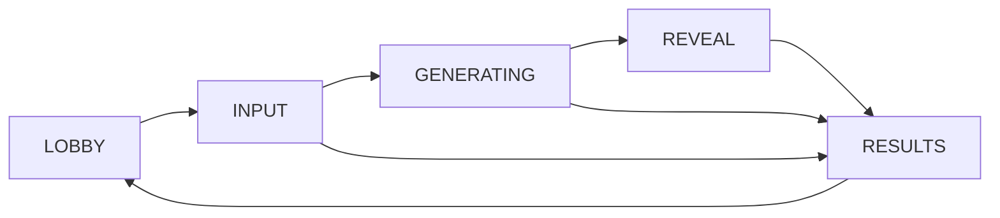

# Word by Word: hackathon game specification

[All docs](../../README.md) · [Technical stack](tech-stack.md) · [Test scenarios](test-scenarios.md) · [Simplification](simplification.md) · [Research](../../research/word-by-word/README.md)

Status: simplified demo design, 12 September 2026. This replaces the earlier broader MVP specification. The repository still contains planning documents, not an implemented game.

Build one complete moment: **friends secretly contribute words, phrases, or short sentences, then watch their ideas become additions to the same video scene**. Consequences remains the selected reference. See the [technical plan](tech-stack.md), [before-and-after comparison](simplification.md), and [reference note](../../research/word-by-word/consequences.md).

## 1. Demo scope

- One room at a time, with one to four players on phones. The host chooses the player count in the lobby; the default is three.
- One host laptop is the shared screen and controls the reveal. The host role does not occupy a player slot; the presenter may separately join on a phone.
- Four contributions and four connected video segments, approximately six seconds each.
- Private collection before generation, followed by a host-controlled reveal and replay.
- Cooperative, with no scoring or voting.

This specification owns Word by Word's demo rules and acceptance; its [technical stack](tech-stack.md) owns implementation. The [app specification](../../app-spec.md) defines the wider product boundaries. Other games remain separate plans.

## 2. Contributions and assignments

| Order | Category | Phone instruction | Example | Visible effect |
| --- | --- | --- | --- | --- |
| 1 | Place | “Where does the story happen?” | Enchanted forest | Establish the setting. |
| 2 | Character | “Who appears in the scene?” | A fox wearing a crown | Introduce the character in that setting. |
| 3 | Action | “What does the character do?” | Dances ballet | Make that character perform the action. |
| 4 | Consequence (Scene change) | “What happens around them?” | Glowing snow begins falling | Add the effect around the existing character and scene. |

Every phone prompt includes: “Write a word, phrase, or short sentence. Keep it to one idea.” Categories guide the contribution; they do not require a particular grammatical form. A word such as `forest` or `dancing` is still valid.

Use the [standard category examples](test-scenarios.md) for future tests. They provide a shared theme plus Character, Action, and Scene change answers. In this four-slot demo, enter the theme as Place and map Scene change to Consequence using the assignments below.

Assign slots round-robin in player join order. One player gets all four slots. With two players, the first gets place and action, and the second gets character and consequence. With three players, the first gets place and consequence, and the others get one slot each. With four, everyone gets one. Keep the order and selected player count for rematches. No randomization service, category settings, or extra templates.

Each contribution is 1–120 Unicode code points after trimming surrounding whitespace. This is the demo's short-text limit; spaces, punctuation, and non-ASCII text are allowed. Preserve wording, capitalization, and punctuation. Do not enforce a word count, sentence count, or an `-ing` ending for actions. Show concrete examples and a character counter before submission; let players correct empty or over-limit input without truncating it. A small versioned input filter checks the full contribution for configured disallowed words; the provider may reject further input during generation. Categories and the one-idea instruction are guidance, without an AI grammar judge.

An accepted contribution locks. Repeating the same submission returns the same accepted result; trying to replace it is rejected. A rejected contribution can be corrected until the deadline. Never autofill or silently rewrite an answer.

The final story presents the disclosed contributions in category order, with a label and contributor name on each card. Use this layout for words, phrases, and sentences alike:

```text
Place: Enchanted forest
Character: A fox wearing a crown
Action: Dances ballet
Consequence: Glowing snow begins falling
```

The cards together form the story. Keep the exact accepted text; do not insert it into the former single-sentence template or use an extra model to rewrite it. Partial results show only disclosed cards. Reveal text and cards must wrap to show the full contribution on phones and the host screen.

## 3. Play a round

1. **Join:** the presenter runs the app locally on the host laptop and opens the host screen with a configured host passcode. It shows a join URL using the laptop's LAN address and a four-digit room code following the [shared standard](../../shared/room-code-spec.md), including leading zeros. The host selects one to four players, who join by name on phones over the same Wi-Fi or hotspot. The lobby accepts up to the selected count. The host can change it while waiting, but must reset the party before reducing it below the number already joined. A QR code is optional polish; a working join URL and code are enough.
2. **Start:** once the selected number of players has joined, the host presses **Start**. Freeze the roster and player count, and assign the four slots. No ready check, late joins, or waiting list.
3. **Write:** players have 45 seconds to submit their assigned contributions privately. The host sees only the number collected. Begin generation immediately when all four are accepted. If time expires with a missing contribution, show an incomplete-round message and offer another round. No timer extension.
4. **Generate:** show “Preparing your story” and the number of saved clips. Build and capture all four in order. Each receives only its own contribution and earlier scene facts. Never show future contributions or previews on the host screen.
5. **Reveal:** once usable clips are saved, the host presses **Play**. Show the first contribution, contributor, and clip. After watching it, the host presses **Next** to reveal the next addition. Phones display the disclosed contributions; everyone watches video on the shared screen. Each contribution produces one segment, regardless of its word count.
6. **Replay:** after the last available clip, show the disclosed story and contribution cards. **Replay** plays those saved clips in order. **Another round** clears the old round and returns the same players to the lobby.

The reveal is deliberately manual: the presenter can pause for a laugh or retry a local playback problem. There is no synchronization across phone video players, automatic advancement, or separate recovery phase.

## 4. Video behavior

Use Reactor FastH3 as the integration candidate with one fixed illustrated style, a wide view, and minimal camera movement. Continue each segment from the preceding one and reinforce established facts in the prompt. Interpret each contribution in its assigned category and the established scene; an action such as “They start breakdancing.” applies to the existing character. Strip audio; render contribution text and contributor names in the app.

In the primary test scenario, the forest must remain recognizable when the crowned fox appears; the same fox and crown must remain when ballet starts; the dancing fox must remain when glowing snow appears. A character being regenerated with a different appearance is a quality issue, not the intended additive effect.

Four independent clips or a single final clip containing all contributions do not meet the demo objective. Brief holds between segments are acceptable. The video model's continuity remains unverified until a live trial passes.

Keep the final frame visible between steps where practical. Use ordinary browser video controls for pause/replay. Native replay of the current disclosed clip does not require a server transition or another generation.

## 5. Small state machine



`REVEAL` initially means the clips are ready with no contribution publicly disclosed yet. The host's first play action reveals index zero; each next action advances once. When the host finishes the last clip, move to `RESULTS`. A result can be complete, partial, or have no video; these are labels, not scores or additional phases.

Host **End round** works during input, generation, and reveal. It stops new work and shows only already disclosed history. A rematch has a new round ID, so a late result from an old generation task cannot change it.

## 6. Limits and simple failures

| Situation | Demo behavior |
| --- | --- |
| Collection | 45 seconds; missing input ends the round without generation. |
| Generation | 120 seconds total, including provider startup and saving clips. Each step also has a 30-second ceiling, capped by the overall deadline. |
| Provider session | One at a time, scoped to FastH3, with a verified provider-enforced 180-second maximum. No automatic paid retries. |
| Rehearsal spending | At most three live session attempts per server run by default; only the presenter can start them. The counter is not durable across restarts. |
| A generation step fails | Stop the chain. Allow a reveal of the saved valid prefix, labelled “Partial story.” Never skip a failed middle step and build later contributions. |
| No usable clip | Explain that generation failed; the host may start a new round when the old session is closed. |
| Shutdown confirmation is late | Keep saved clips playable. Continue provider cleanup separately and block another live session until closure is confirmed. |
| A player refreshes | The same browser cookie restores their identity while this server process remains alive. |
| Host disconnects | Reopen the host screen in the same browser. No automatic host transfer. Existing input/build deadlines still apply. |
| Video stalls | Use replay/reload on the host screen. No regeneration or special recovery timer. |
| Server restarts | The room is lost; rejoin and start again. Verify the previous provider session is closed before enabling new live generation. |

Aim for a roughly two-minute demonstration using the tested preset, and measure this during rehearsal. It is a pacing target, not a vendor latency claim; the maximum generation timeout can make a round longer, and the host controls reveal pauses.

Keep the current replay only. Clear app-held contributions and clips on another round, room reset, or room closure, and expire the room after 30 minutes without a join, submission, or host action. Status polling does not extend this timer. Remove leftover app-owned temporary clips at server startup. Provider retention is separate from this local cleanup.

## 7. What we keep and defer

Keep private contributions until their reveal, server-held provider credentials, slot ownership checks, one generation task, generation limits, and saved replay. These protect the demonstration's central behavior.

Keep readable phone layouts, labelled inputs, keyboard controls, high contrast, and a large shared video. Phones need only forms, status, and revealed text. No output classifier is added for the demo: use the configured input filter/provider checks and a host **Hide video / End round** control. Do not claim those checks guarantee safe or faithful output.

Defer multi-room operation, five-to-eight-player support, extra categories, accounts, host migration, paired displays, synchronized mobile video, durable restart recovery, paid rerolls, quality-report storage, public sharing, downloadable exports, and detailed telemetry. VEED narration/subtitles and Helios continuous steering are also deferred, not included in the demo build.

Fixture mode is a separate, clearly labelled rehearsal option selected before a round. It uses fixed example contributions and prerecorded clips together. It must not accept arbitrary contributions and pretend a canned video was generated from them, or silently replace a failed live round.

## 8. Demo acceptance

The demo is ready when these checks pass on the actual host and network:

1. Three phones join the host screen, submit all four slots, and complete the reveal. Also check four-player assignment once. Exercise words, phrases, and short sentences, including an action without an `-ing` ending and punctuation/non-ASCII text. Verify empty and over-120-character answers can be corrected, and accepted text appears in full and unchanged at reveal and results.
2. Complete three live runs using the [standard test scenarios](test-scenarios.md): `WW-CAT-01` (Enchanted forest) twice and `WW-CAT-02` (Space station) once, with the theme entered as Place and Scene change mapped to Consequence. Record a named alternative if the group selects `WW-CAT-03` or `WW-CAT-04` for the variation. Verify the category instructions and example answers on the phones. Each reveal shows its addition while retaining the earlier scene. Save timings and review actual video, not just command acknowledgements.
3. Replay works after the provider session closes, using the saved clips without a new generation request.
4. Inspect a host snapshot and attempt to request a future clip: neither exposes hidden contributions/media. A player cannot submit another player's slot or start generation.
5. Duplicate submission/start/next actions do not duplicate accepted contributions, sessions, or reveal advances. One provider timeout produces a bounded partial/failed result.
6. Refresh a phone and the host; reset the server once to confirm that a lost room is explained. Confirm generation stops, secrets stay on the backend, and files are cleared on reset.

Record results in the [research directory](../../research/word-by-word/). Broader load testing and the earlier five-story, all-device qualification matrix are deferred. No live provider verification has been performed yet.
