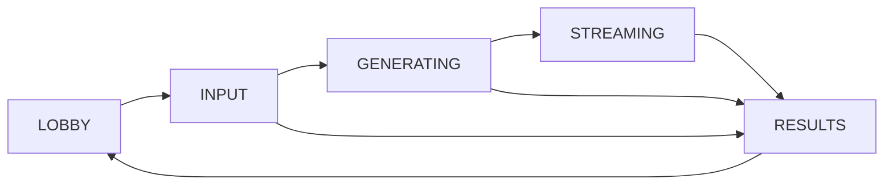

# Word by Word: continuous story

[All docs](../../README.md) · [Technical stack](tech-stack.md) · [Test scenarios](test-scenarios.md)

Status: LingBot World 2 implementation, 16 September 2026. This replaces the four-clip FastH3 flow.

Friends privately contribute four ideas, then watch them enter **one continuous video** automatically. The host does not play or advance separate clips. Generated visual quality is trusted; there is no quality review, scoring, or regeneration gate.

## 1. Demo scope

- One room, one host laptop, and one to four players on phones. The default is three players; the host display does not occupy a player slot.
- Four categories in a fixed order: Place → Character → Action → Consequence.
- One LingBot World 2 session, one continuously played video, and one saved recording for replay.
- Private collection before generation. Automatic category updates during the stream, approximately six seconds apart by default.
- Cooperative, with no scoring or voting.

## 2. Contributions and assignments

| Order | Category | Phone instruction | Example |
| --- | --- | --- | --- |
| 1 | Place | Where does the story happen? | Enchanted forest |
| 2 | Character | Who appears in the scene? | A fox wearing a crown |
| 3 | Action | What does the character do? | Dances ballet |
| 4 | Consequence | What happens around them? | Glowing snow begins falling |

Each form says: “Write a word, phrase, or short sentence. Keep it to one idea.” Assign slots round-robin in join order. One player writes all four; with two players each writes two; with three the first writes Place and Consequence; with four each writes one. Rematches preserve the roster and assignments.

Each contribution is 1–120 Unicode code points after trimming surrounding whitespace. Preserve exact wording, capitalization, punctuation, and non-ASCII text. Empty, over-limit, invalid Unicode, and configured filtered text are rejected with correctable feedback. The categories guide players without an AI grammar check. Accepted text locks; duplicate identical submissions are idempotent. Ownership is enforced by the server. Never autofill a live player's contribution.

The fixture rehearsal uses the exact `WW-CAT-01` examples and one scripted 24-second video. It is clearly labelled, never represented as generated output, and cannot accept unrelated fixture answers.

## 3. Play a round

1. **Join:** the host opens the laptop screen (with a passcode when required) and chooses 1–4 players. Phones join with a name and the shared four-digit room code. Codes can start with zero. No late joins or waiting list.
2. **Start:** in live mode, the host chooses a starting-image source for this round: generate with Codex, upload an image, generate through the OpenAI API, or use the configured server image. Upload requires a valid still PNG, JPEG, or WebP up to 10 MiB and 16 megapixels; the host sees a private preview and ready status. When the selected number has joined and the source is ready, freeze the roster and assign the categories.
3. **Write:** collect all four contributions privately within 45 seconds. The host sees only the count. Missing input ends the round without generation.
4. **Prepare:** after all four answers are accepted, use the selected image source, then open a LingBot World 2 session. Both generation sources use only the first joined player’s accepted Place answer, regardless of submission order. Codex uses the host’s saved ChatGPT login through `codex exec`; API generation requires `OPENAI_API_KEY`. An uploaded or configured image supplies the scene directly and should match Place. The configured file never overrides another selected source. Show “Preparing your story.”
5. **Stream:** automatically play the video once it is available. Establish Place, then send cumulative prompts for Character, Action, and Consequence in the same running session. Apply the next prompt on a timer; no visual inspection or manual Next action is required. Show the submitted words and contributor names as their category is introduced. Phones follow the disclosed story.
6. **Finish:** after the final category has run, stop generation, finish the single recording, and independently confirm provider closure. The browser finishes buffered video without changing its source.
7. **Replay:** Replay plays the saved recording from the beginning, with no generation. Another round clears the recording and uploaded/generated round images, resets the image choice to Codex, and returns the same players to the lobby.

Refreshing the host screen reconnects to the current round's stream; it never creates another model session. Muted inline playback starts automatically where the browser permits it. A Resume control handles autoplay restrictions. Reconnect video retries playback only.

## 4. Video behavior

The model is fixed to `reactor/lingbot-world-2`. Upload one reference image, set Place, and start once. Subsequent `set_prompt` commands contain established facts plus the next category. They replace the active prompt and take effect at the next model chunk boundary. No resets or new generation sessions occur between categories. Navigation remains idle.

The default interval is six seconds of the paced stream; `WORD_BY_WORD_CATEGORY_SECONDS` allows 3–15 seconds. Command latency may extend the preceding stage. Timings mark when inputs were accepted, not a claim that their effects became visible at that exact frame. App checks cover accepted commands, received media, deadlines, access control, recording, and cleanup. They do not judge whether the fox, dance, or snow looks correct.

The backend relays incoming frames as one HLS presentation. HLS transport fragments are internal to continuous playback; users never choose or play them separately. Short source gaps repeat the latest frame, and bursts retain the newest frame in bounded memory. Ten seconds without a frame ends the stream. At completion the presentation is saved as a single silent H.264 MP4.

## 5. State and failures

End round cancels new work, terminates any Codex image process, and keeps only already disclosed contributions. A provider failure keeps the disclosed story and any recording that could be finalized. An early failure shows a retry message after cleanup. Never skip a failed category and apply later ones.

The whole operation has a 180-second deadline, including image preparation and session startup. API image requests have a 60-second timeout; Codex image preparation has a configurable timeout up to 150 seconds within the same overall deadline; commands have a 15-second timeout. The Reactor token permits one LingBot session with a 180-second maximum. Keep the existing three-live-attempt allowance per server run, with no automatic paid retries. A failed image request also consumes the round attempt.

Unconfirmed provider closure blocks another live session and party switching until cleanup is confirmed. Closing the party removes its media and cookies stop granting access. Polling does not extend the inactivity deadline. Reset party rotates the code and clears the roster; Another round retains the code and roster.

## 6. Acceptance

Use `WW-CAT-01` for functional rehearsal, with Place mapped to the theme and Consequence mapped to Scene change. Verify private input, 1–4-player assignments, exact text, automatic progression through all four categories, a single video source, refresh, replay, cancellation, timeout, and host-only media access. The fixture run verifies app behavior; a mocked LingBot protocol test verifies one image upload/start and four cumulative prompt updates. Record the scenario and actual results. Visual model evaluation is not required for this implementation.

Multi-room operation, accounts, public sharing, audio, phone video synchronization, restart recovery, and durable saved stories remain outside this local demo.
