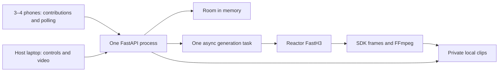

# Word by Word: hackathon technical stack

[All docs](../../README.md) · [Game spec](game-spec.md) · [Simplification](simplification.md) · [Research](../../research/word-by-word/README.md)

Status: simplified implementation plan, 12 September 2026. This replaces the previous multi-service plan for Word by Word. Implementation has not started. Follow the [demo game spec](game-spec.md); see [before and after](simplification.md) for the removed scope.

## 1. Decision

Run **one FastAPI process on the host laptop**, serving a React frontend, holding one room in memory, and running one Reactor generation task. Save the four video clips to temporary local disk and play them on that laptop. Phones connect over the same local network, submit words, phrases, or short sentences, and poll for status once per second.

No database, Redis, WebSockets, worker service, job queue, object-storage service, or distributed state is required for this demo. These are deliberate scope reductions. A server restart loses the room, so run exactly one server process.

## 2. Stack

| Concern | Demo choice |
| --- | --- |
| UI | React 19, TypeScript, Vite, ordinary CSS, browser HTML video |
| Frontend tooling | Node.js 24 LTS and npm; commit `package-lock.json` |
| Backend | Python 3.13, FastAPI, Pydantic 2, Uvicorn with exactly one worker |
| Python environment | uv with committed `uv.lock` |
| State | Python dataclasses/dictionaries; one `asyncio.Lock` protects mutations |
| Client updates | HTTP POST actions and a one-second `GET /api/state` poll; no overlapping polls |
| Video generation | Reactor FastH3 through the generic Python `reactor-sdk`; HTTPX only where its documented REST interface is needed |
| Background work | One retained `asyncio.Task` in the API process |
| Media | FFmpeg / ffprobe and private temporary files; no S3 or boto3 |
| Hosting | Local host laptop; one Uvicorn worker serves the built frontend and API over HTTP on the local network |
| Checks | pytest for a few critical server rules, Ruff, TypeScript checking/build, and a manual phone/browser rehearsal |

The demo runs locally for now. Use the host laptop and phones on the same trusted Wi-Fi or hotspot that allows devices to communicate. The laptop needs outbound internet access for Reactor; verify connectivity and capture on that laptop and network before the event. Reactor is the only external API credential required for live generation. Cloud hosting setup is deferred.

Pin working patch releases and the exact Reactor SDK version when implementing. No additional LLM is selected: the story displays original contributions in ordered cards, and fixed templates assemble cumulative scene instructions. VEED and Helios have no dependencies or feature flags to implement in this demo; revisit them afterward.

## 3. Runtime and files



Build the frontend locally, then serve it from FastAPI at the same origin as `/api`. Install Python, uv, Node.js, and FFmpeg on the host laptop. During development, Vite proxies `/api` to FastAPI; the demo uses the built frontend and one Uvicorn worker without auto-reload. A Dockerfile, Docker Compose, Caddy, and a separate frontend server are not demo requirements.

For phone access, bind Uvicorn to `0.0.0.0` on port `8000` and allow that port through the laptop's local firewall. Set the allowed origin to `http://<laptop-LAN-IP>:8000` and use that address for the host screen and all generated join links. `localhost` works for laptop-only development; on a phone it refers to the phone itself. Confirm that every phone can open the LAN address before starting a round, and keep the laptop awake and connected throughout play.

Use a small layout:

```text
frontend/src/             # Host screen, player form, simple polling hook
backend/app.py           # Routes, cookies, startup/shutdown, static frontend
backend/game.py          # Room state, assignments, validation, phase changes
backend/reactor_video.py # One direct provider/capture integration
backend/tests/test_game.py
```

No generalized game engine, provider-plugin framework, repository layer, or durable outbox. Fixture mode can be a small explicit branch using a fixed example sequence.

## 4. State, actions, and privacy

Keep one `RoomState`: room code, host session, up to four player sessions, phase, round ID, four assigned slots, accepted contribution text, input deadline, last meaningful action time, saved clip paths, highest disclosed index, result label, and the generation-task reference. Track whether provider closure is unresolved and how many live session attempts remain.

Follow the shared [four-digit room code standard](../../shared/room-code-spec.md) for generation, string storage, validation, join links, and implementation acceptance. **Another round** keeps the code; a roster-clearing **Reset party** rotates it.

Accept 1–120 Unicode code points after trimming surrounding whitespace, using the same count in the phone counter and backend validation. Allow spaces, punctuation, and non-ASCII text; apply no word-count, sentence-count, or action-suffix check. Run the configured input filter across the full text. Reject empty or over-limit input with a correctable field error; preserve accepted text exactly after trimming. Forms allow short sentences, and reveal/results cards wrap the full text. Category labels stay separate from player text.

Use five phases: `LOBBY`, `INPUT`, `GENERATING`, `REVEAL`, `RESULTS`. A rematch increments/replaces the round ID. Provider callbacks must match the active round before applying results. Timers and tasks are intentionally not durable.

Protect each state-changing decision with the room's `asyncio.Lock`; release it before network calls, capture, or file I/O. Store the generation-task reference while still holding the lock so simultaneous requests cannot open two sessions. Run blocking media work in FFmpeg or a thread rather than blocking the API loop.

Start one lightweight in-process deadline loop for the input deadline and 30-minute inactivity expiry. Only joins, submissions, and host actions extend inactivity; polling does not. Wrap the generation coroutine in a 120-second overall timeout; give each step up to 30 seconds within that remaining budget. Keep references to both generation and cleanup tasks so exceptions are handled and shutdown can close the provider.

| Endpoint | Purpose |
| --- | --- |
| `POST /api/host` | Check the configured host passcode and issue a host cookie. |
| `POST /api/join` | Validate the four-digit room code string and name, join the current lobby, and issue a player cookie. |
| `GET /api/state` | Return an explicit host or player snapshot, including server time. |
| `POST /api/round/start` | Host freezes the roster and starts collection. The final accepted contribution starts generation automatically. |
| `POST /api/contribution` | Submit `{round_id, slot_index, text}` for the caller's own slot. |
| `POST /api/reveal/next` | Host sends `{round_id, expected_reveal_index}` to disclose exactly the next clip, or finish after the last one. |
| `GET /api/clips/{round_id}/{index}` | Stream a disclosed clip to the authorized host, with range support. |
| `POST /api/round/end` | Host stops new work, requests cleanup, and shows already disclosed history. |
| `POST /api/round/new` | From results, clear the old round/files and return the same players to the lobby. Reject while generation is running or provider closure is unresolved. |
| `POST /api/room/reset` | Host clears the room, rotates its code, and requires players to rejoin. Also rejects while generation is running or closure is unresolved. |

Every round action includes the current `round_id`; reject a stale ID. Repeated submission of the same accepted text after trimming succeeds without another write. Different text for a filled slot is a conflict. Starting outside `LOBBY` is a conflict. `expected_reveal_index` prevents a repeated **Next** request from skipping an addition. This is enough for the demo; no generic idempotency table is needed.

The host snapshot contains public names, counts, phase, saved-clip count, and disclosed contributions only. A player additionally sees their own assigned slots and accepted contributions. Do not serialize the full room object. Authenticate cookies on every request; private clips are outside the static frontend directory and can only be read through the checked route. Future clips are inaccessible even to the host.

Use opaque HttpOnly, SameSite=Lax cookies. For this local HTTP demo, omit the Secure attribute so phone browsers can send cookies to the laptop's LAN address; enable Secure if HTTPS is introduced later. HTTP access is limited to the trusted demo network. Require same-origin JSON POSTs and check `Origin` against the configured LAN origin; rate-limit passcode guesses and join/input attempts in memory. The host passcode and Reactor credential stay in environment variables. A room code locates the room but cannot authorize host actions. No accounts, external authentication service, or display-pairing subsystem. [Cookie attributes](https://developer.mozilla.org/en-US/docs/Web/HTTP/Reference/Headers/Set-Cookie#secure).

Phones do not play synchronized video. The host reveals each clip manually, and the poll updates phone text within roughly a second. Native video pause/replay is a local UI action; it does not open another provider session. Final replay uses the existing disclosed clips in the browser.

## 5. Reactor integration contract

Keep one direct implementation for FastH3. Its documented predecessor chaining fits the four additions, and its queued playback is consumed when played, which is why the demo still needs private capture for replay. Chaining is a capability to test, not a guarantee of visual preservation. [FastH3 API](https://www.reactor.inc/models/fast-h3/api).

The entire provider experiment is small:

1. Open one server-owned session scoped to `reactor/fast-h3`, permitting one session and a maximum lifetime of 180 seconds. Verify that the installed Python SDK applies the constraints. Never send provider credentials or queue messages to a browser.
2. Disable autoplay. Request approximately six seconds per segment with one frozen landscape preset. Store the actual duration only in the room's in-memory clip metadata.
3. Generate place, then character, then action, then consequence. Each prompt includes the category and exact contribution for that step and earlier facts, with fixed style/continuity instructions. Treat the full contribution as one scene addition; refer actions such as “They start breakdancing.” to the established character. It never contains a later contribution. Verify the maximum cumulative text plus fixed instructions fits the provider's input limit during the integration spike; never silently truncate accepted text.
4. Wait for the specific clip to be ready. Play it once privately while capturing its video track; save the file, check it, and continue from its provider clip ID. The next step is admitted only after the previous capture succeeds.
5. Expose the saved valid prefix through `REVEAL` and initiate non-recoverable provider shutdown. Cleanup completion gates another live session, not playback of saved files. If nothing was saved, show a failed result.

The generic SDK documents receiving decoded frames through a track handler. Connect that handler to a bounded FFmpeg input queue. Verify first/last-frame boundaries against the clip events in the initial spike; do not guess that receipt of a finish message means all buffered frames have arrived. [Reactor Python SDK](https://docs.reactor.inc/sdk-reference/python/reactor).

Encode muted H.264 MP4 with `yuv420p` and fast-start metadata. Probe duration, decodability, and dimensions, reject incomplete captures, and cap each file at 20 MiB. Keep source dimensions and letterbox the display. The four-clip local storage allowance is 80 MiB, plus bounded temporary capture overhead.

If an enqueue acknowledgement is ambiguous, do not retry the paid operation. Stop the build, close the session, and use already saved clips. No command journal, session takeover, automatic reconnect, or alternative-provider implementation. If frame capture or continuation cannot work reliably, record the failure and revise the approach before building further UI; do not claim a fixture proves it works.

Provider-side session-count and lifetime constraints are documented. Session time while holding a GPU is billable, including idle time. Verify the actual model rate and the effect of shutdown in the account before rehearsal. [Reactor authentication](https://docs.reactor.inc/authentication), [billing](https://docs.reactor.inc/resources/billing).

## 6. Small operational safeguards

- One host can admit one generation task. Default to at most three live session attempts per server run, decrementing before attempting to open a session. No automatic rerolls, speculative warmup, or application budget ledger.
- A 120-second application generation timeout requests cancellation and cleanup. The independently enforced 180-second provider limit is the backstop; do not assume a dropped network connection stops charges.
- Keep `provider_closing` true until closure is confirmed. Saved clips remain playable while it is true. If confirmation fails, block further live rounds and use the provider dashboard to resolve it. After a server crash, verify the old session is closed before restarting live play, since the in-memory guard and attempt counter are lost.
- Choose live or fixture mode before starting a round. Fixture mode binds fixed contributions to fixed assets, is clearly labelled, and spends no provider credits. It never substitutes for a failed live generation.
- Delete old clips and contributions on a new round, room reset/closure, or 30-minute inactivity expiry. Sweep only this app's temporary directory at startup. Ephemeral files and in-memory rooms are intentionally disposable; do not start additional server processes, restart, or update the app during a demo round.
- Log round IDs, step timings, errors, session closure, and session-attempt count. Do not log raw contributions, cookies, or credentials. No external analytics/metrics platform.

Configuration is limited to the host passcode, Reactor credential, live/fixture mode, allowed origin, fixed model/preset, attempt limit, timeouts, and temp-directory path. The root [example.env](../../../example.env) defines the planned variable names and defaults; copy it to the Git-ignored `.env` for local credentials. Implement backend loading of that root file, resolving relative media paths from the repository root, and reject missing/placeholder credentials before live generation or host access. The template alone does not load settings or enforce limits. Keep exact dependencies in lockfiles.

## 7. Build and test in this order

1. **Video first:** on the demo laptop and network, run `forest → fox → dancing → confetti` through the actual model, capture four clips, close the session, and replay them. Confirm continuity, elapsed time, and cost.
2. **One-room flow:** build the host screen and phone form with in-memory state and polling. Exercise the fixed three/four-player assignments using a clearly labelled fixture round.
3. **Connect the live task:** plug the successful capture function into that flow; keep the same public reveal and privacy checks.
4. **Rehearse:** verify joining and cookie-backed refresh from three/four phones through the laptop's LAN URL, then run the [demo acceptance checks](game-spec.md#8-demo-acceptance), including a provider timeout, duplicate action, and attempted future-clip access.

Write focused pytest checks for assignment, contribution validation and preservation, submission ownership/locking, duplicate start/next protection, hidden snapshot/media access, and timeout results using a fake provider. Run Ruff, TypeScript checking, and the frontend build. Perform the phone/host rehearsal manually, including full-length contribution display. Defer a full Vitest/Testing Library/Playwright matrix, mypy rollout, load testing, migration testing, and process-failover testing until after the hackathon.

This plan supplies the minimum application infrastructure for the chosen demo. The real technical gate remains successful additive video generation and capture. No authenticated trial, dependency installation, local server launch, or application test has been completed by this documentation change.
