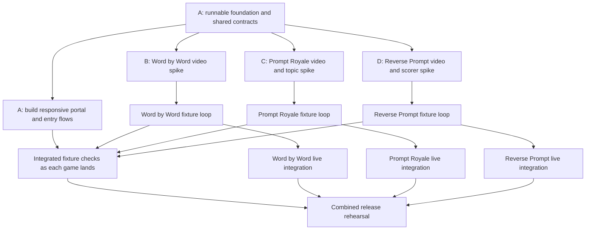

# Parallel development plan

Status: execution plan adopted, 12 September 2026. Scope confirmed: build the portal and **all three playable games locally on the host laptop**, with phones joining over the same Wi-Fi or hotspot. Remote deployment is deferred. The runnable foundation is published at `eb831d80310ae548374143f236c90caf73a90c00`; shared scope/routing/lifecycle amendments are adopted. Portal milestone `0f3fe9f41323c273ba0c341364d0a5bd5b17060d` has passed its contract browser checks. All three fixture games are integrated and the combined portal walkthrough passes. Live-provider acceptance and physical-phone rehearsal remain open; see the portal handoff for evidence. The user subsequently selected FastH3 for Reverse Prompt; its replacement milestone is integrated and its live acceptance remains open.

Use **four sessions, each with its own worktree**: one portal owner also coordinates the shared application and integration, and three game owners each deliver a complete game from browser to provider. The four product deliverables are **the portal, Word by Word, Prompt Royale, and Reverse Prompt**. Begin with a short shared foundation, then run all four sessions concurrently. Each game owner can build, exercise, and fix their entire flow without waiting for a separate frontend or backend owner.

## 1. Sources and scope amendments

Read [AGENTS.md](../AGENTS.md), the [app specification](app-spec.md), the [portal specification](portal-spec.md), and the relevant game's current game and technical specifications. Current game specifications take precedence over the broader [backend proposal](backend-spec.md) and archived designs.

The foundation adopts the following amendments to the earlier Word by Word-only portal:

| Area | Proposed decision |
| --- | --- |
| Availability | Build host/join/continue/return flows for all three games. Enable each portal launch action when its integrated playable loop passes; all three must pass to complete this effort. |
| Runtime | One FastAPI application, one Uvicorn worker, one React build, in-memory game state, private local media. Use explicit router registration for the three games. |
| Local demo target | One server on the host laptop serves the portal, all three games, and API over HTTP. Use `http://localhost:8000` for laptop-only checks and `http://<laptop-LAN-IP>:8000` for the host and phones during group play. Cloud hosting, Caddy, TLS setup, domains, and deployment pipelines are deferred. |
| Room lifecycle | One active party across the application. A party belongs to one game. Starting a different game requires the host to close the current party and finish cleanup; players then join the new party. |
| Navigation | Back to games preserves the current party and deadlines. Continue party resumes an authenticated role. Switching games is a separate, explicit action that clears the old roster and replay. |
| Shared code | Share transport, polling mechanics, configuration, navigation, and process lifecycle. Keep phases, roles, snapshots, media permissions, scoring, timers, retries, and attempt accounting in each game. |

Local operation and the shared [four-digit room code standard](shared/room-code-spec.md) are confirmed requirements for every game. The remaining shared integration decisions are proposals, not requirements already present in every game spec. The coordinator updates the portal availability and shared routing/lifecycle sections in `docs/portal-spec.md`, `docs/app-spec.md`, `docs/README.md`, and game technical plans in the foundation commit. Preserve the existing game rules and acceptance criteria. Databases, queues, WebSockets, a generic game engine, and optional VEED work remain deferred.

## 2. Worktree ownership

The paths below are the implemented foundation layout and ownership boundaries. Python package names use underscores; browser and URL game IDs use hyphens.

| Session / branch | Owned files | Deliverable |
| --- | --- | --- |
| **A — Portal, shared app, and integration**, `codex/app-integration` | `backend/app.py`, `backend/shared/`, `frontend/src/app/` (including `portal/`), `frontend/src/shared/`, frontend entry files, manifests and lockfiles, build/configuration files, `scripts/`, integration checks, shared docs | Complete responsive portal with all three game cards, host/join entry, Continue party, return/switch flows, and recovery messages; runnable foundation, shared styling/transport, party admission, local startup/setup, and release integration. |
| **B — Word by Word**, `codex/word-by-word` | `backend/games/word_by_word/`, `backend/tests/word_by_word/`, `frontend/src/games/word-by-word/`, `scripts/games/word-by-word/`, its fixtures and research | Host display, player inputs, four-step FastH3 chain, protected manual reveal, partial results, saved replay, and rematch. |
| **C — Prompt Royale**, `codex/prompt-royale` | `backend/games/prompt_royale/`, `backend/tests/prompt_royale/`, `frontend/src/games/prompt-royale/`, `scripts/games/prompt-royale/`, its fixtures and research | Both topic modes, private prompts, Helios generation and bounded retry, simultaneous arena, ten-second voting, and results. |
| **D — Reverse Prompt**, `codex/reverse-prompt` | `backend/games/reverse_prompt/`, `backend/tests/reverse_prompt/`, `frontend/src/games/reverse-prompt/`, `scripts/games/reverse-prompt/`, its fixtures and research | Private three-person relay, three independent FastH3 videos, local scoring, protected media, replay/reset, and persistent quota guard. |

Game-specific subdirectories are exceptions to A's ownership of their parent directory. Each game owner also owns `docs/development/handoffs/<game-id>.md` and game-specific API examples under `docs/development/contracts/<game-id>/`.

A creates any necessary game entry stubs in the foundation commit, then transfers those directories to B/C/D. After that, A integrates through the agreed exports. Cross-boundary fixes go to the file owner; agree an explicit temporary ownership transfer if another session must edit them. Do not have two sessions edit the same file concurrently.

A owns `pyproject.toml`, `uv.lock`, `frontend/package.json`, `frontend/package-lock.json`, Vite configuration, global CSS, `example.env`, and worktree setup. Game owners submit dependency/version and configuration requests through their handoff file. A resolves the request promptly, updates the relevant lockfile with its package manager, and publishes the shared commit. Do not manually merge lockfile contents or create divergent final manifests per game.

### Portal build package — Session A

Build the portal as a complete user-facing feature, with its own milestones and browser acceptance. Its main implementation lives in `frontend/src/app/portal/`; shared session discovery and room-code resolution live in `backend/shared/`.

| Deliverable | Required behavior |
| --- | --- |
| Home and game discovery | VibeParty identity, a short introduction, visible Join party action, and three distinct game cards with descriptions, player counts, host setup, and launch actions. Adapt the current portal copy for all three playable games; explain Word by Word's separate laptop host and the other games' playing host accurately. |
| Host and join entry | Each card opens the correct game's host entry. Generic code entry resolves the game and opens its join form; copied join links and direct route loads work. Game owners implement their passcode/name forms, lobby, and game-specific admission errors. A owns their navigation and shared presentation components. |
| Continue and return | Show Continue party only from an authorized session check. Back to games preserves the party and returns to the portal; continuation restores the correct role and phase. Portal visits never start, reset, or generate a round. |
| Close and switch | Explain that closing the party clears its replay and requires everyone to rejoin. The host closes through the current game's cleanup contract before launching another game. Keep the pending-cleanup explanation visible until switching is allowed. |
| Recovery and layout | Clear wrong-code, expired-party, reconnecting, and another-game-active states. Support phone and desktop layouts, keyboard navigation, visible focus, readable contrast, labelled forms, and large tap targets. Public home content exposes no roster, private submissions, or media. |

Portal milestones:

1. **Portal UI:** complete the responsive home, cards, generic join form, and session/recovery states against the foundation contract while the game owners run their spikes.
2. **Connected portal:** wire real session discovery and code resolution, then verify host/join/return/continue with each game as its fixture loop lands. Keep game availability explicit during development.
3. **Portal acceptance:** all three games can be launched from the home page; complete a round and return for each game; exercise manual code entry, copied links, direct loads, refresh, same-session continuation, and close/switch/rejoin. Check cleanup blocking, network recovery, keyboard access, and a phone-sized viewport. Record the results in `docs/development/handoffs/portal.md`.

The release requires this portal acceptance alongside the three games' acceptance checks. Schedule portal construction immediately after the shared foundation, with connected checks as game milestones arrive.

## 3. Foundation contract: complete before branching game implementation

A publishes one small, runnable foundation commit. It must provide the following so the game sessions can proceed independently:

1. **Pinned baseline and commands.** React 19, TypeScript, Vite/npm, Python 3.13, uv, FastAPI/Pydantic, lint/build/test configuration, and documented start/check commands. Record FFmpeg requirements. Pin compatible provider and scoring dependencies through the game spikes; do not guess an SDK version is compatible.
2. **Runnable shell.** FastAPI serves the built frontend and API from the host laptop and supports direct browser route loads. Publish a local demo command using one Uvicorn worker, no reload, and `0.0.0.0:8000` for phone access. Development proxy and allowed-origin settings work together. Game modules have explicit router/lifecycle entry points and empty UI entry components. A disabled or unready game does not break the portal.
3. **Written shared contracts.** Create `docs/development/contracts/shared.md` containing exact paths, exported signatures, session discovery shape, error envelope, room admission/closure behavior, and polling helper interface. Reference the accepted [room code standard](shared/room-code-spec.md) and publish shared generation, validation, and lookup interfaces with a leading-zero example. Include concrete anonymous, host, player, expired-session, and another-game-active examples.
4. **Ownership and isolated configuration.** Resolve media paths relative to each worktree; use a separate directory per game. Keep Reverse Prompt quota/model storage outside disposable media. Document the ports and live-provider handoff below.
5. **Minimal verification.** The shell builds, API routes can be registered without importing a live session, page refresh works, and shared party admission rejects simultaneous creation of two different games. Use focused checks for this shared behavior.

Freeze these application boundaries in that contract:

| Boundary | Contract to publish |
| --- | --- |
| Browser routes | `/`, `/join`, `/games/<game-id>/host`, and `/games/<game-id>/join?code=…`. The game route renders its current phase. Keep `/host` as a Word by Word alias and support existing code-only join links through room resolution. |
| Game API routes | Prefix each game's existing endpoint suffixes with `/api/games/<game-id>`. For example, Word by Word's `/api/host` becomes `/api/games/word-by-word/host`; Prompt Royale's `/api/room` becomes `/api/games/prompt-royale/room`. Publish every exact route mapping. |
| Room codes | Follow the accepted [four-digit standard](shared/room-code-spec.md). A owns shared generation, validation, and lookup in `backend/shared/` and entry presentation in `frontend/src/shared/`; all three games use these helpers. |
| Generic join | A rate-limited `POST /api/party/resolve` accepts a four-digit room code as a string and returns only the game's join destination, preserving leading zeros. It reveals no roster or private state and does not authorize membership. Game-specific join still validates the code and guest input using the shared standard. |
| Session discovery | `GET /api/session` returns an authorized game ID, role, and continuation URL, or an anonymous result. It does not serialize game state or refresh game presence/inactivity timers. A transport failure is distinct from a missing session. |
| Backend integration | Each game exposes an `APIRouter` plus documented startup, shutdown, session-summary, and close-party functions. The shell registers the three modules explicitly. Game owners control their background tasks and media authorization. |
| Frontend integration | Each game exports its route component. Shared fetch and polling helpers accept a game URL and game-owned snapshot type. Polling has one request in flight, handles focus/reconnect, and discards obsolete responses. |
| Identity and cookies | Use game-scoped opaque HttpOnly cookies and require the relevant game session on every action/media request. Omit Secure for the trusted local HTTP demo and preserve each game's SameSite requirement. Require same-origin JSON mutations and validate Origin against the configured browser origin. Room codes and names never confer a role. |
| Shared errors | A small `{code, message, field?}` envelope with agreed HTTP statuses. Each game supplies its own conflict/validation reasons and request/response types. |
| Party admission | A short shared lock reserves the active game during room creation and releases failed creation. Same-game repeat entry follows that game's spec. Different-game creation returns a clear conflict. Avoid holding this lock during provider or file I/O; document lock ordering. |
| Close and switch | Host authorization is checked by the current game. Mark the party closing, reject new work, cancel/await owned work, confirm provider closure, clear private round data and sessions, then release admission. An unresolved closure keeps switching blocked. |

Game-specific API payloads, state machines, and snapshots stay in each game's module and contract examples. Full-stack ownership lets a game owner change their own frontend and backend together without coordinating every field through A.

Do not introduce a shared generation policy. Word by Word's FastH3 chaining, Prompt Royale's Helios generation, and Reverse Prompt's independent FastH3 sessions differ in capture, duration, continuity, and retry rules. Keep the adapters inside their game initially. Share a small low-level utility later only when two working implementations demonstrate the same need; callers retain their own limits and authorization.

## 4. Execution waves and merge checkpoints

**Wave 0 — A publishes the foundation.** Record the actual foundation commit SHA. Create B/C/D worktrees from that exact commit, so all sessions inherit the same exports, configuration, and lockfiles. A continues in the integration worktree. The initial serial work should stop at a runnable boundary; defer gameplay and reusable abstractions to the owners who need them.

**Wave 1 — Prove each risky integration.** Each game owner starts with its specified provider-to-playback spike on the actual laptop OS/architecture. A builds the portal and prepares the combined local runtime in parallel. B verifies the complete additive FastH3 chain, capture boundaries, prompt size, shutdown, and saved replay. C verifies Helios capture and tokenizer behavior, and selects/validates the topic LLM, timeout, output limit, and separate call allowance. D verifies independent FastH3 playback capture, termination, persistent attempt accounting, and a pinned local scorer with offline warm-up. Verify SDK, FFmpeg, and scoring compatibility locally; if a dependency requires Linux, evaluate a local container or VM on the same laptop only when the spike establishes that need. Share SDK/runtime findings promptly. Paid trials are serialized across worktrees as described below.

**Checkpoint 1:** each game has an executable spike and recorded evidence, or a specific failed gate. A records compatible dependency revisions. A fixture does not pass a live integration gate. If a game's provider approach fails, resolve or explicitly revise that game's plan before expanding its UI; the other games continue.

**Wave 2 — Deliver complete fixture flows.** B/C/D implement their entire game using local assets and deterministic provider fakes. Fixtures are labelled and follow each game's requirements: Word by Word binds fixed contributions to its clips; Prompt Royale labels fixture topics/video; Reverse Prompt uses an explicit scripted rehearsal mode with sample scores. Internal test fakes can also exercise arbitrary inputs without pretending to generate live videos. Each owner writes the focused behavior tests and browser verification required by its specification.

**Checkpoint 2:** merge each complete fixture flow as soon as it passes its own checks. A verifies portal entry, join, continuation, return, and closure with that game. A can validate one game while the others are still building. Fix integration drift here, before live work is considered complete.

**Wave 3 — Attach live adapters and finish recovery.** Game owners connect their validated adapters to the same rule and privacy paths, complete cancellation/cleanup, and run game-specific live checks. A rehearses the combined app on the laptop and phones over its LAN HTTP origin, checks cross-game admission and cookie isolation, and resolves shared runtime/dependency issues.

**Checkpoint 3:** each enabled game has passed its specified live acceptance on the intended runtime/devices. The release is complete only when all three pass plus the shared portal/switching checks. QR codes, VEED, extra artwork, and animations follow this checkpoint.

## 5. Game-specific acceptance and ownership

The linked specifications remain the authoritative checklists; the table identifies each session's most consequential work.

| Owner | Required behavior and verification |
| --- | --- |
| B — [Word by Word rules](games/word-by-word/game-spec.md) / [technical plan](games/word-by-word/tech-stack.md) | Separate host display and 3–4 player phones; deterministic assignment of four slots; 45-second collection; exact trimmed Unicode contributions; immutable submissions; one FastH3 chain and no paid retries; 120-second total/30-second step limits; hidden future text/media; manual reveal; saved valid prefixes; End round; replay without generation; same-roster rematch; cleanup guards and three-attempt per-process limit. Complete the specified three live runs and phone/privacy/duplicate-action checks. |
| C — [Prompt Royale rules](games/prompt-royale/game-spec.md) / [technical plan](games/prompt-royale/tech-stack.md) | Playing host within the 3–4 player roster; bundled and LLM topics with explicit confirmation/regeneration; token validation; two entry slots with start pacing; one eligible retry within the original deadline; anonymous and stable 2×2 arena; coordinated playback within each phone; exclusions before ballot freeze; ten-second vote with no self-votes; ties/abstention; host-absence and stale-result handling. Rehearse three players then four, both topic modes, phone playback, and the specified failure cases. |
| D — [Reverse Prompt rules](games/reverse-prompt/game-spec.md) / [technical plan](games/reverse-prompt/tech-stack.md) | Exactly three players with host as author A; no input countdown; private B/C relay clues; three independent FastH3 sessions with no retries; local pinned MiniLM scoring/token limits; author excluded from guessing/scoring; unscored inference failures; nine-attempt persistent quota and unresolved-session guard; reset/stale callback behavior. Pass DEMO-01 through DEMO-08, offline scoring, a full live round, and a forced generation failure. |

Provider defaults, model compatibility, timing, and cost are verification tasks, not established measurements. Record evidence under `docs/research/<game-id>/`. Keep source prompts, cookies, and credentials out of operational logs; fixture examples may be documented as examples.

## 6. Worktree and runtime isolation

Use one named branch per worktree. A begins `codex/app-integration` from the agreed repository baseline; B/C/D branch from A's published foundation SHA. All four named worktrees now use the published foundation.

Run the existing [environment setup](environment-setup.md) in each worktree. Its script preserves existing `.env` files, so copied settings must be checked explicitly. The `.env` file is private; never print or commit it.

| Session | Suggested API port | Suggested Vite port |
| --- | --- | --- |
| A | 8000 | 5173 |
| B | 8011 | 5174 |
| C | 8012 | 5175 |
| D | 8013 | 5176 |

- A makes ports, proxy target, browser origin, and generated join origin configurable in the foundation. During development, the allowed origin must match the actual browser-facing URL, including its port. For the combined demo, bind the server to `0.0.0.0:8000`, set `PUBLIC_ORIGIN=http://<laptop-LAN-IP>:8000`, and open that URL on both the host and phones. A phone's `localhost` addresses that phone. Verify the laptop firewall and Wi-Fi/hotspot allow connections, and keep the laptop awake.
- The application runs locally; live video still needs outbound internet access to Reactor, and Prompt Royale's live topic suggestions need access to its selected LLM. Preload Reverse Prompt's scoring model so scoring runs locally. A fixture rehearsal can work without provider calls.
- Keep `GENERATION_MODE=fixture` by default in every copied environment. A documents game-specific live settings without permitting a global toggle to bypass a game's admission checks.
- Keep each worktree's `.venv`, frontend dependencies/build output, and mutable media directories separate. Use `.local/vibeparty/<game-id>/clips` under that checkout. Only delete the owning game's disposable files.
- Keep Reverse Prompt's quota file outside all cleanup directories and preserve it across restarts. A new worktree or process does not replenish the allowed live campaign; initialize/allocate its allowance deliberately before use. Pinned model files may use a read-only shared cache, with no startup download.
- Browser cookies are not isolated by port. Use a separate browser profile/session for each worktree server and separate host/player identities inside its rehearsal. Distinct ports alone do not prevent session collisions.
- Exactly one server process owns a worktree's in-memory rooms. Disable reload for any live round and for the final demonstration.

**Live-provider handoff:** one worktree at a time may run paid Reactor trials against the shared account. The coordinator grants the active slot, records the allocated allowance and attempts, and transfers it only after sessions are confirmed closed. During C's slot, Prompt Royale may use its specified internal concurrency; this does not allow another worktree to run live alongside it. Sharing an API key or using different keys does not create an independent project budget.

Game-local attempt counters continue to enforce their specs. Keep Word by Word/Prompt Royale counters for the process lifetime, including after party closure and game switching. Reverse Prompt's persistent unresolved-session block must also prevent switching to another game to start live work. After a crash, perform the required operator session check before any new live launch. Keep a simple rehearsal record of allowance, attempts, and closure; a new billing service is unnecessary.

## 7. Integration procedure

1. Each owner commits small milestones: spike/contracts, fixture loop, live integration/recovery. Before requesting integration, provide the commit SHA, contract/dependency changes, commands run and results, browser evidence, remaining limitations, and live-session closure status in the game's handoff file.
2. A reviews the actual change and merges one ready milestone at a time into `codex/app-integration`, preserving ancestry. Use normal merges during development so owners can continue their branches; avoid repeatedly squash-merging a branch that remains active.
3. The owner then merges the latest integration branch back into their worktree before the next milestone. If another branch was integrated meanwhile, absorb that update as well. A resolves shared-file conflicts; the relevant game owner resolves game-file conflicts. Do not rewrite a branch others have already based work on.
4. Shared contract changes are proposed with affected consumers listed. A publishes the contract change and compatibility stubs first; game owners update their modules, then A removes obsolete compatibility only after consumers land. Keep these changes small enough to review directly.
5. A runs the affected game checks plus shared integration checks after a merge. Once they pass, continue to the next milestone; broaden testing only for a changed boundary, failure, or unresolved concern.

The game sessions own their unit/provider tests and their browser flows. A owns the combined behavior: two concurrent create requests for different games; role isolation across namespaces; generic code joining; refresh/deep links; Back to games/Continue party; Close party/switch/rejoin; switching with provider cleanup unresolved; expired/server-lost sessions; and private media/range access across games. Follow the specifications' focused testing scope and use browser verification for visible flows.

Before declaring the combined demo ready, run each game's required acceptance checks and a consecutive portal walkthrough of all three on the host laptop and actual phones through the same LAN HTTP address. Verify that no old cookie, clip, quota reset, or pending callback crosses the game handoff. Confirm the local scorer and all selected provider dependencies coexist in the final locked local runtime. Completion requires a reproducible local setup/start command and successful local rehearsal; remote deployment is outside this effort.

## 8. Ready-to-use session briefs

Give every session the foundation commit SHA, its ownership row, and this plan. A receives this brief first; the three game briefs begin after the foundation is published.

**A — Portal, shared app, and integration**

> Build the complete VibeParty portal and own the shared application/integration for all three playable games on the host laptop. Follow `docs/parallel-development-plan.md`, including its Portal build package and local HTTP target. First record the remaining scope/routing/lifecycle amendments, scaffold the local runtime, publish the shared contracts and a runnable foundation commit, and give its SHA to the game sessions. Then build the responsive home, three game cards, host/join entry, session continuation, return/switch flows, and recovery states. Connect each game as its fixture milestone lands and record portal browser acceptance in `docs/development/handoffs/portal.md`. Deliver reproducible local setup/start commands and phone access over the laptop's LAN address. Promptly handle shared dependency/configuration requests, coordinate exclusive live-provider slots, and integrate game milestones. Work only in your assigned paths except by explicit ownership transfer.

**B — Word by Word**

> Implement Word by Word locally on the host laptop, end to end in the assigned backend, frontend, test, script, and research directories. Read its current game/technical specs and `docs/parallel-development-plan.md`. Prove FastH3 additive generation/capture first, then deliver a labelled fixture loop, then live play and recovery. Preserve the separate host role, exact contributions, hidden future media, manual reveal, saved replay, and cleanup limits. Request shared dependency changes from A. Record verification and milestone SHAs in your handoff file; coordinate every live trial with A.

**C — Prompt Royale**

> Implement Prompt Royale locally on the host laptop, end to end in your assigned directories. Read its current game/technical specs and `docs/parallel-development-plan.md`. Prove Helios capture/tokenization and resolve the topic LLM integration, then build both topic modes, the complete labelled fixture round, and live play. Preserve anonymous stable arena positions, simultaneous playback, ten-second voting, host presence rules, bounded retry, and attempt limits. Own the required tests and browser scenario. Request shared dependency changes from A and record evidence/milestone SHAs. Coordinate every live trial with A.

**D — Reverse Prompt**

> Implement Reverse Prompt locally on the host laptop, end to end in your assigned directories. Read its current game/technical specs and `docs/parallel-development-plan.md`. Prove independent FastH3 capture and offline scoring, then build the three-player relay and live integration. Preserve private clue access including media range requests, no input countdown, local MiniLM scoring, unscored failure behavior, and the persistent quota/closure guard. Own DEMO-01 through DEMO-08 verification and your browser rehearsal. Request shared dependencies/model setup from A and record evidence/milestone SHAs. Coordinate every live trial with A.
