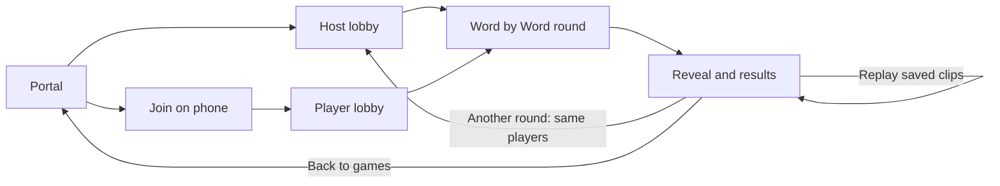

# VibeParty: hackathon portal specification

Status: proposed design, 12 September 2026. The repository contains specifications; implementation has not started.

## 1. Goal and scope

Give the group one front door: **discover Word by Word, host or join a party, finish a round, and play again or return home**. Show the two planned games so the wider idea is clear.

For the hackathon, Word by Word is the only playable game. Prompt Royale and Reverse Prompt appear as **Coming soon**. This document defines the portal and navigation; the [Word by Word game spec](games/word-by-word/game-spec.md) owns gameplay and its [technical plan](games/word-by-word/tech-stack.md) owns the runtime. The [app specification](app-spec.md) defines product purpose and document ownership.

Keep one room, three or four player phones, and a separate host laptop. The presenter can also play by joining on a phone. Building the portal must not require implementing either upcoming game.

## 2. Home page

Use one short page at `/`. A visitor should immediately understand what the app does and where to go.

| Area | Required content and behavior |
| --- | --- |
| Header | VibeParty name and a visible **Join party** link. |
| Introduction | “Turn your words into a shared movie.” Supporting line: “Open a party on a laptop. Join on 3–4 phones. Watch what you make together.” |
| Word by Word card | **Play now** badge, “Secret words. One evolving scene. Everyone creates together.” Show “3–4 players · shared laptop screen · cooperative” and a primary **Host Word by Word** button. |
| Prompt Royale card | **Coming soon** badge and “Write a prompt, watch the clips, and vote for your favorite.” |
| Reverse Prompt card | **Coming soon** badge and “Pass an idea through videos and descriptions, then guess where it started.” |
| Returning session | When the browser has a valid host or player session, show **Continue party**, linking to that role’s current screen. |

Keep Word by Word first and visually strongest. Use a simple three-card layout on desktop and stacked cards on phones, with **Join party** visible above the cards. Give each game a distinct accent or simple icon; use text and ordinary CSS for the initial build. Keep instructions on this page and in the lobby brief.

The upcoming cards are informational: no launch action, empty detail page, signup form, or release date. Their status must be readable without relying on color. Use labelled controls, visible keyboard focus, readable contrast, and large phone buttons throughout.

## 3. Complete the loop

### Host and join

1. The presenter selects **Host Word by Word**, enters the configured host passcode if needed, and reaches the host lobby. There is no account or host-name step.
2. The lobby shows the room code, a phone join link with **Copy link**, the player names and count, and three short instructions: join on phones, submit secret words, watch the laptop. For the local demo, the join link uses the configured laptop LAN origin, and players connect to the same Wi-Fi or hotspot. A QR code is optional polish.
3. A phone opens the join link, or selects **Join party** on the portal and enters the code. The link prefills the code; the player supplies a guest name and presses **Join**.
4. Joined phones show the roster and “Waiting for the host to start.” The host’s **Start round** becomes available with three or four players. Fewer players see “Waiting for at least 3 players.” There is no ready check or settings step.
5. Starting hands both screens to the existing game flow: private words, generation progress, manual reveal, and results. The portal adds no game phases.

Opening a page never starts a round, generates a video, or resets a room. Host entry creates the single room only if none exists; an existing room is resumed. Repeated entry must not create another room or clear the current party.

### Finish, replay, and return

| Control | Who uses it | Result |
| --- | --- | --- |
| **Replay** | Host, when disclosed clips exist | Replay the current saved clips. No new generation. Partial rounds replay only their disclosed clips. |
| **Another round** | Host, on results | Clear the old round and return the same players to the lobby. Phones follow through the existing state poll. |
| **Back to games** | Host or player, in lobby/results | Open `/`. Keep the room and browser session so **Continue party** can resume it. This action does not reset the party. |
| **Reset party** | Host, in lobby/results | Use the existing room-reset action, clear the roster and replay, and rotate the room code for a new group. Label the consequence: “Everyone will need to rejoin.” |

On phone results, show the disclosed story and “The host can replay or start another round,” plus **Back to games**. Video and round controls remain on the laptop.

**Another round** and **Reset party** follow the game’s existing generation/cleanup guards. While provider closure is unresolved, explain “Finishing the previous session” and keep these actions unavailable; saved replay and portal navigation remain available. If live attempts are exhausted, explain that another live round is unavailable under the configured demo limit.

During an active round, the host uses the existing **End round** action to reach results before returning through the portal controls. Browser Back or refresh alone must not end a round. Returning home does not pause existing deadlines. The game’s 30-minute inactivity expiry still clears the room; polling does not extend it.

## 4. Small recovery paths

| Situation | What the visitor sees and can do |
| --- | --- |
| Wrong code or no room | Inline message: “That party isn’t available. Check the code with your host.” Keep the form editable. |
| Four players already joined | “This party is full.” Keep the join form available; add no waiting list. |
| New player joins during a round | “A round is in progress. Try again when the host returns to the lobby.” Existing sessions can still resume. |
| Incorrect host passcode | Inline error on the host form; allow correction. |
| Refresh or return to the portal | Use the existing cookie and server snapshot to resume the correct role and phase, including accepted words. |
| Network interruption | Show “Reconnecting…” with retry. Preserve the screen; do not interpret a network failure as a lost room. |
| Expired room or server restart | Explain “This party has ended.” Offer a player the join form and the presenter the host entry. Follow the existing provider-closure requirement before another live run. |
| Failed or incomplete round | Use the game’s partial/failed result message and recovery controls. A visitor can always return to the portal. |

Public portal content contains no room roster, private words, or clips. **Continue party** is based on an authorized snapshot, never on a name or room code alone. A browser without a session sees the normal home page.

## 5. Minimal implementation

Use the React frontend and FastAPI service from the game’s technical plan. Three browser routes are enough:

| Route | Responsibility |
| --- | --- |
| `/` | Introduction, three game cards, join entry, and session continuation. |
| `/host` | Passcode entry, then the host lobby/game/results according to server state. |
| `/join?code=…` | Code/name form, then the player lobby/game/results according to server state. Only the room code belongs in the link. |

Serve the frontend for direct loads and refreshes of all three paths. Reuse `/api/host`, `/api/join`, `/api/state`, and the existing round/reset actions from the technical plan. Define `/api/host` to initialize the room when absent and otherwise resume it after authentication. The portal requires no separate backend service or catalog API.

Keep the three game descriptions in a local array with an ID, title, description, and `available` or `coming_soon` status. Only Word by Word has a host destination. Adding a future game can later add its destination when its playable loop exists; a generic game engine, shared scoring system, or game-switching protocol is outside this build.

The server remains authoritative for sessions, join admission, host actions, and game state. Share the existing non-overlapping one-second polling hook across the host/player screens. Home only needs a session check for **Continue party**; it does not keep an idle room alive.

## 6. Build order and cut line

1. **Keep the video gate first.** Follow the technical plan’s live generation/capture spike. The portal must not delay or substitute for proving that the game works.
2. **Add the front door.** Build the home page, the three cards, and host/join entry forms. Wire them to the single room. Show session continuation.
3. **Connect the entire round.** Walk from the portal through lobby, input, reveal, results, replay, another round, and back home. Use the game’s explicitly labelled fixture mode while wiring screens; it retains its fixed example words and clips.
4. **Rehearse live, then polish.** Verify the loop on the actual laptop and phones. Add QR, decorative artwork, or small transitions only after the required checks pass.

Defer game detail pages, search/filtering, accounts, profiles, leaderboards, public room browsing, saved history, sharing/export, waitlists, and both upcoming game implementations. The portal is complete when the group can finish and repeat the Word by Word experience from one entry URL.

## 7. Acceptance checks

- Home shows exactly three games: Word by Word can be hosted; Prompt Royale and Reverse Prompt clearly say **Coming soon** and cannot launch.
- One laptop and three phones complete the whole loop from `/`, including saved replay and another round with the same players. Check the four-player lobby once.
- Both manual code entry and the copied join link work on a phone. Direct route loads and refreshes restore the correct screen without creating a second room or duplicate player.
- **Back to games → Continue party** restores the same role and current state. **Reset party** requires players to rejoin with the new code.
- A full room, an in-progress round, a wrong code, and a lost room each give a useful message and next action. Partial/failed results still allow return home; cleanup blocks new work as specified.
- Check the portal on a phone-sized viewport and with a keyboard. Run the frontend type check/build and the game’s focused checks during implementation.
