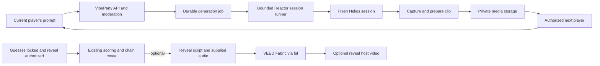

# Reverse Prompt: Reactor and VEED research

Researched: **12 September 2026**. Scope: the Reverse Prompt game in VibeParty. This is a public-documentation review and integration proposal; no authenticated API calls, paid generations, latency benchmarks, or SDK installation were performed. Prices and access must be checked again before implementation.

The current hackathon implementation is detailed in the [game specification](../../games/reverse-prompt/game-spec.md) and [tech stack](../../games/reverse-prompt/tech-stack.md). The [before-and-after comparison](../../games/reverse-prompt/simplification.md) records the simplification to one room, three players, one process, and local media. Reactor Helios remains the video generator; Sentence Transformers with `all-MiniLM-L6-v2` remains the local scorer. No OpenAI service or key is required. Current decisions supersede the illustrative architecture, app moderation requirements, timing, and cost scenarios below. The dated provider findings remain evidence, not additional demo requirements; live validation is still required.

## Recommendation

**Prototype Reactor Helios as the relay video generator. Use VEED Fabric for an optional animated host, initially with reusable clips prepared before play.** Keep the live-avatar idea as a later experiment until VEED supplies an accessible API and its operating limits.

Reactor documents text-driven streaming generation and clip recording, which together offer a route from a player's interpretation to the next playable scene. Fabric's published endpoint takes an image and audio to animate a speaking character; it does not accept a standalone scene prompt. That makes the two products complementary for this game. This recommendation is an inference from their documented interfaces, pending a live integration check. [Helios API](https://www.reactor.inc/models/helios/api), [Reactor recordings](https://docs.reactor.inc/concepts/recordings), [Fabric API schema](https://fal.ai/models/veed/fabric-1.0/api).

| Role in Reverse Prompt | Reactor | VEED | Proposed decision |
| --- | --- | --- | --- |
| Generate each scene from the current player's text | Helios supports text-to-video. | Fabric requires image + audio. | Test Helios first. |
| Produce a clip the next player can replay privately | Recording API plus application-owned storage. | Fabric returns a video asset, but its content is a talking character. | Capture Reactor output and serve it through VibeParty. |
| Explain rules and announce the reveal | Possible additional model integration. | Fabric is well matched to a speaking mascot. | Optional pre-generated VEED host clips. |
| Live conversational host | Outside the proposed relay integration. | Public website links to a Live Avatar API waitlist. | Do not make this an MVP dependency. |
| Compare guesses and select winners | No role needed. | No role needed. | Preserve the specified embedding scorer. |

The table combines the interfaces above with VEED's [public API listing](https://www.veed.io/api) and the existing game rules; it is not a claim that either vendor supplies a complete game backend.

## Game requirements that shape the fit

The [game specification](../../app-spec.md#6-game-3-reverse-prompt) defines a private telephone-style relay:

1. The author writes `P0`; generate `V0`.
2. The next player watches only `V0`, writes `P1`, and generates `V1` **from P1 alone**.
3. Repeat once per remaining player, then show the final video to everyone.
4. Everyone except the author guesses `P0`. Lock guesses, compute similarity to the original player text, and reveal the full chain.

A three-player round therefore requires three sequential generations. The simplified demo uses five-second landscape clips, no human-input countdowns, and a 90-second generation deadline with one attempt per clip. The earlier 45-second input windows and 180-second generation phases used in the historical planning examples below are superseded. The previous video must influence the next step only through the player's interpretation. Persistent model memory, previous-frame conditioning, captions that expose prompts, or an avatar that narrates hidden text would change the rules.

The earlier [backend specification](../../backend-spec.md#6-generation-provider-boundary) proposed durable jobs, private media, frozen presets, budget reservations, and failure handling. The historical integration proposal below fits those boundaries. For the demo, use the [single-process design](../../games/reverse-prompt/tech-stack.md) instead; private media and bounded sessions remain necessary.

## Reactor findings

### Model choice and output

Reactor is a platform for streaming and controlling world/video models. Its documentation provides JavaScript, React, and Python integration paths. Its website advertises sub-50 ms streaming, but that is not a measured submission-to-playable-clip time for VibeParty. [Reactor overview](https://docs.reactor.inc/overview), [Reactor platform](https://www.reactor.inc/).

**Helios is the first model to test.** The API supports setting a text prompt before starting, without requiring an image. It generates 33-frame chunks, approximately 1.375 seconds at 24 fps, and applies commands at chunk boundaries. [Helios API](https://www.reactor.inc/models/helios/api).

The model overview lists video-only output, native 640×384, and 1280×768 with default 2× super-resolution. This landscape aspect ratio is 5:3, not 16:9. Preserve it in the player or letterbox if a display requires 16:9; cropping could remove a clue. Freeze one supported resolution and rendering template for the whole round. [Helios model overview](https://docs.reactor.inc/model-api-reference/helios/overview).

LingBot World 2 requires both a prompt and a reference image before starting, so it would add an image-generation stage to this text-only relay. Happy Oyster supports prompt-created explorable worlds, but navigation would introduce another player action and a different game mechanic. These are possible later variants, not prerequisites for Reverse Prompt. [LingBot World 2 API](https://www.reactor.inc/models/lingbot-world-2/api), [Happy Oyster API](https://www.reactor.inc/models/happy-oyster/api).

### Recording and playback

Reactor documents snap clips of the preceding N seconds and full-session recordings, **provided recording is enabled for the model**. Clip requests must complete while the connection is ready. Clip URLs expire after 24 hours; the documentation says clips are then deleted and are not used for training. This statement concerns recordings, not an independently verified retention policy for every kind of account data. [Recording lifecycle](https://docs.reactor.inc/concepts/recordings).

The Python SDK exposes `request_clip(duration_seconds)` and `request_recording()`, returning a clip manifest rather than video bytes. Persist that descriptor for media-preparation recovery. [Python recording methods](https://docs.reactor.inc/sdk-reference/python/reactor).

Python's `download_clip()` writes MPEG-TS, whereas the JavaScript download helper assembles MP4. The Python path therefore needs remuxing, codec inspection, and conversion if necessary before browser playback. Renaming a `.ts` file to `.mp4` is insufficient. [Recording download formats](https://docs.reactor.inc/concepts/recordings).

**Integration gate:** verify that the actual Helios account/preset enables recordings, that a short clip contains the intended frames, and that its download remains retrievable after session termination. The general recording documentation does not substitute for that test.

### Privacy, access, and lifecycle

Session-scoped tokens can operate their sessions, including clips and session logs. Authentication supports model restrictions, maximum session count, and a server-enforced duration cap. [Reactor authentication](https://docs.reactor.inc/authentication).

Consequently, keep both Reactor keys and session tokens in the backend for this game. The next player should receive only VibeParty's authorized video route. A token limited to one model is still not a read-only permission to watch one clue. Treat raw model messages, clip descriptors, filenames, and logs as private until projected into safe application responses.

Use a fresh session for each accepted relay prompt. Reusing an autoregressive stream by changing its prompt risks carrying earlier visual context into the next result. Helios documents a reset operation, but fresh sessions provide a simpler boundary to verify for this MVP. [Helios state and reset behavior](https://www.reactor.inc/models/helios/api).

Default documented account limits are five concurrent sessions and ten new sessions per minute, with a burst of three. These are account-wide; multiple rooms and other games compete for them. Check the account's actual quotas and enforce admission across workers. [Reactor rate limits](https://docs.reactor.inc/resources/rate-limits).

### Moderation limitation

Reactor says it screens submitted text and reference images and terminates violating sessions. A moderated session still incurs its ordinary GPU-time charge until termination. The reviewed page does not establish a separate preflight endpoint or a complete output-moderation contract. [Reactor content moderation](https://docs.reactor.inc/resources/content-moderation).

The broader product's requirement to reject unsafe input before paid generation would need a separate application moderation step. The hackathon demo defers that classifier and output scanning: local checks validate format/length, while Reactor screens generation input and the presenter can stop/reset. Map provider rejection to an unscored error; do not promise that every rejected attempt is free or that final guesses and video output receive comprehensive screening.

## VEED findings

### Fabric is the accessible avatar route

VEED directs developers to fal.ai for Fabric access and billing; this requires a fal account and key rather than VEED editor credentials. A VEED subscription or hackathon partnership should not be assumed to include API credits. [VEED Fabric help](https://support.veed.io/en/articles/15230480-veed-fabric-1-0-api).

The published `veed/fabric-1.0` schema requires `image_url`, `audio_url`, and `resolution` (`480p` or `720p`). It returns a `video` file descriptor, with an MP4 example. There is no text-prompt field in that schema. The queue interface supports submission, status lookup, and result retrieval by request ID. [Fabric endpoint](https://fal.ai/models/veed/fabric-1.0/api).

**Game fit:** use an original mascot image and a prepared voice recording to create short host videos. Generating arbitrary spoken text also requires a separate text-to-speech step; do not assume Fabric synthesizes the audio. Avoid putting a speaking character between every interpretation and its generated scene, which would add delay and change the clue format.

### Live avatars and editing

VEED's website currently exposes a **Live Avatar API Waitlist** link. No public session-creation, streaming, or interruption contract for that offering was established in this research; the linked form could not be retrieved. Treat hackathon-specific access as a question for VEED, not as a shipped dependency. Fabric's queued video endpoint does not establish live conversational capability. [VEED API page](https://www.veed.io/api), [linked waitlist](https://forms.gle/9Q7hqCCxkW5ZAedo6).

The API catalogue also lists subtitles, lip sync, background removal, and green screen. These could support an optional reveal presentation. A complete automatic recap editor/concatenation API was not verified here. For the MVP, replay existing clips in the application's reveal UI; any later export should be a separate feature. [VEED API catalogue](https://www.veed.io/api).

### Concrete host experience

| Moment | Proposed VEED content | Information boundary |
| --- | --- | --- |
| Lobby | Reusable rules clip: “Watch the scene, describe it, and see how far the idea travels.” | Generic instructions only; provide matching text. |
| Generation wait | Optional reusable encouragement or mascot loop. | No prompt, guess, or analysis of hidden clips. |
| Guesses locked and reveal begins | Optional short announcement of the original idea and the biggest change. | Use only data already authorized for the public reveal. |
| Scores visible | Optional congratulations using the server's final results. | The avatar never chooses or changes a winner. |

Prepare the generic clips before the demo and label them as a pre-generated host if describing the technology. A dynamic reveal can run asynchronously after results are available. If it is slow or fails, continue with text and the existing videos. Keep instructions and scores readable with sound muted.

## Proposed integration

This diagram and sequence preserve the earlier broader application design, not vendor-provided game endpoints. Durable workers, automatic skip/recovery, and dynamic VEED jobs are deferred; implement the [simplified integration](../../games/reverse-prompt/tech-stack.md#4-reactor-integration-and-essential-limits) for the hackathon.



1. Accept the prompt using the existing turn, moderation, idempotency, and budget checks. Store player text separately from the fixed rendering instruction. Submit no previous video, image, prompt, or model snapshot.
2. Queue a durable job. Its worker starts a bounded asynchronous Reactor runner and persists the session ID as soon as available. Mint a token restricted to `reactor/helios`, one session, and a duration no longer than the remaining generation deadline. The Python client can receive a pre-minted JWT. [Token constraints](https://docs.reactor.inc/authentication), [Python client constructor](https://docs.reactor.inc/sdk-reference/python/reactor).
3. Set the current effective prompt and start. Capture enough generated media for the frozen five-second preset. Four documented chunks nominally span 5.5 seconds, but validate actual media timestamps and clip boundaries; a wall-clock sleep does not prove that five seconds of video exists. Use a deterministic trim policy, never select a “best take.”
4. Request and persist the clip while connected. Download into bounded temporary storage, prepare browser-compatible media, and terminate the creator session as soon as export permits. Always attempt cleanup on failure; the provider duration cap protects against a crashed worker. The current Python reference specifies that the creator's `disconnect()` terminates the session; disconnecting an adopted session does not. [Session ownership](https://docs.reactor.inc/concepts/sessions).
5. Validate duration, dimensions, MIME/codec, output policy, and absence of prompt-bearing metadata. Store privately. Mark the job successful only once the asset is playable, then authorize the next player through the existing streaming route.
6. On initial-video failure, end unscored. On a later-step failure, skip it and pass the last successful video onward. Require a successful interpretation-generated video before scoring. Retry media preparation against the saved result; do not regenerate merely because a download or remux failed.

**Backend adjustment:** the existing provider protocol resembles an asynchronous render-job API. Reactor needs an active SDK connection during generation and capture. Implement that as a bounded worker operation behind the adapter; expose persisted application-job status to the API. Keep the API and scheduler responsive, and size worker leases/time limits for the streaming operation. A provider session ID is not evidence of a separately pollable render job.

A restart must inspect the saved session/clip receipt before admitting a new paid attempt. Provider-side submission idempotency and full orphan-session reconciliation were not verified. Preserve `submission_unknown` handling and conservative reservations until those contracts are established. Do not blindly repeat session creation on task redelivery.

The optional VEED path uses a separate job and budget. Store fal's returned request ID immediately, poll through the worker, validate/copy the result, and expose it only in the authorized reveal. Keep `FAL_KEY` server-side. Reuse prepared host assets; do not wait on Fabric to advance relay turns or publish scores. [Fabric queue and authentication](https://fal.ai/models/veed/fabric-1.0/api).

## Cost and pacing

### Published rates and illustrative costs

Helios's model page lists **17 credits per second, or $0.102/minute**. Reactor bills GPU-held wall-clock time from `ready` until session termination, including idle time. Clip length is not billed-session length. Its billing page documents a public pricing endpoint, but direct retrieval of that endpoint failed during this review; the figures below use the published model page. [Helios price](https://www.reactor.inc/models/helios/info), [Reactor billing](https://docs.reactor.inc/resources/billing).

Fabric's serving platform currently lists **$0.08 per output second at 480p** and **$0.15 at 720p**, matching VEED's API catalogue. These are generated-video seconds, a different billing unit from Reactor. [Fabric pricing](https://fal.ai/models/veed/fabric-1.0), [VEED rate table](https://www.veed.io/api).

| Scenario | Assumption | Calculated provider cost |
| --- | --- | --- |
| Three-player Helios relay | Three sessions, each holding a GPU for 30 seconds | `3 × 30 × $0.0017 = $0.153` |
| Eight-player Helios relay | Eight sessions at the same assumed duration | `8 × 30 × $0.0017 = $0.408` |
| One reusable 20-second Fabric host clip | Standard model, 480p / 720p | `$1.60 / $3.00` once per generated asset |
| Optional eight-second dynamic reveal | Standard model, 480p / 720p | `$0.64 / $1.20` per generated reveal |

These are arithmetic scenarios, not observed costs or safe reservation ceilings. They exclude retries, extra session time, audio/image creation, moderation, storage, transfer, and application compute. Reserve against enforceable session-duration limits and retry policy; record actual start/termination times. Because Reactor bills idle sessions, close them before a player spends 45 seconds writing the next prompt. Reactor's programmatic usage/billing endpoints are described as still in development, so verify settlement through the dashboard. [Billing and usage tracking](https://docs.reactor.inc/resources/billing).

### Sequential waiting dominates the demo

For `n` players, a useful planning estimate is:

```text
round time before scoring/reveal
  = sum of n prompt-entry times
  + sum of n submission-to-playable-video times
  + video viewing/replay time
  + final-guess time
```

With all 45-second input windows used, an **assumed** 30 seconds per playable video, and five seconds of viewing per generated clip, this is about **4 min 45 sec for three players** and **11 min 25 sec for eight**. Extra replays, handoffs, scoring, and the reveal add time. Faster submissions reduce it. Generation within one chain cannot be parallelized because each interpretation depends on the previous result.

Use three players for the first demo. Measure allocation time, time to first frame, time to enough usable media, export/preparation time, and total paid session time separately. Benchmark from the intended deployment environment and test playback on actual phone browsers. Do not turn streaming latency marketing into a promised round duration.

## Conflicts and open questions

| Finding | Consequence / confirmation needed |
| --- | --- |
| VEED's help article states $0.05/second and a one-minute maximum, while its API catalogue/fal list $0.08–$0.15 and a VEED article describes five-minute clips. | Use the serving endpoint's current price for budgeting. Confirm maximum audio duration; use short host clips meanwhile. [Help article](https://support.veed.io/en/articles/15230480-veed-fabric-1-0-api), [fal pricing](https://fal.ai/models/veed/fabric-1.0), [VEED Fabric article](https://www.veed.io/learn/best-avatar-apis). |
| Reactor's billing page shows a Python recoverable-disconnect example, while its current Python reference and session guide say `disconnect()` has no recoverable parameter. | Pin the SDK and follow its tested API; use ordinary creator-session termination for completed steps. [Python reference](https://docs.reactor.inc/sdk-reference/python/reactor), [session guide](https://docs.reactor.inc/concepts/sessions). |
| Helios examples describe chunk-message fields, while the generated event table labels `chunk_complete` as having no fields. | Inspect the pinned SDK/runtime payload before depending on counters or prompt fields. Keep all raw messages private. [Helios API](https://www.reactor.inc/models/helios/api). |
| Recording availability, exact five-second capture, export readiness after termination, and browser codec compatibility are not live-tested. | A playable private recording is the first technical gate. |
| Immutable hosted-model revisions, rejected-session billing details, idempotency/reconciliation, and required output checks are not fully established. | Confirm with Reactor before treating its adapter as production-ready. Record SDK, schema, preset, and any available model version. |
| VEED live-avatar credentials, transport, latency, quotas, interruption behavior, and pricing are unverified. | Obtain the hackathon-specific integration contract if a live host is desired. A waitlist link is insufficient. |
| fal input/output retention and deletion controls were not checked; Reactor's 24-hour recording rule covers only the documented clip data. | Confirm provider handling before sending private reveal content; begin VEED work with generic mascot assets. |

The Python SDK's published distribution supports Python 3.10+ but includes a native library with platform-specific wheels. Linux wheels require glibc 2.34+; musl distributions are not listed as supported. Verify the planned Python 3.13 container and pin an exact working release instead of assuming any image can run it. [Reactor SDK distribution](https://pypi.org/project/reactor-sdk/).

## Implementation sequence and decision gates

These are proposed follow-up tasks updated for the simplified demo, not completed validation:

1. **Access and one-clip spike:** obtain Reactor credentials, confirm recording support and current rates, and generate one five-second text-only clip from the intended server environment. Pass when it is copied, playable on phones, and the session is confirmed terminated within its cap.
2. **Three-player relay:** use clearly different prompts to check that fresh sessions receive only the current interpretation. Verify that the author/host and other guest cannot fetch an interpreter's private clue. Refresh during generation and playback; complete all three steps before guessing.
3. **Measure viability:** record subject/action clarity, failures, costs, and submission-to-playable times within the demo attempt allowance. The application deadline is 90 seconds per clip. Measure the full three-player round; neither the deadline nor advertised streaming latency promises fast completion.
4. **Failure and spending:** exercise duplicate submission, server restart, recording failure, and moderation rejection. Pass when private content remains protected, stale work cannot change a new round, and the persistent quota/unresolved-session guard prevents an accidental new paid attempt.
5. **Optional VEED host:** export one reusable intro if time remains. Confirm mobile playback. Dynamic reveal and live avatar integration are outside the demo scope.

Proceed with Reactor only after the private clip and lifecycle checks pass. If they fail, local fixtures can support interface development while the live path is resolved; label any scripted rehearsal and do not count it as live success. Do not silently switch providers or fixtures during play. Live three-player success is the evidence needed to mark the proposed provider integration as demo-validated.
