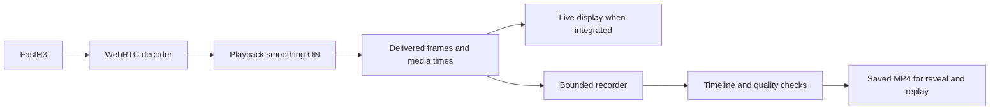

# FastH3 with smoothing on: playback and replay guide

[All docs](../README.md) · [Word by Word technical plan](../games/word-by-word/tech-stack.md) · [Measured smoothing experiments](../research/word-by-word/smoothing-experiment-2026-09-13.md)

Updated: 14 September 2026. Shared guidance for VibeParty integrations using FastH3. **Keep smoothing on for live playback. Timestamp-aware replay capture is a proposed implementation that still needs validation.** Each game's specification continues to own its reveal rules and accepted video quality.

## 1. Choose the playback and recording contract

WebRTC's playback smoother buffers decoded frames and can discard overdue frames to maintain rendering timing. Receiving fewer callbacks than the generated frame count can therefore be normal for this path. For recording, decide which result the game requires:

| Requirement | Approach with smoothing on |
| --- | --- |
| Watch the video as it arrives | Display the live media track with normal player timing. Recording success does not gate an authorized live preview. |
| Save a replay that tolerates small losses in delivered motion | Record delivered frames with verified presentation times; validate the resulting timeline and viewing quality. This is the proposed approach below. |
| Preserve every generated frame | Obtain a separately verified complete artifact or capture before discard stages. Smoothing may remain on for the viewing path. |

The tested Python SDK 1.5.1 selects native WebRTC build `webrtc-7907-a5ddff60-p6` through `reactor-webrtc-sys` 0.16.0. Its media configuration defaults to smoothing on. In a maintained native adapter, the explicit setting is:

```cpp
// Native RTCConfiguration, before creating the peer connection.
rtc_config.set_prerenderer_smoothing(true);
```

This is not a Python constructor option or a browser `<video>` attribute. Leaving the tested SDK's default intact retains smoothing. A browser receiving a live track handles its own playout; the native backend flag does not configure that browser. [WebRTC configuration](https://webrtc.googlesource.com/src/+/a5ddff60/media/base/media_config.h), [native accessor](https://webrtc.googlesource.com/src/+/a5ddff60/api/peer_connection_interface.h).

## 2. Understand the current application

Word by Word currently plays the provider stream privately on the backend, saves MP4 files, and reveals those files through an ordinary browser `<video>`. The host does not currently receive a live Reactor track. True live preview would require a media-delivery integration that preserves the game's private contributions and ordered disclosure.

The current recorder expects every advertised frame and feeds raw frames to FFmpeg at a fixed 24 fps. It waits for the expected count before considering completion. Its file validator also requires an exact frame count. If 156 of 158 frames arrive, capture reaches its timeout. Simply ending that loop early would instead produce a shortened recording under the current encoding settings. [Recorder](../../backend/games/word_by_word/live.py), [file validator](../../backend/games/word_by_word/providers.py), [host player](../../frontend/src/games/word-by-word/index.tsx).

This guide proposes accepting a timed replay of the delivered stream where a game permits that tradeoff. The existing exact-frame requirement remains in force until implementation, quality criteria, and game acceptance are updated together.



This is a conceptual division of responsibilities. Native SDK callbacks, browser rendering and the server's recording path are different integration surfaces; the diagram does not imply the repository already implements this fan-out.

## 3. Prepare and play a FastH3 clip

FastH3 generates clips ahead of playback. `play` consumes a ready clip; another `play` is not a saved-replay mechanism. `clip_finished` describes completed sending, so receiving and decoding may still be draining. With `set_flush_on_clip_end` disabled, the stream holds its final frame between clips. Continuation uses the predecessor's `clip_id`. [FastH3 API](https://www.reactor.inc/models/fast-h3/api).

Use the existing [backend session setup](../../backend/games/word_by_word/live.py) as the version-specific integration reference:

1. Register media, message, error and session handlers before connecting. Keep provider credentials and commands under backend ownership.
2. Retain smoothing on. Configure manual playback, the selected canvas and the end-of-clip hold behavior; verify the acknowledgments. Word by Word currently uses `set_autoplay({enabled: false})`, `set_canvas({aspect: "16:9"})` and `set_flush_on_clip_end({enabled: false})`.
3. Enqueue once, retain the returned clip identity, and wait for that clip's generated/ready state. Record its actual frame count and duration. Use the existing ambiguity handling if the response is uncertain.
4. Prepare the recorder and its bounded buffers before issuing `play`. Establish the active clip's start from verified event/media ordering. Buffering early frames must not admit a previous clip's hold frame or expose future contributions.
5. Send one `play` for the ready clip. Keep callbacks short; move encoding and file I/O out of the media callback. Record timing and queue occupancy throughout delivery.
6. Finalize using the lifecycle below, validate the file, and then allow the next private capture. Retain the predecessor ID separately from the saved file path.

Recheck command payloads and event envelopes against the installed SDK and actual deployment when upgrading. Current online SDK examples may target a different version from our tested Python 1.5.1 installation.

## 4. Preserve presentation timing in the recording

Queue a frame together with its timing and identity, where available:

```text
(frame bytes, dimensions, media presentation time, clip identity, frame identity)
```

Validate what the timestamp means and its units. Generation time, packet arrival time, callback time and intended presentation time are different clocks. Prefer a media timeline whose origin can be mapped to the clip's actual beginning. Normalize encoder timestamps against that verified origin; rebasing blindly to the first received frame can conceal a missing opening.

For example, a 24 fps sequence has frames due at 0, 41.7, 83.3 and 125 ms. If the third frame is discarded, preserve the remaining times. The image at 41.7 ms stays visible until 125 ms. The recording retains the timing, with the same missing motion; it does not invent an intermediate image.

For the measured 158-frame clip, the intended duration at 24 fps is about 6.583 seconds. Encoding 156 received images consecutively at 24 fps produces 6.500 seconds. A timestamp-aware recording can retain 6.583 seconds only when the start, end and intervening timing are established; setting duration alone does not prove a complete scene.

Use an encoder/muxer path that accepts explicit frame timestamps and durations. Variable-frame-rate MP4 is a candidate. A constant-frame-rate output may repeat an image according to that same verified timeline, while recording those holds as quality loss. Raw `bgra` bytes through the current `-f rawvideo -framerate 24` pipe carry no individual presentation timestamps; changing an output frame-rate option alone does not supply the missing timing. [FFmpeg rawvideo input](https://ffmpeg.org/ffmpeg-formats.html#rawvideo).

**Current implementation gap:** the live diagnostics received absent optional frame IDs and timestamps. First expose usable media timing from the SDK, or validate another timing source. Monotonic time at callback receipt is an experimental approximation affected by buffering and scheduling. Label it as arrival timing, measure its error with known inputs, and keep it out of production acceptance until its limits are understood.

A timestamp-capable encoder library or native recorder is a candidate dependency, not an adopted one. Validate the MP4's packet/frame timestamps, final frame duration and full decoding on the actual host player. Word by Word's output remains silent H.264, `yuv420p`, source dimensions and fast-start MP4 within its existing size limits. Games retaining audio also need a shared media clock and audio/video synchronization checks.

## 5. Finish capture without waiting for discarded frames

Use an explicit lifecycle:

```text
PREPARED → RECEIVING → DRAINING → FINALIZING → VALID or REJECTED
```

| State | Required behavior |
| --- | --- |
| Prepared | Handlers and bounded storage are ready; the clip identity and boundary strategy are known. |
| Receiving | Admit only the active clip's media, preserving timing. Count loss and queue errors. |
| Draining | A matching finish event starts a fixed drain deadline. Continue accepting in-flight frames belonging to that clip. |
| Finalizing | Stop admission, finish the encoder, and measure timeline coverage and quality. |
| Valid/rejected | Publish only a valid private file; otherwise remove the partial output and report the actual failure. |

An expected frame count becomes a diagnostic for this proposed mode. It does not decide whether draining can begin. Stop draining after the verified media endpoint has arrived and queued work is handled, or at the configured deadline. A temporary quiet period alone is insufficient proof of completion. Repeated hold frames must not extend the deadline or satisfy missing source-frame coverage.

Choose the drain bound within the game's remaining step/session budget and record it in the trial. The earlier proposal suggested **one second after sender finish as an initial experiment**, not a measured universal guarantee. The live diagnostics observed frames arriving after finish, so immediate cutoff is already known to be unsafe. [Capture proposal](../research/word-by-word/capture-fix-proposal-2026-09-13.md).

Keep storage bounded by both frames and bytes. The current Word recorder allows 32 queued frames and 128 MiB of raw data; account for any additional buffers in the total. Overflow, encoding failure, missing first frame, missing finish and cancellation need explicit outcomes. Reactor's native FFI callback queue can also drop frames before Python; a low application queue peak cannot establish zero loss there. [Native callback queue](https://github.com/reactor-team/reactor-client-sdks/blob/9156ce9b09b3ebb8ed717d49d8ac69c5e44cec1d/crates/reactor-ffi/src/lib.rs#L893).

## 6. Judge the resulting viewing experience

For each clip, retain a compact evidence record:

- SDK/native build, model, codec, preset and smoothing setting.
- Generated/sent, decoded, native-delivered/dropped and application-accepted counts where available. Keep absent counters as `null`.
- Timestamp source, units and validity; verified opening/end coverage; intended and saved duration.
- Longest presentation gap, hold duration and timestamp discontinuities. A naturally static scene alone is not a transport freeze.
- Callback time, queue peaks/overflow, time to first frame, sender finish, last media arrival and drain duration.
- Full decoding, host playback, visible action, clip transitions and replay after provider closure.

Agree each game's loss, hold and duration-error limits from visual trials before enabling tolerance. A small frame-count difference may be acceptable only if the scene remains coherent and its important action and boundaries survive. **Keep 57/158 as a severe-loss rejection case.** Lengthening or padding that output does not restore the missing action. Likewise, 153/158 is not an automatic pass just because its count is closer.

## 7. Alternative: save a provider recording

Where the deployed model supports recording, Reactor offers `request_clip(seconds)` and `request_recording()` plus download helpers. This could allow normal smoothed playback while saving media through a separate provider path. These requests refer to session recording windows; they are not a verified export by FastH3 generation ID. [Reactor recordings](https://docs.reactor.inc/concepts/recordings).

Hosted FastH3 recording support, boundary mapping, final-chunk readiness and completeness still need verification. Check the returned media's real format against the installed SDK, normalize its timestamps and validate the saved file. Use bounded download and cleanup behavior. The presence of a download API alone does not establish a complete replay.

## 8. Validation before adoption

First run synthetic recording tests with known frame identities, media times and boundaries:

| Case | Evidence required |
| --- | --- |
| All 158 source frames delivered | Correct timeline, valid encoding and normal playback. |
| 157, 156 or 153 delivered | Lost positions are known; time is preserved; measured holds inform the quality decision. |
| 57 delivered | Clear severe-loss rejection and no published padded replay. |
| Late frames after finish | Correct bounded drain without losing a valid tail. |
| Missing opening or ending | Boundary loss is detected despite an apparently correct total duration. |
| Held/repeated frames and adjacent clips | Repeats cannot disguise loss; previous/future clip content is excluded. |
| Invalid/absent times, overflow, no finish, cancellation | Bounded failure with partial-file and encoder cleanup. |

Then exercise the actual H.264/native SDK/FFmpeg/player path with smoothing on. Compare viewing quality, presentation times and stage counters. The [existing experiment](../research/word-by-word/smoothing-experiment-2026-09-13.md) confirmed native smoother drops in controlled timing cases, while eight local VP8 comparisons preserved all frames. Its H.264 sender failed before transmission. It did not validate this timestamp-aware recorder or prove the cause of the older 57/158 failure.

For Word by Word, use [the standard scenarios](../games/word-by-word/test-scenarios.md): `WW-CAT-01` twice and `WW-CAT-02` once, within the applicable attempt/session limits. Preserve the **Place → Character → Action → Consequence** mapping; the theme supplies Place and Scene change supplies Consequence. Record exact answers, scenario/repeat ID, all four additions, continuity, private collection, manual reveal and replay after independently verified provider closure. Synthetic timing tests do not replace these model and browser checks.

Implementation touchpoints are the [capture/event handling](../../backend/games/word_by_word/live.py), [media validation](../../backend/games/word_by_word/providers.py), [step lifecycle](../../backend/games/word_by_word/service.py), and [host playback](../../frontend/src/games/word-by-word/index.tsx). Update the applicable game requirements alongside any accepted loss policy. This shared guide documents the approach; it does not enable it or report a successful live trial.
